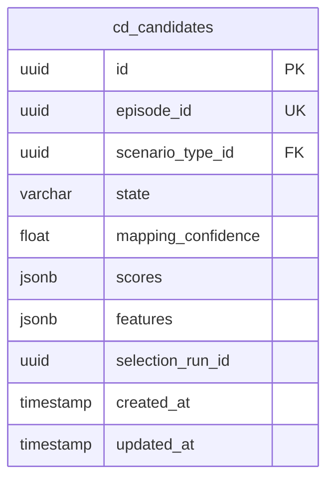

# Candidate Context — Manual Creation & State Machine

## Overview

Build the Candidate bounded context (Phase 1) — the second DDD context in Diamond after Scenario. Creates candidates from episodes, manages a 6-state lifecycle via state machine, and wires event handlers for cross-context integration.

## Problem Statement / Motivation

The Diamond pipeline transforms raw episodes into labeled, validated training data. The Candidate context is the bridge between ingestion and labeling — it tracks each episode's journey through the pipeline via a state machine. Without this, there is no way to manage which episodes are ready for labeling, which have been validated, or which are released to datasets.

## Proposed Solution

Follow the canonical Scenario context structure exactly. Build a full DDD bounded context with:

- **Aggregate Root:** `Candidate` (class-based, using `AggregateRoot` base — unlike Scenario's plain interfaces, the state machine logic justifies a richer domain model)
- **State Machine:** 6 states with forward-only transitions, enforced in the domain layer
- **4 API endpoints** for CRUD + state transitions
- **2 event handlers** for cross-context reactions
- **Domain events** emitted on creation and every state transition

## Technical Approach

### Architecture

```
src/contexts/candidate/
  index.ts                              # Composition root
  domain/
    entities/
      Candidate.ts                      # Aggregate root (class-based with state machine)
    value-objects/
      ScoreVector.ts                    # Stub (empty Phase 1)
      FeatureSet.ts                     # Stub (empty Phase 1)
      ScenarioMapping.ts               # Maps candidate to scenario type
    errors.ts                           # CandidateNotFoundError, etc.
    events.ts                           # Typed event definitions
  application/
    ports/
      CandidateRepository.ts           # Outbound port (interface)
      ScenarioReader.ts                # Cross-context read port
    use-cases/
      ManageCandidates.ts              # Create, get, list, transition
    handlers/
      onEpisodeIngested.ts             # episode.ingested → create candidate
      onLabelTaskFinalized.ts          # label_task.finalized → transition to labeled
  infrastructure/
    DrizzleCandidateRepository.ts      # Drizzle implementation
    ScenarioContextAdapter.ts          # Adapter calling Scenario context

app/api/v1/candidates/
  route.ts                              # POST (create) + GET (list)
  [id]/
    route.ts                            # GET (by id)
    state/
      route.ts                          # PATCH (transition)

src/db/schema/candidate.ts              # Drizzle schema
```

### Database Schema

**Table prefix:** `cd_` (following `sc_` pattern)

```
cd_candidates
├── id              uuid        PK (UUIDv7)
├── episode_id      uuid        NOT NULL, UNIQUE
├── scenario_type_id uuid       NULLABLE
├── state           varchar(20) NOT NULL, DEFAULT 'raw'
├── mapping_confidence float    NOT NULL, DEFAULT 0.0
├── scores          jsonb       NOT NULL, DEFAULT '{}'
├── features        jsonb       NOT NULL, DEFAULT '{}'
├── selection_run_id uuid       NULLABLE
├── created_at      timestamp(tz) NOT NULL, DEFAULT now()
└── updated_at      timestamp(tz) NOT NULL, DEFAULT now()
```

**Indexes:**

- UNIQUE on `episode_id` (1:1 relationship with episodes)
- INDEX on `state` (filter dimension)
- INDEX on `scenario_type_id` (filter dimension)

**State enum** (stored as `varchar(20)`, NOT pgEnum — matching Scenario convention):
`raw`, `scored`, `selected`, `labeled`, `validated`, `released`

All 6 states defined now for forward compatibility, but only Phase 1 transitions are allowed.



### State Machine

```mermaid
stateDiagram-v2
    [*] --> raw : create
    raw --> selected : manual select (PATCH)
    selected --> labeled : PATCH or label_task.finalized event
    labeled --> validated : PATCH
    validated --> released : PATCH

    note right of scored : Phase 2 only (raw → scored)
```

**Phase 1 Transition Matrix:**

| From      | To        | Trigger                   | API   | Event                |
| --------- | --------- | ------------------------- | ----- | -------------------- |
| (new)     | raw       | Create candidate          | POST  | episode.ingested     |
| raw       | selected  | Manual select             | PATCH | —                    |
| selected  | labeled   | Manual or label finalized | PATCH | label_task.finalized |
| labeled   | validated | Manual validate           | PATCH | —                    |
| validated | released  | Manual release            | PATCH | —                    |

**Invalid transitions** return `409 INVALID_STATE_TRANSITION` (already mapped in middleware).

### Events

**Emitted:**

| Event                     | Payload                                          | Trigger                                 |
| ------------------------- | ------------------------------------------------ | --------------------------------------- |
| `candidate.created`       | `{ candidate_id, episode_id, scenario_type_id }` | POST create or episode.ingested handler |
| `candidate.state_changed` | `{ candidate_id, from_state, to_state }`         | Every state transition                  |

**Consumed:**

| Event                  | Handler                | Action                                                                                                                                             |
| ---------------------- | ---------------------- | -------------------------------------------------------------------------------------------------------------------------------------------------- |
| `episode.ingested`     | `onEpisodeIngested`    | Create candidate in `raw` state. Idempotent: catches `DuplicateError` silently (unique constraint on episode_id).                                  |
| `label_task.finalized` | `onLabelTaskFinalized` | Transition candidate from `selected` → `labeled`. If candidate not found or not in `selected` state, log warning and skip (no-op for idempotency). |

### API Endpoints

#### `POST /api/v1/candidates`

Create a candidate manually.

**Request body:**

```typescript
z.object({
  episode_id: z.string().uuid(),
  scenario_type_id: z.string().uuid().optional(),
});
```

**Logic:**

1. Validate scenario_type_id exists (if provided) via `ScenarioReader` port
2. Set `mapping_confidence` = 1.0 if scenario_type_id provided, 0.0 if null
3. Create candidate in `raw` state
4. Emit `candidate.created` event
5. Return `201 created(candidate)`

**Errors:**

- 422: validation failure (missing episode_id, invalid UUID)
- 409: duplicate episode_id (`DuplicateError`)
- 404: scenario_type_id not found (if provided)

#### `GET /api/v1/candidates/:id`

Get a single candidate.

**Response:** `200 ok(candidate)` or `404 NotFoundError`

#### `GET /api/v1/candidates`

List candidates with filters and pagination.

**Query params:**

```typescript
z.object({
  state: z
    .enum(["raw", "scored", "selected", "labeled", "validated", "released"])
    .optional(),
  scenario_type_id: z.string().uuid().optional(),
  episode_id: z.string().uuid().optional(),
  page: z.coerce.number().int().positive().default(1),
  page_size: z.coerce.number().int().positive().max(100).default(50),
});
```

**Response:** `200 paginated(candidates, total, page, pageSize)`

**Sort:** `created_at DESC` (most recent first)

#### `PATCH /api/v1/candidates/:id/state`

Transition candidate state.

**Request body:**

```typescript
z.object({
  target_state: z.enum(["selected", "labeled", "validated", "released"]),
});
```

**Logic:**

1. Load candidate (404 if missing)
2. Validate transition via domain state machine (`candidate.transitionTo(targetState)`)
3. Persist updated state + updatedAt
4. Emit `candidate.state_changed` event
5. Return `200 ok(updatedCandidate)`

**Errors:**

- 404: candidate not found
- 409: invalid state transition
- 422: invalid target_state value

### Cross-Context Integration

**ScenarioReader port** — Validates `scenario_type_id` on candidate creation:

```typescript
// src/contexts/candidate/application/ports/ScenarioReader.ts
interface ScenarioReader {
  exists(scenarioTypeId: UUID): Promise<boolean>;
}
```

Implemented by `ScenarioContextAdapter` which imports the Scenario context's use case internally. Episode validation is skipped in Phase 1 (no Ingestion context yet).

### Key Design Decisions

1. **Class-based Aggregate Root** (unlike Scenario's plain interfaces): The Candidate has real domain logic (state machine transitions, validation rules). Using `AggregateRoot` base class + `addDomainEvent()` is appropriate here.

2. **State stored as varchar, not pgEnum**: Matches Scenario convention. Easier to add states without ALTER TYPE migrations.

3. **1:1 Episode-Candidate with unique constraint**: Idempotency via duplicate detection. The `episode.ingested` handler catches `DuplicateError` silently.

4. **All forward transitions allowed via PATCH**: Simpler API surface. The domain layer enforces which transitions are valid, not the API layer.

5. **`scored` state included but unused**: Zero-cost forward compatibility for Phase 2.

6. **No optimistic locking in Phase 1**: The in-process event bus is synchronous and Node.js is single-threaded. Race conditions are theoretically possible but extremely unlikely. Can add `updatedAt`-based locking in Phase 2 if needed.

7. **ScenarioReader as an outbound port**: Follows hexagonal architecture. The Candidate context depends on an interface, not directly on the Scenario context's internals.

## Implementation Phases

### Phase A: Database Schema + Domain Layer

**Files:**

- `src/db/schema/candidate.ts` — Drizzle table + relations
- `src/db/schema/index.ts` — Add re-export
- `src/contexts/candidate/domain/entities/Candidate.ts` — Aggregate root with state machine
- `src/contexts/candidate/domain/value-objects/ScoreVector.ts` — Empty stub
- `src/contexts/candidate/domain/value-objects/FeatureSet.ts` — Empty stub
- `src/contexts/candidate/domain/value-objects/ScenarioMapping.ts` — Type definition
- `src/contexts/candidate/domain/errors.ts` — Context-specific errors
- `src/contexts/candidate/domain/events.ts` — Typed event definitions

**Success criteria:**

- [ ] Schema generates clean migration via `pnpm db:generate`
- [ ] Schema pushes to local DB via `pnpm db:push`
- [ ] Candidate aggregate validates state transitions correctly
- [ ] `pnpm lint` passes

### Phase B: Repository + Ports + Use Cases

**Files:**

- `src/contexts/candidate/application/ports/CandidateRepository.ts` — Interface
- `src/contexts/candidate/application/ports/ScenarioReader.ts` — Interface
- `src/contexts/candidate/infrastructure/DrizzleCandidateRepository.ts` — Implementation
- `src/contexts/candidate/infrastructure/ScenarioContextAdapter.ts` — Scenario reader adapter
- `src/contexts/candidate/application/use-cases/ManageCandidates.ts` — CRUD + transitions
- `src/contexts/candidate/index.ts` — Composition root

**Success criteria:**

- [ ] Repository CRUD operations work against local DB
- [ ] State transitions emit domain events
- [ ] Duplicate episode_id throws DuplicateError
- [ ] ScenarioReader validates scenario_type_id
- [ ] `pnpm lint` passes

### Phase C: API Routes

**Files:**

- `app/api/v1/candidates/route.ts` — POST + GET (list)
- `app/api/v1/candidates/[id]/route.ts` — GET (by id)
- `app/api/v1/candidates/[id]/state/route.ts` — PATCH (transition)

**Success criteria:**

- [ ] All 4 endpoints return correct responses
- [ ] Validation errors return 422
- [ ] Not found returns 404
- [ ] Invalid transitions return 409
- [ ] Duplicate episode_id returns 409
- [ ] List endpoint supports pagination and filters
- [ ] `pnpm lint` passes

### Phase D: Event Handlers + Registry

**Files:**

- `src/contexts/candidate/application/handlers/onEpisodeIngested.ts`
- `src/contexts/candidate/application/handlers/onLabelTaskFinalized.ts`
- `src/lib/events/registry.ts` — Register handlers

**Success criteria:**

- [ ] `episode.ingested` event creates candidate idempotently
- [ ] `label_task.finalized` event transitions candidate to labeled
- [ ] Handlers are resilient to missing/duplicate events (no-op, not crash)
- [ ] Events registered in registry.ts
- [ ] `pnpm lint` passes
- [ ] `pnpm build` succeeds (full TypeScript strict check)

## Acceptance Criteria

### Functional Requirements

- [ ] Manual candidate creation via POST with optional scenario_type_id
- [ ] Get candidate by ID
- [ ] List candidates with filters (state, scenario_type_id, episode_id) and pagination
- [ ] State transitions via PATCH (raw→selected→labeled→validated→released)
- [ ] Invalid transitions return 409
- [ ] `candidate.created` event emitted on creation
- [ ] `candidate.state_changed` event emitted on every transition
- [ ] `episode.ingested` handler auto-creates candidate (idempotent)
- [ ] `label_task.finalized` handler transitions to labeled (idempotent)
- [ ] Duplicate episode_id returns 409

### Non-Functional Requirements

- [ ] Follows DDD/hexagonal architecture (ports, adapters, composition root)
- [ ] TypeScript strict mode + noUncheckedIndexedAccess
- [ ] Ultracite lint passes
- [ ] Build succeeds

## Dependencies & Prerequisites

- Scenario context must be functional (for ScenarioReader validation)
- Event bus infrastructure (`src/lib/events/`) — already exists
- API middleware (`src/lib/api/middleware.ts`) — already exists, handles all needed error types
- Domain base classes (`src/lib/domain/`) — already exist (AggregateRoot, ValueObject, DomainError)

## Risk Analysis & Mitigation

| Risk                                                             | Impact | Mitigation                                                               |
| ---------------------------------------------------------------- | ------ | ------------------------------------------------------------------------ |
| No Ingestion context yet — can't validate episode_id             | Low    | Skip episode validation in Phase 1. Add when Ingestion context is built. |
| Silent event handler failures (InProcessEventBus catches + logs) | Medium | Document behavior. Phase 2 can add dead-letter / retry.                  |
| No optimistic locking on state transitions                       | Low    | Single-threaded Node.js makes races unlikely. Add if needed.             |
| `scored` state unused in Phase 1                                 | None   | Included in enum, no transitions defined. Zero cost.                     |

## References & Research

### Internal References

- Scenario context (canonical pattern): `src/contexts/scenario/`
- Domain base classes: `src/lib/domain/AggregateRoot.ts`, `ValueObject.ts`, `DomainError.ts`
- Event bus: `src/lib/events/InProcessEventBus.ts`
- API middleware: `src/lib/api/middleware.ts`
- Response helpers: `src/lib/api/response.ts`
- Validation helpers: `src/lib/api/validate.ts`
- ID generation: `src/shared/ids.ts`
- Shared types: `src/shared/types.ts`
- Schema pattern: `src/db/schema/scenario.ts`

### Documented Gotchas

- Zod v4: `import { z } from "zod"` (not `zod/v4`)
- Zod v4: `z.record(z.string(), z.unknown())` (2 args required)
- State stored as `varchar(20)` not pgEnum (Scenario convention)
- IDs generated in repository layer via `generateId()`
- `withApiMiddleware` already maps `InvalidStateTransitionError` → 409
- Route params are async in Next.js 16: `const { id } = await ctx.params`

### Linear

- Epic: [GET-8](https://linear.app/getbasalt/issue/GET-8)
