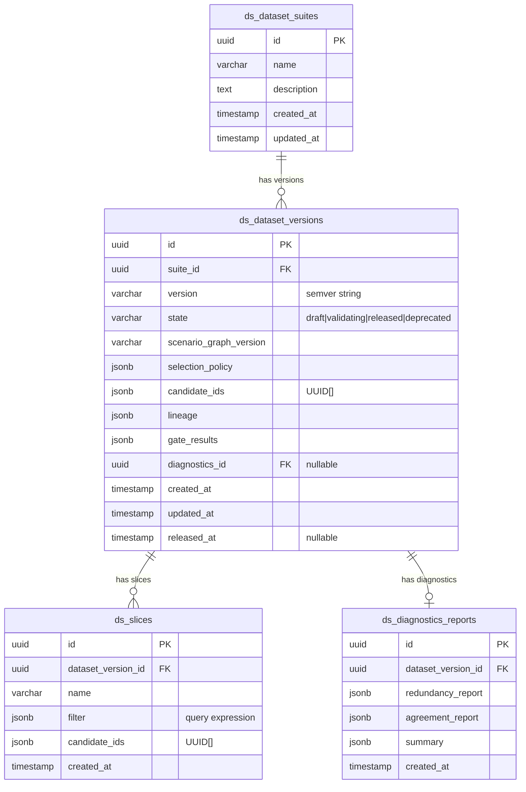
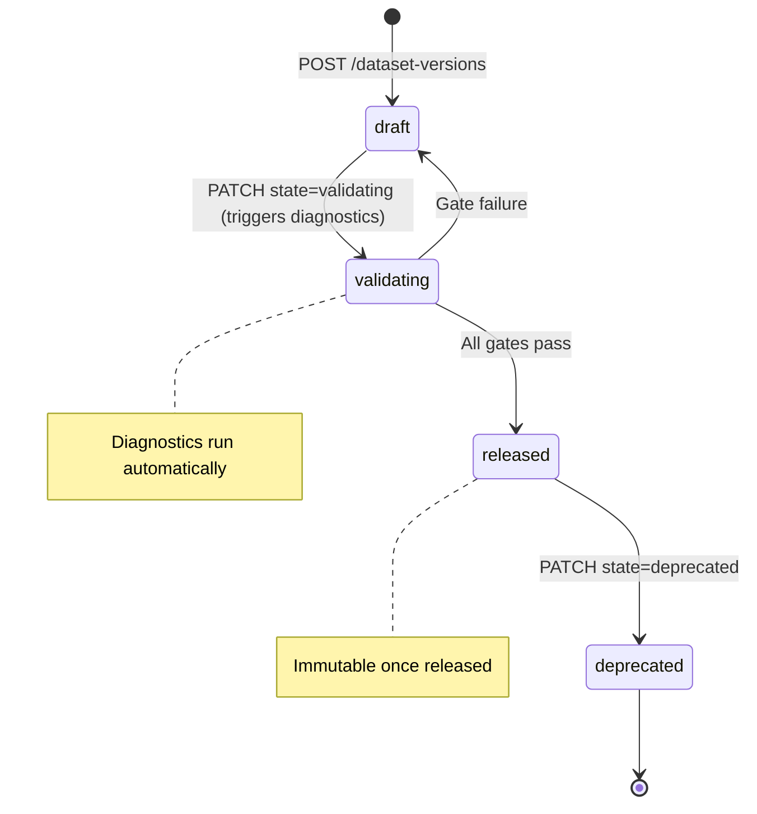
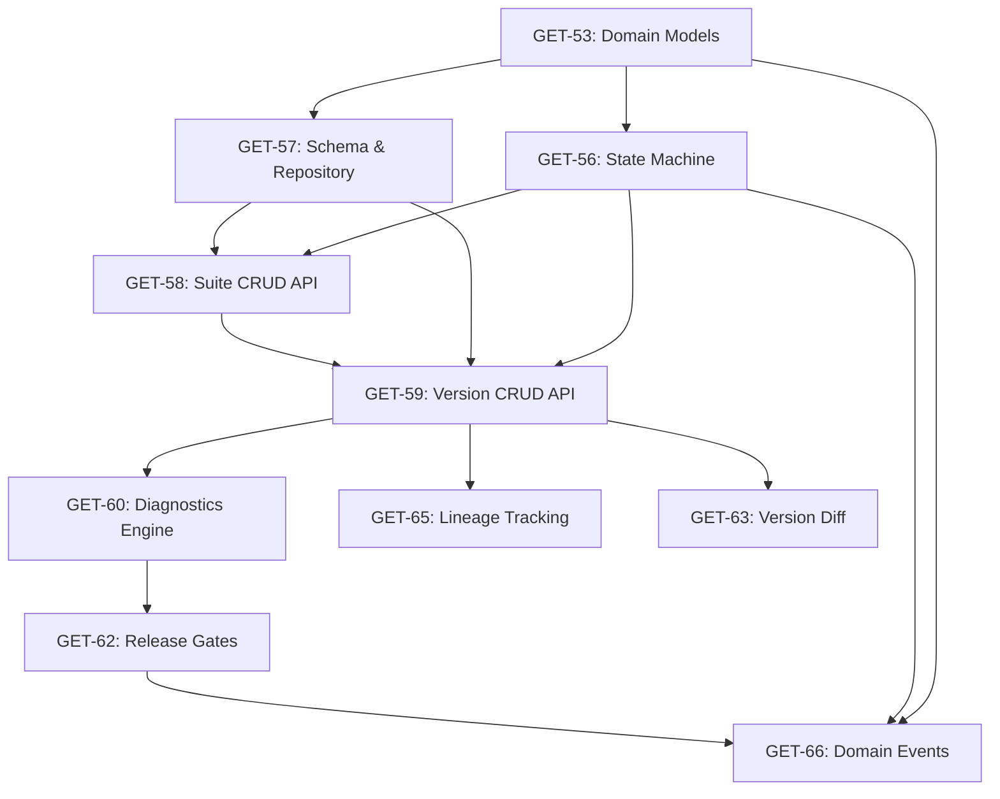

# Dataset Context — Versioned Suites & Release Gates

## Overview

Build the **Dataset** bounded context — the 4th context in Diamond's DDD architecture. It assembles labeled candidates into versioned, diffable, gateable dataset releases. This context reads from Candidate, Labeling, and Scenario contexts but owns its own aggregate root (`DatasetVersion`) with a state machine governing the release lifecycle.

**Bounded Context:** Dataset
**DB Prefix:** `ds_`
**Aggregate Root:** DatasetVersion
**State Machine:** `draft` → `validating` → `released` | `draft` (gate failure) → `deprecated`

## Problem Statement

After candidates are scored, selected, labeled, and validated through the Candidate and Labeling pipelines, there is no mechanism to:

- Group candidates into named, versioned dataset releases
- Run quality diagnostics (redundancy, agreement) before release
- Enforce release gates that block low-quality datasets
- Track full lineage from dataset examples back to source episodes
- Compute diffs between dataset versions

The Dataset context closes this gap, providing the final stage of the data pipeline.

## Design Decisions & Open Questions Resolved

These decisions were surfaced by SpecFlow analysis of the spec and resolved using codebase conventions:

| #   | Question                              | Decision                                                                                                                    | Rationale                                                                                                                                |
| --- | ------------------------------------- | --------------------------------------------------------------------------------------------------------------------------- | ---------------------------------------------------------------------------------------------------------------------------------------- |
| 1   | **Sync vs async validation?**         | **Synchronous** (within HTTP request)                                                                                       | Matches existing patterns (LabelTask transitions). Practical limit ~500 candidates/version in Phase 1. Async job system is out of scope. |
| 2   | **Candidate state eligibility?**      | Only `validated` or `released` candidates                                                                                   | Prevents datasets from containing unlabeled/unscored data. Enforced at version creation.                                                 |
| 3   | **Snapshot vs live references?**      | **candidate_ids[] is immutable** once created; underlying data read live; DiagnosticsReport snapshotted at computation time | Lineage captures point-in-time metadata. Diagnostics are a snapshot.                                                                     |
| 4   | **Semver format?**                    | User-supplied string, validated `^\d+\.\d+\.\d+$`, UNIQUE(suite_id, version) at DB level                                    | Mirrors Rubric versioning pattern.                                                                                                       |
| 5   | **Can drafts be edited?**             | **No** — create a new version instead                                                                                       | Keeps versions simple and auditable. Avoids mutable draft complexity. Gate failure → create new version with adjusted candidates.        |
| 6   | **Slice management?**                 | **Phase 2 scope** — not included in this epic                                                                               | Slices are defined in the domain model but no CRUD endpoints. The `ds_slices` table is created for future use.                           |
| 7   | **Cross-suite diffs?**                | **Allowed** — both versions just need to exist                                                                              | Useful for comparing datasets across different use cases.                                                                                |
| 8   | **Concurrency on state transitions?** | **Optimistic locking** via `updated_at` check in UPDATE WHERE clause                                                        | Matches simplest approach; `ConcurrencyConflictError` already mapped to 409.                                                             |
| 9   | **Gate failure response?**            | Return 200 with version in `draft` state + populated `gate_results`                                                         | Not an error — it's a valid outcome. Client reads `state` + `gate_results` to understand what happened.                                  |
| 10  | **Duplicate candidate IDs?**          | Silently deduplicated at creation time                                                                                      | Array stored as Set, no error thrown.                                                                                                    |
| 11  | **LabelReader port?**                 | Create new port + adapter in Dataset context                                                                                | Does not exist today. Reads from `manageLabels` via lazy import.                                                                         |
| 12  | **Bulk CandidateReader?**             | Add `getMany(ids: UUID[])` to CandidateReader port                                                                          | Prevents N+1 reads during version creation and diagnostics.                                                                              |

## Technical Approach

### Architecture

Follows the established hexagonal/DDD pattern identical to Scenario, Candidate, and Labeling contexts:

```
src/contexts/dataset/
  index.ts                              # Composition root
  application/
    ports/
      DatasetSuiteRepository.ts         # Outbound port
      DatasetVersionRepository.ts       # Outbound port
      CandidateReader.ts                # Cross-context port
      LabelReader.ts                    # Cross-context port
      ScenarioReader.ts                 # Cross-context port
    use-cases/
      ManageDatasetSuites.ts            # Suite CRUD
      ManageDatasetVersions.ts          # Version lifecycle + state transitions
      RunDiagnostics.ts                 # Diagnostics engine orchestration
      ComputeVersionDiff.ts             # Diff computation
  domain/
    entities/
      DatasetSuite.ts                   # Simple entity type
      DatasetVersion.ts                 # Aggregate root with state machine
      Slice.ts                          # Child entity type
    value-objects/
      DiagnosticsReport.ts              # Redundancy + agreement metrics
      Lineage.ts                        # Full traceability record
      GateResult.ts                     # Per-gate pass/fail with threshold
      VersionDiff.ts                    # Structured diff between versions
    errors.ts                           # Context-specific errors
    events.ts                           # Typed domain events
  infrastructure/
    DrizzleDatasetSuiteRepository.ts
    DrizzleDatasetVersionRepository.ts
    CandidateContextAdapter.ts          # Lazy import from candidate context
    LabelContextAdapter.ts              # Lazy import from labeling context
    ScenarioContextAdapter.ts           # Lazy import from scenario context

src/db/schema/dataset.ts                # All ds_ prefixed tables

app/api/v1/dataset-suites/route.ts      # POST + GET (list)
app/api/v1/dataset-suites/[id]/route.ts # GET (single)
app/api/v1/dataset-versions/route.ts    # POST + GET (list)
app/api/v1/dataset-versions/[id]/route.ts           # GET (single)
app/api/v1/dataset-versions/[id]/state/route.ts     # PATCH (transitions)
app/api/v1/dataset-versions/[id]/diff/[otherId]/route.ts  # GET (diff)
```

### ERD



### DatasetVersion State Machine



### Implementation Phases

#### Phase 1: Domain Foundation (GET-53, GET-56)

**Linear Issues:** GET-53, GET-56
**Goal:** Define all domain types and the state machine before touching infrastructure.

**GET-53 — Domain Models:**

Files to create:

- `src/contexts/dataset/domain/entities/DatasetSuite.ts` — Plain type interface
- `src/contexts/dataset/domain/entities/DatasetVersion.ts` — AggregateRoot class with state machine
- `src/contexts/dataset/domain/entities/Slice.ts` — Plain type interface
- `src/contexts/dataset/domain/value-objects/DiagnosticsReport.ts` — ValueObject with redundancy + agreement metrics
- `src/contexts/dataset/domain/value-objects/Lineage.ts` — ValueObject capturing candidate sources, label task IDs, rubric versions, scenario graph version
- `src/contexts/dataset/domain/value-objects/GateResult.ts` — ValueObject: `{ gate: string, threshold: number, actual: number, passed: boolean }`
- `src/contexts/dataset/domain/value-objects/VersionDiff.ts` — ValueObject for diff results
- `src/contexts/dataset/domain/errors.ts` — `DatasetNotFoundError`, `SuiteNotFoundError`, `DatasetImmutableError`
- `src/contexts/dataset/domain/events.ts` — Typed event definitions

Key decisions:

- `candidate_ids` stored as `UUID[]` (TypeScript array), persisted as JSONB
- `version` is a semver string (e.g., `"1.0.0"`), not auto-incrementing integer
- `selection_policy` is opaque JSONB — validated in domain, not at DB level
- State stored as `varchar({ length: 20 })`, not pgEnum (matches Candidate pattern)

**GET-56 — State Machine:**

```typescript
// src/contexts/dataset/domain/entities/DatasetVersion.ts
export const DATASET_VERSION_STATES = [
  "draft",
  "validating",
  "released",
  "deprecated",
] as const;
export type DatasetVersionState = (typeof DATASET_VERSION_STATES)[number];

const VALID_TRANSITIONS: Record<DatasetVersionState, DatasetVersionState[]> = {
  draft: ["validating"],
  validating: ["released", "draft"],
  released: ["deprecated"],
  deprecated: [],
};
```

The `DatasetVersion` class extends `AggregateRoot` and provides:

- `transitionTo(targetState)` — validates transition, emits `dataset_version.state_changed`
- `startValidation()` — convenience for `draft → validating`
- `release(gateResults)` — convenience for `validating → released`, sets `released_at`
- `rejectToDraft(gateResults)` — convenience for `validating → draft` on gate failure
- `deprecate(reason)` — convenience for `released → deprecated`

Invariant: once `released`, all mutation methods throw `DatasetImmutableError`.

**Acceptance Criteria:**

- [ ] All domain types compile with strict TypeScript
- [ ] State machine rejects invalid transitions with `InvalidStateTransitionError`
- [ ] Released versions reject mutations with `DatasetImmutableError`
- [ ] Domain events are properly typed

---

#### Phase 2: Database & Repository (GET-57)

**Linear Issue:** GET-57
**Goal:** Create schema, migration, and repository implementations.

**Schema file:** `src/db/schema/dataset.ts`

Tables to create:

- `ds_dataset_suites` — id, name (unique), description, created_at, updated_at
- `ds_dataset_versions` — id, suite_id (FK), version, state, scenario_graph_version, selection_policy (JSONB), candidate_ids (JSONB), lineage (JSONB), gate_results (JSONB), diagnostics_id (nullable UUID), created_at, updated_at, released_at (nullable)
- `ds_slices` — id, dataset_version_id (FK), name, filter (JSONB), candidate_ids (JSONB), created_at
- `ds_diagnostics_reports` — id, dataset_version_id (FK), redundancy_report (JSONB), agreement_report (JSONB), summary (JSONB), created_at

Indexes:

- `ds_dataset_versions_suite_id_idx` on suite_id
- `ds_dataset_versions_state_idx` on state
- `ds_dataset_suites_name_idx` unique on name
- Composite unique: `(suite_id, version)` on ds_dataset_versions

Repository ports:

- `DatasetSuiteRepository` — create, findById, findByName, list
- `DatasetVersionRepository` — create, findById, updateState, updateDiagnostics, updateGateResults, list (filter by suite_id, state), findBySuiteAndVersion

Infrastructure:

- `DrizzleDatasetSuiteRepository` — standard Drizzle patterns with `.returning()`
- `DrizzleDatasetVersionRepository` — same patterns, JSONB columns cast with `as`

Don't forget:

- [ ] Export from `src/db/schema/index.ts`: `export * from "./dataset"`
- [ ] Run `pnpm db:generate` then `pnpm db:migrate`
- [ ] Use `varchar({ length: 20 })` for state column

**Acceptance Criteria:**

- [ ] All tables created with `ds_` prefix
- [ ] Migration runs cleanly
- [ ] Repository CRUD operations work
- [ ] JSONB columns properly serialize/deserialize

---

#### Phase 3: Suite CRUD API (GET-58)

**Linear Issue:** GET-58
**Goal:** Simple CRUD for dataset suites — named containers for versions.

API Routes:

- `app/api/v1/dataset-suites/route.ts` — POST (create) + GET (list)
- `app/api/v1/dataset-suites/[id]/route.ts` — GET (single with version summary)

Use case: `ManageDatasetSuites`

- `create({ name, description })` → validates name uniqueness, returns suite
- `get(id)` → returns suite (with version count, latest version info)
- `list(page, pageSize)` → paginated list

Zod schemas:

```typescript
const createSuiteSchema = z.object({
  name: z.string().min(1).max(255),
  description: z.string().optional().default(""),
});

const listSuitesSchema = z.object({
  page: z.coerce.number().int().positive().default(1),
  page_size: z.coerce.number().int().positive().max(100).default(50),
});
```

Composition root wiring:

- `src/contexts/dataset/index.ts` — instantiate repos, export `manageDatasetSuites`

**Acceptance Criteria:**

- [ ] POST creates suite, returns 201
- [ ] GET list returns paginated results
- [ ] GET single returns suite with version summary
- [ ] Duplicate name returns 409

---

#### Phase 4: Version CRUD + State API (GET-59)

**Linear Issue:** GET-59
**Goal:** Create draft versions, get version details, trigger state transitions.

API Routes:

- `app/api/v1/dataset-versions/route.ts` — POST (create draft) + GET (list)
- `app/api/v1/dataset-versions/[id]/route.ts` — GET (single with diagnostics, lineage, gates)
- `app/api/v1/dataset-versions/[id]/state/route.ts` — PATCH (state transition)

Use case: `ManageDatasetVersions`

- `create({ suite_id, version, candidate_ids, selection_policy? })` → validates suite exists, version is unique within suite, candidates exist (via CandidateReader), pins scenario_graph_version, returns draft version
- `get(id)` → returns version with joined diagnostics and slice data
- `list({ suite_id?, state? }, page, pageSize)` → filtered paginated list
- `transition(id, targetState, context?)` → loads aggregate, validates transition, persists, publishes events

Cross-context adapters needed:

- `CandidateContextAdapter` — verifies candidate IDs exist and are in valid state (`getMany` for bulk reads, `isInState` for eligibility check — only `validated` or `released` candidates accepted)
- `ScenarioContextAdapter` — reads current scenario graph version to pin (needs `getLatestVersion()` method beyond existing `exists()` port)

Zod schemas:

```typescript
const createVersionSchema = z.object({
  suite_id: z.string().uuid(),
  version: z.string().regex(/^\d+\.\d+\.\d+$/, "Must be semver format"),
  candidate_ids: z.array(z.string().uuid()).min(1),
  selection_policy: z.record(z.string(), z.unknown()).optional(),
});

const transitionSchema = z.object({
  target_state: z.enum(["validating", "released", "deprecated"]),
  reason: z.string().optional(), // for deprecation
});
```

Important: `draft → validating` transition triggers diagnostics (Phase 5). Initially, just transition the state — diagnostics integration comes in GET-60.

**Acceptance Criteria:**

- [ ] POST creates draft version with validated candidates, returns 201
- [ ] Rejects unknown suite_id with 404
- [ ] Rejects duplicate (suite_id, version) with 409
- [ ] Rejects empty candidate_ids array
- [ ] GET returns version with all JSONB fields
- [ ] PATCH transitions state correctly
- [ ] Released versions are immutable (reject PATCH except to deprecated)
- [ ] Emits `dataset_version.created` event on POST

---

#### Phase 5: Diagnostics Engine (GET-60)

**Linear Issue:** GET-60
**Goal:** Build the internal diagnostics engine for Phase 1 scope.

Use case: `RunDiagnostics`

- Triggered when version transitions to `validating`
- Computes two metrics:
  1. **Redundancy** — near-duplicate detection among candidates using Jaccard similarity on tokenized content
  2. **Label agreement** — Cohen's kappa across labels for shared candidates (reads from LabelReader)
- Stores results as `DiagnosticsReport` (JSONB) linked to the version
- After completion, evaluates release gates (Phase 6)

Cross-context adapters needed:

- `LabelContextAdapter` — new port + adapter (does not exist today). Reads labels for candidate IDs to compute agreement. Port interface:
  ```typescript
  export interface LabelReader {
    getLabelsForCandidates(
      candidateIds: UUID[]
    ): Promise<Map<UUID, LabelSummary[]>>;
  }
  // Where LabelSummary = { labelTaskId: UUID, labelValue: unknown, annotatorId: string }
  ```
  Adapter uses lazy import from `@/contexts/labeling` → `manageLabels.listByCandidateIds()`

DiagnosticsReport structure:

```typescript
interface DiagnosticsReport {
  redundancy: {
    method: "jaccard_similarity";
    threshold: number;
    duplicate_pairs: Array<{
      candidate_a: string;
      candidate_b: string;
      similarity: number;
    }>;
    redundancy_index: number; // 0-1, fraction of candidates with duplicates
  };
  agreement: {
    method: "cohens_kappa";
    overall_kappa: number;
    per_scenario_kappa: Record<string, number>;
    sample_size: number;
  };
  computed_at: string; // ISO timestamp
}
```

**Acceptance Criteria:**

- [ ] Diagnostics compute redundancy index
- [ ] Diagnostics compute agreement kappa
- [ ] Results stored in `ds_diagnostics_reports`
- [ ] Version links to diagnostics via `diagnostics_id`

---

#### Phase 6: Release Gates (GET-62)

**Linear Issue:** GET-62
**Goal:** Evaluate gates after diagnostics, auto-release or block.

Gate definitions (Phase 1):

- `min_agreement` — block if `overall_kappa < threshold` (default 0.6)
- `max_redundancy` — block if `redundancy_index > threshold` (default 0.1)

Flow:

1. `RunDiagnostics` completes → evaluates gates
2. Each gate produces a `GateResult`: `{ gate, threshold, actual, passed }`
3. If ALL gates pass → transition to `released`, emit `dataset_version.released`
4. If ANY gate fails → transition back to `draft`, emit `release_gate.blocked`

Gate configuration stored in `selection_policy` JSONB on the version (optional overrides), with system defaults as fallback.

**Acceptance Criteria:**

- [ ] Gates evaluate after diagnostics
- [ ] All-pass → auto-release
- [ ] Any-fail → back to draft with `release_gate.blocked` event
- [ ] Gate results stored on version as `gate_results` JSONB
- [ ] Emits `diagnostics.completed` event

---

#### Phase 7: Version Diff (GET-63)

**Linear Issue:** GET-63
**Goal:** Compute structured diffs between any two versions.

API Route:

- `app/api/v1/dataset-versions/[id]/diff/[otherId]/route.ts` — GET

Use case: `ComputeVersionDiff`

- Takes two version IDs, loads both
- Computes:
  - `added` — candidate IDs in version A but not B
  - `removed` — candidate IDs in B but not A
  - `unchanged` — candidate IDs in both
  - `total_a` / `total_b` — counts
  - `scenario_coverage_delta` — if scenario graph versions differ

VersionDiff structure:

```typescript
interface VersionDiff {
  version_a: { id: string; version: string; suite_id: string };
  version_b: { id: string; version: string; suite_id: string };
  added_count: number;
  removed_count: number;
  unchanged_count: number;
  added_candidate_ids: string[];
  removed_candidate_ids: string[];
}
```

**Acceptance Criteria:**

- [ ] GET returns structured diff
- [ ] Handles versions from different suites (cross-suite diff)
- [ ] Returns 404 if either version not found

---

#### Phase 8: Lineage Tracking (GET-65)

**Linear Issue:** GET-65
**Goal:** Capture full traceability from dataset examples back to source.

When a `DatasetVersion` is created, build lineage by reading from cross-context adapters:

- For each candidate_id: read episode source, label_task_ids, scores
- Capture: rubric versions used, scenario_graph_version pinned, selection policy params

Lineage structure:

```typescript
interface Lineage {
  scenario_graph_version: string;
  selection_policy: Record<string, unknown>;
  candidate_count: number;
  candidates: Array<{
    candidate_id: string;
    episode_id: string;
    label_task_ids: string[];
    rubric_version?: number;
    scenario_type_id?: string;
  }>;
  captured_at: string; // ISO timestamp
}
```

Stored as JSONB on the version. Built at creation time (POST), not lazily.

**Acceptance Criteria:**

- [ ] Lineage captures candidate → episode → label_task chain
- [ ] Lineage stored on version at creation
- [ ] GET version endpoint includes lineage

---

#### Phase 9: Domain Events (GET-66)

**Linear Issue:** GET-66
**Goal:** Wire all Dataset context events to the event bus.

Events to define and emit:
| Event | Trigger | Payload |
|-------|---------|---------|
| `dataset_version.created` | POST /dataset-versions | `{ dataset_version_id, suite_id, version }` |
| `dataset_version.state_changed` | Any state transition | `{ dataset_version_id, from_state, to_state }` |
| `diagnostics.completed` | RunDiagnostics finishes | `{ dataset_version_id, diagnostics_id, blocked, gate_results }` |
| `dataset_version.released` | Gates pass, version released | `{ dataset_version_id, suite_id, version, candidate_count }` |
| `dataset_version.deprecated` | Manual deprecation | `{ dataset_version_id, reason }` |
| `release_gate.blocked` | Gate failure | `{ dataset_version_id, failed_gates }` |

Registration in `src/lib/events/registry.ts`:

- No inbound cross-context handlers needed in Phase 1
- All events emitted from Dataset use cases via `eventBus.publishAll()`

**Acceptance Criteria:**

- [ ] All 6 event types defined with typed payloads
- [ ] Events emitted at correct lifecycle points
- [ ] Event handlers are idempotent (catch NotFound, InvalidStateTransition)

---

## Implementation Order & Dependencies



**Recommended implementation order:**

1. GET-53 + GET-56 (domain foundation — can be one PR)
2. GET-57 (schema + repos)
3. GET-58 (suite API — simpler, validates infra works)
4. GET-59 (version API — core CRUD)
5. GET-65 (lineage — extends version creation)
6. GET-60 (diagnostics — extends validation flow)
7. GET-62 (gates — extends diagnostics)
8. GET-63 (diff — independent read path)
9. GET-66 (events — wire everything up, can be incremental)

## Edge Cases & Invariants

### Validation Rules

- `candidate_ids` must be non-empty on version creation
- `version` must be valid semver and unique within suite
- `suite_id` must reference existing suite
- Cannot transition from `released` to anything except `deprecated`
- Cannot modify candidate_ids, lineage, or selection_policy after creation (draft is also immutable in content, only state changes)

### Concurrency

- Two simultaneous `validating → released` transitions: use optimistic concurrency via `updated_at` check (existing pattern from Candidate context)
- Suite name uniqueness enforced at DB level (unique constraint)
- Version uniqueness within suite enforced at DB level (composite unique)

### Cross-Context Data Integrity

- Candidates referenced by a released version cannot be "un-referenced" — the version is immutable
- If a candidate is later deleted/modified in the Candidate context, the Dataset version retains its snapshot (lineage captures point-in-time state)
- Diagnostics read label data at computation time — labels may change later, but diagnostics are a snapshot

### Error Handling

- `DatasetImmutableError` → 409 (add to middleware.ts error mapping)
- All standard errors (NotFound, InvalidStateTransition, Duplicate) already mapped

## SpecFlow Analysis — Gaps Addressed

The following gaps were identified by SpecFlow analysis and resolved in this plan:

**Addressed in plan:**

- State machine `validating → draft` rollback explicitly included in VALID_TRANSITIONS
- Candidate state eligibility enforced (only `validated`/`released`)
- Duplicate candidate IDs silently deduplicated
- GET /dataset-suites/:id included (Gap 10 resolved)
- GET /dataset-versions list endpoint included with filters (Gap 12/14 resolved)
- LabelReader port creation folded into Phase 5 (Gap 17 resolved)
- CandidateReader bulk `getMany()` added to adapter (Gap 16 resolved)
- Optimistic concurrency via `updated_at` WHERE clause (Gap 19 resolved)
- Gate failure returns 200 with `draft` state + `gate_results` (Gap 28 resolved)
- ScenarioReader extended with `getLatestVersion()` (Gap 18 resolved)

**Deferred to Phase 2:**

- Slice CRUD endpoints (Gap 8) — table created, no API surface yet
- Draft version editing (Gap 9) — create new version instead
- Cancelled/archived state (Gap 2) — not needed for MVP
- Async validation (Gap 3) — synchronous with ~500 candidate practical limit
- Cross-context event handlers for candidate state changes (Gap 27)

## Files to Create (Complete List)

### Domain Layer (11 files)

- `src/contexts/dataset/domain/entities/DatasetSuite.ts`
- `src/contexts/dataset/domain/entities/DatasetVersion.ts`
- `src/contexts/dataset/domain/entities/Slice.ts`
- `src/contexts/dataset/domain/value-objects/DiagnosticsReport.ts`
- `src/contexts/dataset/domain/value-objects/Lineage.ts`
- `src/contexts/dataset/domain/value-objects/GateResult.ts`
- `src/contexts/dataset/domain/value-objects/VersionDiff.ts`
- `src/contexts/dataset/domain/errors.ts`
- `src/contexts/dataset/domain/events.ts`

### Application Layer (6 files)

- `src/contexts/dataset/application/ports/DatasetSuiteRepository.ts`
- `src/contexts/dataset/application/ports/DatasetVersionRepository.ts`
- `src/contexts/dataset/application/ports/CandidateReader.ts`
- `src/contexts/dataset/application/ports/LabelReader.ts`
- `src/contexts/dataset/application/ports/ScenarioReader.ts`
- `src/contexts/dataset/application/use-cases/ManageDatasetSuites.ts`
- `src/contexts/dataset/application/use-cases/ManageDatasetVersions.ts`
- `src/contexts/dataset/application/use-cases/RunDiagnostics.ts`
- `src/contexts/dataset/application/use-cases/ComputeVersionDiff.ts`

### Infrastructure Layer (5 files)

- `src/contexts/dataset/infrastructure/DrizzleDatasetSuiteRepository.ts`
- `src/contexts/dataset/infrastructure/DrizzleDatasetVersionRepository.ts`
- `src/contexts/dataset/infrastructure/CandidateContextAdapter.ts`
- `src/contexts/dataset/infrastructure/LabelContextAdapter.ts`
- `src/contexts/dataset/infrastructure/ScenarioContextAdapter.ts`

### Composition Root (1 file)

- `src/contexts/dataset/index.ts`

### Database (1 file + migration)

- `src/db/schema/dataset.ts`
- Update `src/db/schema/index.ts`

### API Routes (6 files)

- `app/api/v1/dataset-suites/route.ts`
- `app/api/v1/dataset-suites/[id]/route.ts`
- `app/api/v1/dataset-versions/route.ts`
- `app/api/v1/dataset-versions/[id]/route.ts`
- `app/api/v1/dataset-versions/[id]/state/route.ts`
- `app/api/v1/dataset-versions/[id]/diff/[otherId]/route.ts`

### Event Registry (1 update)

- Update `src/lib/events/registry.ts`

### Middleware (1 update)

- Update `src/lib/api/middleware.ts` — add `DatasetImmutableError` → 409 mapping

**Total: ~30 new files + 3 file updates**

## References & Research

### Internal References

- Candidate state machine: `src/contexts/candidate/domain/entities/Candidate.ts:5-22`
- LabelTask state machine: `src/contexts/labeling/domain/entities/LabelTask.ts:9-26`
- Composition root pattern: `src/contexts/labeling/index.ts:1-22`
- API middleware: `src/lib/api/middleware.ts:1-76`
- Response helpers: `src/lib/api/response.ts`
- Validation helpers: `src/lib/api/validate.ts`
- AggregateRoot base: `src/lib/domain/AggregateRoot.ts`
- Event bus: `src/lib/events/InProcessEventBus.ts`
- Event registry: `src/lib/events/registry.ts`
- Scenario versioning: `src/contexts/scenario/application/GraphVersioningService.ts`
- Cross-context adapter: `src/contexts/candidate/infrastructure/ScenarioContextAdapter.ts`

### Institutional Learnings Applied

- `docs/solutions/integration-issues/bounded-context-ddd-implementation-patterns.md`
- `docs/solutions/integration-issues/candidate-context-ddd-implementation-patterns.md`
- `docs/solutions/integration-issues/labeling-context-annotation-workflow-patterns.md`
- `docs/solutions/integration-issues/nextjs16-infrastructure-scaffolding-gotchas.md`

### Gotchas to Remember

- Zod v4: `z.record(z.string(), z.unknown())` — always 2 args
- Zod v4: `.nonnegative()` not `.nonneg()`
- Next.js 16: `const { id } = await ctx.params` — must await
- State as `varchar`, not pgEnum
- Cross-context imports: always lazy `await import()` inside methods
- Empty barrel files need `export {}`
