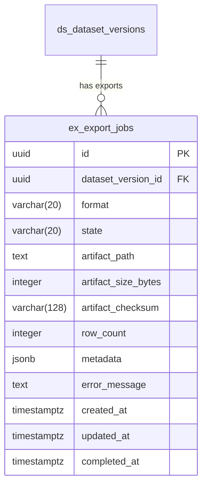

# Export Context — Serialization & Export Jobs

## Overview

Build the **Export** bounded context — the 5th context in Diamond's DDD architecture. It serializes released dataset versions into formats consumable by evaluation runners and CI systems (JSONL for MVP), tracks export jobs with a state machine, stores artifacts on the local filesystem, and auto-exports when a dataset version is released.

## Problem Statement / Motivation

Evaluation runners and CI pipelines need a stable, versioned, deterministic file artifact to score model outputs. Today, released dataset versions exist only as database records — there is no way to extract them as portable files. The Export context bridges this gap: given a released `DatasetVersion`, it assembles candidate + label data from cross-context ports, serializes it into a standard format with a metadata header, and stores the artifact for download.

## Proposed Solution

A standard DDD bounded context following the established checklist (`src/contexts/export/`), with:

- **ExportJob** aggregate root with state machine: `pending → processing → completed | failed`
- **JSONL serializer** (MVP format) with metadata header line
- **Local filesystem artifact store** (future: S3 via port swap)
- **Event-driven auto-export** on `dataset_version.released`
- **REST API** for manual trigger, status polling, listing, and download

## Technical Approach

### Architecture

```
┌─────────────────────────────────────────────────────────┐
│  API Layer (app/api/v1/exports/)                        │
│  POST /         — trigger export                        │
│  GET  /         — list exports (paginated)              │
│  GET  /:id      — get export status + artifact info     │
│  GET  /:id/download — stream artifact file              │
└──────────────────────┬──────────────────────────────────┘
                       │
┌──────────────────────▼──────────────────────────────────┐
│  Application Layer                                      │
│  ManageExports (use case)                               │
│  onDatasetVersionReleased (event handler)               │
└──────────┬───────────────────────┬──────────────────────┘
           │                       │
┌──────────▼──────────┐ ┌─────────▼──────────────────────┐
│  Domain Layer       │ │  Ports (Outbound)               │
│  ExportJob (AR)     │ │  ExportJobRepository            │
│  ExportFormat (VO)  │ │  DatasetVersionReader           │
│  ExportArtifact(VO) │ │  CandidateDataReader            │
│  errors.ts          │ │  LabelDataReader                │
│  events.ts          │ │  ArtifactStore                  │
└─────────────────────┘ │  FormatSerializer               │
                        └─────────────────────────────────┘
                                   │
┌──────────────────────────────────▼──────────────────────┐
│  Infrastructure Layer                                   │
│  DrizzleExportJobRepository                             │
│  DatasetContextAdapter (lazy import)                    │
│  CandidateContextAdapter (lazy import)                  │
│  LabelContextAdapter (lazy import)                      │
│  LocalFilesystemArtifactStore                           │
│  JsonlSerializer                                        │
└─────────────────────────────────────────────────────────┘
```

### Key Design Decisions

**1. Synchronous execution within the request (MVP)**

The `InProcessEventBus` is synchronous (`src/lib/events/InProcessEventBus.ts`). For MVP, both manual POST and auto-export run serialization inline. The POST returns the completed job (201) or a failed job (with error details). This avoids introducing a job queue.

**Known limitation:** Large datasets (10K+ candidates) may hit request timeouts. Acceptable for MVP — document as a known constraint with a future path to async via a job queue.

**2. JSONL only for MVP**

JSONL is the simplest format and the most common for eval runners. The `FormatSerializer` port allows adding CSV/Parquet later by implementing new serializers without changing the use case.

**3. Deduplication via unique constraint**

A database unique constraint on `(dataset_version_id, format)` for non-failed jobs prevents duplicate exports. The auto-export handler catches `DuplicateError` and returns early (idempotent). Manual POST also returns 409 if a completed export already exists.

**4. Local filesystem artifact store**

Artifacts stored under `.exports/{dataset_version_id}/{export_job_id}.{ext}`. Path is structured by version ID for easy browsing. The `ArtifactStore` port abstracts this for future S3 migration.

**5. Streaming download endpoint**

`GET /api/v1/exports/:id/download` streams the file with `Content-Type` and `Content-Disposition` headers. Separate from the status endpoint to keep concerns clean.

### Row Schema (JSONL)

Each export file has a **metadata header** (first line) followed by **data rows** (one per candidate):

```jsonl
{"_meta": {"version": "1.2.0", "suite_id": "...", "scenario_graph_version": "v3", "candidate_count": 150, "lineage_hash": "sha256:abc...", "exported_at": "2026-02-19T12:00:00Z", "format": "jsonl", "gate_results_summary": {"all_passed": true, "gates": 3}}}
{"candidate_id": "...", "episode_id": "...", "scenario_type_id": "...", "labels": [{"label_task_id": "...", "annotator_id": "...", "value": {...}}]}
{"candidate_id": "...", "episode_id": "...", "scenario_type_id": "...", "labels": [...]}
```

**Data per row** (assembled from cross-context ports):

- `candidate_id` — from DatasetVersion.candidateIds
- `episode_id` — from CandidateReader
- `scenario_type_id` — from CandidateReader
- `labels` — from LabelReader (label_task_id, annotator_id, value)

**Lineage hash**: SHA-256 of the `lineage` JSONB field, ensuring determinism verification.

### Implementation Phases

#### Phase 1: Database Schema + Domain Layer

**Files:**

- `src/db/schema/export.ts` — `ex_export_jobs` table
- `src/db/schema/index.ts` — add `export * from "./export"`
- `src/contexts/export/domain/entities/ExportJob.ts` — aggregate root with state machine
- `src/contexts/export/domain/value-objects/ExportFormat.ts` — format enum
- `src/contexts/export/domain/value-objects/ExportArtifact.ts` — artifact metadata interface
- `src/contexts/export/domain/errors.ts` — `ExportNotReleasedError`, `ExportAlreadyExistsError`
- `src/contexts/export/domain/events.ts` — typed events

**Schema (`ex_export_jobs`):**

```typescript
export const exExportJobs = pgTable(
  "ex_export_jobs",
  {
    id: uuid().primaryKey(),
    datasetVersionId: uuid("dataset_version_id").notNull(),
    format: varchar({ length: 20 }).notNull(),
    state: varchar({ length: 20 }).notNull().default("pending"),
    artifactPath: text("artifact_path"),
    artifactSizeBytes: integer("artifact_size_bytes"),
    artifactChecksum: varchar("artifact_checksum", { length: 128 }),
    rowCount: integer("row_count"),
    metadata: jsonb().notNull().default({}),
    errorMessage: text("error_message"),
    createdAt: timestamp("created_at", { withTimezone: true })
      .notNull()
      .defaultNow(),
    updatedAt: timestamp("updated_at", { withTimezone: true })
      .notNull()
      .defaultNow(),
    completedAt: timestamp("completed_at", { withTimezone: true }),
  },
  (t) => [
    unique("ex_export_jobs_version_format_uniq").on(
      t.datasetVersionId,
      t.format
    ),
    index("ex_export_jobs_dataset_version_id_idx").on(t.datasetVersionId),
    index("ex_export_jobs_state_idx").on(t.state),
  ]
);
```

**State machine:**

```
pending → processing → completed
                    → failed
```

No retry transition — failed exports require creating a new job (delete old + POST new).

**ExportJob aggregate root:**

```typescript
export const EXPORT_JOB_STATES = [
  "pending",
  "processing",
  "completed",
  "failed",
] as const;
export type ExportJobState = (typeof EXPORT_JOB_STATES)[number];

const VALID_TRANSITIONS: Record<ExportJobState, ExportJobState[]> = {
  pending: ["processing"],
  processing: ["completed", "failed"],
  completed: [],
  failed: [],
};
```

**Domain events:**

```typescript
// export.completed
{
  (export_job_id,
    dataset_version_id,
    format,
    artifact_path,
    row_count,
    checksum);
}

// export.failed
{
  (export_job_id, dataset_version_id, format, error_message);
}
```

#### Phase 2: Ports + Infrastructure

**Files:**

- `src/contexts/export/application/ports/ExportJobRepository.ts`
- `src/contexts/export/application/ports/DatasetVersionReader.ts`
- `src/contexts/export/application/ports/CandidateDataReader.ts`
- `src/contexts/export/application/ports/LabelDataReader.ts`
- `src/contexts/export/application/ports/ArtifactStore.ts`
- `src/contexts/export/application/ports/FormatSerializer.ts`
- `src/contexts/export/infrastructure/DrizzleExportJobRepository.ts`
- `src/contexts/export/infrastructure/DatasetContextAdapter.ts`
- `src/contexts/export/infrastructure/CandidateContextAdapter.ts`
- `src/contexts/export/infrastructure/LabelContextAdapter.ts`
- `src/contexts/export/infrastructure/LocalFilesystemArtifactStore.ts`
- `src/contexts/export/infrastructure/JsonlSerializer.ts`

**Port interfaces:**

```typescript
// DatasetVersionReader — what Export needs from Dataset
interface DatasetVersionExportView {
  id: UUID;
  suiteId: UUID;
  version: string;
  state: string;
  scenarioGraphVersion: string;
  candidateIds: string[];
  lineage: LineageData | null;
  gateResults: unknown[] | null;
  releasedAt: Date | null;
}

// CandidateDataReader — what Export needs from Candidate
interface CandidateExportView {
  id: UUID;
  episodeId: string;
  scenarioTypeId: string | null;
}

// LabelDataReader — what Export needs from Labeling
interface LabelExportView {
  labelTaskId: UUID;
  annotatorId: string;
  value: Record<string, unknown>;
}

// ArtifactStore
interface ArtifactStore {
  write(
    path: string,
    content: ReadableStream | Buffer
  ): Promise<{ sizeBytes: number }>;
  readStream(path: string): ReadableStream;
  exists(path: string): Promise<boolean>;
  delete(path: string): Promise<void>;
}

// FormatSerializer
interface FormatSerializer {
  format: ExportFormat;
  fileExtension: string;
  serialize(metadata: ExportMetadata, rows: ExportRow[]): Buffer;
}
```

**Cross-context adapters** follow the lazy import pattern:

```typescript
// DatasetContextAdapter
export class DatasetContextAdapter implements DatasetVersionReader {
  async getById(id: UUID): Promise<DatasetVersionExportView | null> {
    const { manageDatasetVersions } = await import("@/contexts/dataset");
    try {
      return await manageDatasetVersions.get(id);
    } catch {
      return null;
    }
  }
}
```

**JSONL Serializer:**

```typescript
export class JsonlSerializer implements FormatSerializer {
  format = "jsonl" as const;
  fileExtension = "jsonl";

  serialize(metadata: ExportMetadata, rows: ExportRow[]): Buffer {
    const lines = [
      JSON.stringify({ _meta: metadata }),
      ...rows.map((row) => JSON.stringify(row)),
    ];
    return Buffer.from(lines.join("\n") + "\n", "utf-8");
  }
}
```

#### Phase 3: Use Case + Composition Root

**Files:**

- `src/contexts/export/application/use-cases/ManageExports.ts`
- `src/contexts/export/index.ts`

**ManageExports use case methods:**

1. `create(input: { dataset_version_id, format })` — validate version is released, check dedup, create job, run serialization, store artifact, update job to completed
2. `get(id: UUID)` — return job data with artifact info
3. `list(filter, page, pageSize)` — paginated list with filters
4. `getArtifactStream(id: UUID)` — return readable stream for download

**Serialization flow inside `create()`:**

```
1. Validate dataset version exists and state === "released"
2. Check for existing non-failed export (same version + format) → throw DuplicateError
3. Create ExportJob aggregate (state: pending)
4. Persist job → repo.create()
5. Transition to processing → repo.updateState()
6. Read dataset version data via DatasetVersionReader
7. Read candidate data via CandidateDataReader (batch by candidateIds)
8. Read label data via LabelDataReader (batch by candidateIds)
9. Assemble rows: merge candidate + labels per candidate_id
10. Build metadata header (version, lineage hash, gate summary)
11. Serialize via FormatSerializer
12. Write artifact via ArtifactStore
13. Compute checksum (SHA-256 of artifact content)
14. Transition to completed, store artifact metadata
15. Publish domain events
16. Return job data
```

**Composition root (`index.ts`):**

```typescript
import { db } from "@/db";
// ... infrastructure imports

const exportJobRepo = new DrizzleExportJobRepository(db);
const datasetVersionReader = new DatasetContextAdapter();
const candidateDataReader = new CandidateContextAdapter();
const labelDataReader = new LabelContextAdapter();
const artifactStore = new LocalFilesystemArtifactStore();
const jsonlSerializer = new JsonlSerializer();

export const manageExports = new ManageExports(
  exportJobRepo,
  datasetVersionReader,
  candidateDataReader,
  labelDataReader,
  artifactStore,
  { jsonl: jsonlSerializer }
);
```

#### Phase 4: API Routes + Event Handler

**Files:**

- `app/api/v1/exports/route.ts` — POST + GET (list)
- `app/api/v1/exports/[id]/route.ts` — GET (by id)
- `app/api/v1/exports/[id]/download/route.ts` — GET (stream file)
- `src/contexts/export/application/handlers/onDatasetVersionReleased.ts`
- `src/lib/events/registry.ts` — add subscription

**POST /api/v1/exports:**

```typescript
const createSchema = z.object({
  dataset_version_id: z.string().uuid(),
  format: z.enum(EXPORT_FORMATS).default("jsonl"),
});

export const POST = withApiMiddleware(async (req: NextRequest) => {
  const input = await parseBody(req, createSchema);
  const result = await manageExports.create(input);
  return created(result);
});
```

**GET /api/v1/exports (list):**

```typescript
const listSchema = z.object({
  dataset_version_id: z.string().uuid().optional(),
  format: z.enum(EXPORT_FORMATS).optional(),
  state: z.enum(EXPORT_JOB_STATES).optional(),
  page: z.coerce.number().int().positive().default(1),
  page_size: z.coerce.number().int().positive().max(100).default(50),
});
```

**GET /api/v1/exports/:id:**

```typescript
export const GET = withApiMiddleware(async (_req, ctx) => {
  const { id } = await ctx.params;
  return ok(await manageExports.get(id as UUID));
});
```

**GET /api/v1/exports/:id/download:**

```typescript
export const GET = withApiMiddleware(async (_req, ctx) => {
  const { id } = await ctx.params;
  const { stream, filename, contentType } =
    await manageExports.getArtifactStream(id as UUID);
  return new Response(stream, {
    headers: {
      "Content-Type": contentType,
      "Content-Disposition": `attachment; filename="${filename}"`,
    },
  });
});
```

**Event handler (idempotent):**

```typescript
export async function onDatasetVersionReleased(
  event: DomainEvent
): Promise<void> {
  const { dataset_version_id } = event.payload as {
    dataset_version_id: string;
  };
  try {
    await manageExports.create({
      dataset_version_id: dataset_version_id as UUID,
      format: "jsonl",
    });
  } catch (error) {
    if (error instanceof DuplicateError) return; // already exported
    if (error instanceof NotFoundError) return; // version gone
    throw error;
  }
}
```

**Registry addition (`src/lib/events/registry.ts`):**

```typescript
import { onDatasetVersionReleased } from "@/contexts/export/application/handlers/onDatasetVersionReleased";
eventBus.subscribe("dataset_version.released", onDatasetVersionReleased);
```

## Acceptance Criteria

### Functional Requirements

- [ ] `POST /api/v1/exports` with `{ dataset_version_id, format: "jsonl" }` creates an export job, serializes the dataset version, stores the artifact, and returns 201 with job data
- [ ] `POST /api/v1/exports` returns 409 if a non-failed export already exists for the same version + format
- [ ] `POST /api/v1/exports` returns 422 if the dataset version is not in `released` state
- [ ] `POST /api/v1/exports` returns 404 if the dataset version does not exist
- [ ] `GET /api/v1/exports/:id` returns the export job with state, artifact path, size, checksum, and row count
- [ ] `GET /api/v1/exports` returns paginated list of export jobs with filters (dataset_version_id, format, state)
- [ ] `GET /api/v1/exports/:id/download` streams the artifact file with correct Content-Type and Content-Disposition headers
- [ ] `GET /api/v1/exports/:id/download` returns 404 if the export is not completed
- [ ] JSONL output has a metadata header line followed by one data row per candidate
- [ ] Metadata header includes: version, suite_id, scenario_graph_version, candidate_count, lineage_hash, exported_at, format, gate_results_summary
- [ ] Each data row includes: candidate_id, episode_id, scenario_type_id, labels array
- [ ] `dataset_version.released` event triggers auto-export in JSONL format
- [ ] Auto-export is idempotent — duplicate events do not create duplicate exports
- [ ] `export.completed` and `export.failed` domain events are emitted with correct payloads
- [ ] Same DatasetVersion + same format always produces identical output (determinism)

### Non-Functional Requirements

- [x] All cross-context imports use lazy `await import()` pattern
- [x] All API routes wrapped with `withApiMiddleware()`
- [x] Zod validation on all request bodies and query params
- [x] `pnpm lint` passes (ultracite)
- [x] `pnpm build` succeeds (strict TypeScript)
- [x] Database migration generates cleanly via `pnpm db:generate`

## ERD



## Dependencies & Risks

| Risk                                                                     | Mitigation                                                                         |
| ------------------------------------------------------------------------ | ---------------------------------------------------------------------------------- |
| Large datasets may exceed request timeout (sync execution)               | Document as MVP limitation; future: async job queue                                |
| LabelContextAdapter N+1 pattern causes slow exports                      | Reuse existing adapter pattern; optimize in follow-up if needed                    |
| Filesystem storage not suitable for multi-instance deployment            | ArtifactStore port abstracts storage; swap to S3 adapter later                     |
| Unique constraint on (version_id, format) blocks re-export after failure | Failed jobs exclude from constraint (partial unique index or delete-then-recreate) |

## Future Considerations

- **CSV / Parquet formats** — implement new `FormatSerializer` adapters
- **Async job processing** — introduce a job queue (BullMQ / pg-boss) for large exports
- **S3 artifact store** — implement `S3ArtifactStore` adapter, return pre-signed URLs
- **Full candidate content** — extend CandidateDataReader to include episode content (prompts, responses)
- **Slice-scoped exports** — export a specific slice of a dataset version
- **Export deletion** — `DELETE /api/v1/exports/:id` to clean up artifacts

## References

### Internal References

- Dataset context composition root: `src/contexts/dataset/index.ts`
- DatasetVersion entity: `src/contexts/dataset/domain/entities/DatasetVersion.ts`
- Dataset schema: `src/db/schema/dataset.ts`
- Lineage value object: `src/contexts/dataset/domain/value-objects/Lineage.ts`
- Event bus: `src/lib/events/InProcessEventBus.ts`
- Event registry: `src/lib/events/registry.ts`
- API middleware: `src/lib/api/middleware.ts`
- API response helpers: `src/lib/api/response.ts`
- Existing cross-context adapter example: `src/contexts/dataset/infrastructure/LabelContextAdapter.ts`

### Documented Learnings

- Bounded context checklist: `docs/solutions/integration-issues/bounded-context-ddd-implementation-patterns.md`
- Cross-context adapter patterns: `docs/solutions/integration-issues/dataset-context-versioned-suites-release-gates-patterns.md`
- State machine patterns: `docs/solutions/integration-issues/candidate-context-ddd-implementation-patterns.md`
- Infrastructure gotchas: `docs/solutions/integration-issues/nextjs16-infrastructure-scaffolding-gotchas.md`

### Implementation Checklist

1. Schema: `src/db/schema/export.ts` + update `src/db/schema/index.ts`
2. Domain: entities, errors, events, value objects under `src/contexts/export/domain/`
3. Ports: repository + cross-context reader interfaces under `application/ports/`
4. Infrastructure: Drizzle repository + adapters + artifact store + serializer under `infrastructure/`
5. Use cases: `ManageExports` under `application/use-cases/`
6. Composition root: `src/contexts/export/index.ts`
7. API routes: `app/api/v1/exports/` (POST, GET list, GET by id, GET download)
8. Event handler: `application/handlers/onDatasetVersionReleased.ts`
9. Register event: add subscription in `src/lib/events/registry.ts`
10. Verify: `pnpm lint` + `pnpm build` + `pnpm db:generate`
