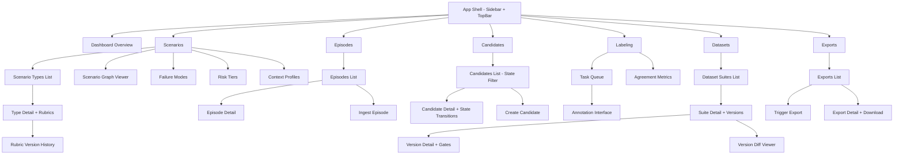

# feat: Build Frontend Dashboard & Application Screens

## Overview

Build the first version of the Diamond Engine frontend — a full application shell with screens for all 6 implemented bounded contexts. The backend (Phase 1) is complete with 35 API route files across Scenario, Candidate, Labeling, Dataset, Export, and Ingestion contexts. The frontend is currently greenfield: only a component showcase page exists with 13 shadcn/ui components and an amber/brutalist theme (radius 0, Geist Pixel Square, dark-mode default).

This milestone bootstraps the application chrome (sidebar, navigation, layout), a data fetching layer, and 7 functional screens that surface every Phase 1 API.

## Problem Statement / Motivation

All backend APIs are live but there is no way for users to interact with the platform beyond raw API calls. The frontend needs to provide:

- A dashboard overview of the platform's health and activity
- CRUD interfaces for every domain entity
- State machine visualizations and transition controls for Candidates and Dataset Versions
- An annotation workflow for labelers
- Export triggering and monitoring

## Proposed Solution

### Architecture

```
app/
├── layout.tsx                    # Root layout (providers, fonts, dark mode)
├── (dashboard)/
│   ├── layout.tsx                # App shell: sidebar + top bar + main area
│   ├── page.tsx                  # Dashboard overview
│   ├── scenarios/
│   │   ├── page.tsx              # Scenario types list
│   │   ├── [id]/page.tsx         # Scenario type detail + rubrics
│   │   ├── graph/page.tsx        # Scenario graph viewer
│   │   ├── failure-modes/page.tsx
│   │   ├── risk-tiers/page.tsx
│   │   └── context-profiles/page.tsx
│   ├── episodes/
│   │   ├── page.tsx              # Episodes list with filters
│   │   └── [id]/page.tsx         # Episode detail
│   ├── candidates/
│   │   ├── page.tsx              # Candidates list with state filter
│   │   └── [id]/page.tsx         # Candidate detail + state transitions
│   ├── labeling/
│   │   ├── page.tsx              # Label task queue
│   │   ├── [id]/page.tsx         # Annotation interface
│   │   └── metrics/page.tsx      # Agreement metrics dashboard
│   ├── datasets/
│   │   ├── page.tsx              # Dataset suites list
│   │   ├── [id]/page.tsx         # Suite detail + versions list
│   │   ├── versions/[id]/page.tsx # Version detail + release gates
│   │   └── diff/page.tsx         # Version diff viewer
│   └── exports/
│       ├── page.tsx              # Exports list + trigger
│       └── [id]/page.tsx         # Export detail + download
src/
├── lib/
│   └── api-client.ts             # Typed fetch wrapper for /api/v1/*
├── hooks/
│   ├── use-api.ts                # Generic data fetching hook (GET with SWR-like caching)
│   └── use-mutation.ts           # Generic mutation hook (POST/PUT/PATCH/DELETE)
└── components/
    ├── app-shell/
    │   ├── sidebar.tsx           # Collapsible sidebar with nav links
    │   ├── top-bar.tsx           # Search, notifications, user menu
    │   └── breadcrumbs.tsx       # Auto-generated breadcrumbs
    ├── data-table/
    │   ├── data-table.tsx        # Reusable table with sorting/filtering/pagination
    │   ├── column-header.tsx     # Sortable column header
    │   └── pagination.tsx        # Pagination controls
    ├── state-badge.tsx           # Color-coded state badges for state machines
    ├── empty-state.tsx           # Reusable empty state with icon + CTA
    ├── kpi-card.tsx              # Dashboard KPI card
    └── confirm-dialog.tsx        # Confirmation dialog for destructive actions
```

### Data Fetching Strategy

Use React 19 `use()` with Next.js 16 server components where possible. For interactive pages needing client-side mutations, use a thin `api-client.ts` wrapper around `fetch` with typed responses. No external data fetching library (SWR/React Query) — keep it minimal with native `fetch` + `use()` + `startTransition`.

### Navigation Structure

Sidebar sections matching bounded contexts:

1. **Overview** — Dashboard
2. **Scenarios** — Types, Graph, Failure Modes, Risk Tiers, Context Profiles, Rubrics
3. **Episodes** — List, Ingest
4. **Candidates** — List (filterable by state)
5. **Labeling** — Task Queue, Metrics
6. **Datasets** — Suites, Versions
7. **Exports** — List, Trigger

## Technical Considerations

- **Server Components by default**: All list/detail pages should be server components fetching data directly. Only add `"use client"` for interactive widgets (state transitions, forms, filters).
- **Pagination**: All list APIs support pagination — the data table must handle `page`, `pageSize`, and total count.
- **State machines**: Candidate (raw→scored→selected→labeled→validated→released) and DatasetVersion states need visual state badges and valid-transition-only action buttons.
- **Auth**: Bearer token is handled by `proxy.ts` — frontend pages behind `(dashboard)` layout can call API routes directly since they share the same origin.
- **Error boundaries**: Each page section should have error boundaries with retry affordances.
- **Empty states**: Every list page needs an empty state with a CTA to create the first item.
- **Optimistic updates**: State transitions should optimistically update the UI before server confirmation.
- **Additional shadcn components needed**: Table, Dialog, Sheet, Tabs, Tooltip, Progress, Skeleton, Toast, Breadcrumb, Sidebar (from shadcn)

## Acceptance Criteria

### Functional Requirements

- [ ] Application shell with sidebar navigation, top bar, and breadcrumbs
- [ ] Dashboard page with KPI cards, active datasets table, recent activity
- [ ] Scenario management: list, create, edit, delete scenario types + taxonomy entities
- [ ] Scenario graph viewer showing type hierarchy
- [ ] Rubric management with version history
- [ ] Episode list with source/status filtering and detail view
- [ ] Candidate list with state filter pills and detail view with state transition buttons
- [ ] Label task queue with assign/claim workflow
- [ ] Label submission interface with rubric-guided annotation
- [ ] Dataset suite CRUD and version management with state transitions
- [ ] Version diff viewer showing changes between two versions
- [ ] Export triggering with format selection and status monitoring
- [ ] Export download when complete

### Non-Functional Requirements

- [ ] All pages load in < 1s on localhost (server-rendered)
- [ ] Dark mode works correctly across all screens
- [ ] Consistent amber theme — no color leaks from default shadcn
- [ ] Responsive layout (sidebar collapses on mobile)
- [ ] TypeScript strict — no `any` types in frontend code
- [ ] All API responses typed end-to-end

### Quality Gates

- [ ] `pnpm lint` passes with zero errors
- [ ] `pnpm build` succeeds with no type errors
- [ ] Every list page has an empty state
- [ ] Every mutation has error handling with user feedback (toast)
- [ ] Every state transition shows confirmation dialog

## Success Metrics

- All 6 bounded context APIs are surfaced in the UI
- A user can complete the full workflow: ingest episode → manage scenarios → label candidates → assemble dataset → export
- No dead-end pages — every screen has clear navigation forward/backward

## Dependencies & Prerequisites

- Phase 1 backend APIs (complete — 68/69 issues done)
- Additional shadcn/ui components to install: table, dialog, sheet, tabs, tooltip, progress, skeleton, toast, breadcrumb, sidebar
- No external data fetching library needed

## Risk Analysis & Mitigation

| Risk                                       | Impact                  | Mitigation                                                           |
| ------------------------------------------ | ----------------------- | -------------------------------------------------------------------- |
| Large surface area (7 screens, ~20 routes) | Scope creep             | Epic-per-context with clear sub-issues; ship incrementally           |
| No existing data fetching pattern          | Tech debt if done wrong | Establish api-client.ts + hooks in Epic 0 before any screens         |
| State machine UIs complex                  | UX confusion            | Shared state-badge component + only show valid transitions           |
| Scenario graph visualization               | Complexity              | Start with simple tree/list view; defer interactive graph to Phase 2 |

## Epic & Issue Breakdown

### Epic 0: Application Shell & Infrastructure

> Foundation: layout, navigation, data fetching layer, shared components, backend pre-requisites

Sub-issues:

- [ ] Add `GET /api/v1/stats` aggregation endpoint (entity counts by state for dashboard KPIs)
- [ ] Add `GET /api/v1/me` endpoint (resolve current user from Bearer token for labeling workflow)
- [ ] Install additional shadcn/ui components (table, dialog, sheet, tabs, tooltip, progress, skeleton, toast, breadcrumb, sidebar)
- [ ] Create typed API client (`src/lib/api-client.ts`) with error handling and typed response envelope
- [ ] Create data fetching hooks (`use-api.ts`, `use-mutation.ts`) using React 19 `use()` + `startTransition`
- [ ] Build app shell layout: sidebar navigation + top bar + breadcrumbs (`app/(dashboard)/layout.tsx`)
- [ ] Create shared data table component with sorting, filtering, URL-persisted pagination
- [ ] Create shared components: state-badge, empty-state, kpi-card, confirm-dialog, json-viewer
- [ ] Update root layout metadata (title: "Diamond Engine", description)

### Epic 1: Dashboard Overview

> KPI cards, active datasets summary, recent activity, quick actions

Sub-issues:

- [ ] Build dashboard page with KPI cards (dataset count, episode count, pending reviews, recent exports)
- [ ] Add active datasets table showing latest suites with status badges
- [ ] Add quick actions panel (Create Scenario, Import Episodes, Trigger Export)
- [ ] Add recent activity feed (latest state transitions across contexts)

### Epic 2: Scenario Management Screens

> Full CRUD for scenario taxonomy + graph viewer + rubric management

Sub-issues:

- [ ] Build scenario types list page with create/edit/delete
- [ ] Build scenario type detail page with linked rubrics
- [ ] Build failure modes list page with CRUD
- [ ] Build risk tiers list page with CRUD
- [ ] Build context profiles list page with CRUD
- [ ] Build scenario graph viewer (tree/hierarchy view with version selector)
- [ ] Build rubric management page with version history and version detail view

### Epic 3: Episode & Ingestion Screens

> Episode list with filtering + detail view + ingest flow

Sub-issues:

- [ ] Build episodes list page with source/status filtering and pagination
- [ ] Build episode detail page showing full episode data + metadata
- [ ] Build episode ingestion form (manual ingest via POST /api/v1/episodes)

### Epic 4: Candidate Management Screens

> Candidate list with state machine + detail view + state transitions

Sub-issues:

- [ ] Build candidates list page with state filter pills and pagination
- [ ] Build candidate detail page showing episode data, scenario mapping, state history
- [ ] Implement state transition actions with confirmation dialogs (valid transitions only)
- [ ] Build manual candidate creation form

### Epic 5: Labeling Workflow Screens

> Task queue, annotation interface, agreement metrics

Sub-issues:

- [ ] Build label task queue page with status filtering (pending, assigned, submitted, finalized)
- [ ] Build annotation interface: task detail + rubric display + label submission form
- [ ] Implement task state transitions (assign, submit, finalize) with guards
- [ ] Build label history view for a task (all submitted labels)
- [ ] Build agreement metrics page (inter-annotator agreement, adjudication status)

### Epic 6: Dataset & Version Management Screens

> Suite CRUD, version management, release gates, diff viewer

Sub-issues:

- [ ] Build dataset suites list page with CRUD
- [ ] Build suite detail page with versions list and version creation
- [ ] Build version detail page with state machine, release gate status, slice breakdown
- [ ] Build version diff viewer (compare two versions side by side)
- [ ] Implement version state transitions (draft → sealed → released) with gate checks

### Epic 7: Export Management Screens

> Trigger exports, monitor progress, download artifacts

Sub-issues:

- [ ] Build exports list page showing all export jobs with status
- [ ] Build export trigger form (select dataset version, format, options)
- [ ] Build export detail page with progress status and download button
- [ ] Implement auto-refresh for in-progress exports

## ERD: Navigation & Page Structure



## SpecFlow Analysis — Key Gaps & Decisions

### Gaps to Address in Epic 0 (Pre-requisites)

1. **No dashboard aggregation endpoints** — Existing APIs only return paginated lists. Add a `GET /api/v1/stats` endpoint returning entity counts grouped by state, so the dashboard doesn't need 6+ API calls.

2. **No user identity endpoint** — Labeling workflow needs `annotator_id` and `assigned_to`. Add a `GET /api/v1/me` endpoint (or use a hardcoded test user for Phase 1.5). Auth is Bearer-token-based via `proxy.ts`.

3. **Scenario graph snapshot schema undocumented** — The `scScenarioGraphVersions.snapshot` JSONB shape is needed for graph visualization. **Decision**: Phase 1.5 uses a JSON tree viewer; defer interactive graph to Phase 2.

4. **Five label types need five different annotation UIs** — `discrete` (radio), `extractive` (text spans), `generative` (textarea), `rubric_scored` (scoring grid), `set_valued` (multi-select). Each is its own mini-app. **Decision**: Phase 1.5 implements `discrete` and `rubric_scored` (most common); others get a JSON fallback editor.

5. **Export polling strategy** — No WebSocket/SSE. **Decision**: 2-second polling for 30s, then manual refresh button.

### Gaps Addressed in Plan

- Empty states for all list pages (already in acceptance criteria)
- Breadcrumbs + cross-context navigation (in app shell epic)
- URL-persisted filter state using `searchParams`
- 409 Conflict handling for concurrent state transitions (show "entity was modified, refresh" toast)
- Paginated sub-lists for dataset version candidates (show summary + first 50)
- JSONB fields rendered as collapsible key-value trees

### Deferred to Phase 2+

- Interactive scenario graph visualization (Dagre/D3)
- Keyboard shortcuts for annotation
- Real-time collaborative labeling (WebSocket task queue updates)
- `extractive`, `generative`, `set_valued` label type rich UIs
- User management / role-based access control
- Global search / command palette
- Bulk state transitions for candidates

## References & Research

### Internal References

- Phase 1 Linear milestone: 68/69 issues done (GET-5 through GET-129)
- DDD patterns: `docs/solutions/integration-issues/bounded-context-ddd-implementation-patterns.md`
- Next.js 16 gotchas: `docs/solutions/integration-issues/nextjs16-infrastructure-scaffolding-gotchas.md`
- API route structure: `app/api/v1/` (35 route files)
- Theme showcase: `app/page.tsx` (current component kitchen sink)
- shadcn config: `components.json` (radix-lyra style, neutral base, RSC enabled)

### Existing shadcn Components (13 installed)

alert-dialog, badge, button, card, combobox, dropdown-menu, field, input, input-group, label, select, separator, textarea

### Components to Install

table, dialog, sheet, tabs, tooltip, progress, skeleton, toast, breadcrumb, sidebar
