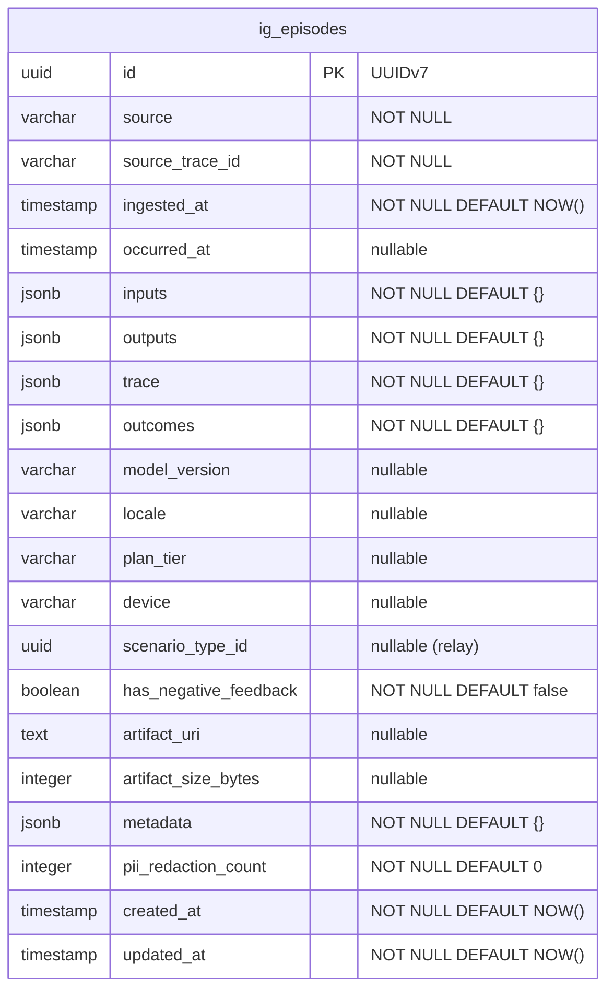

# Ingestion Context — Episode Intake & Storage

## Overview

Build the Ingestion bounded context — accept raw production episode data, normalize via Anti-Corruption Layer connectors, enforce PII redaction, store raw artifacts immutably, persist structured metadata in PostgreSQL, and emit `episode.ingested` events to trigger downstream candidate creation.

This is the 6th bounded context (after Scenario, Candidate, Labeling, Dataset, Export) and follows all established DDD/hexagonal patterns.

## Problem Statement

The Diamond pipeline requires a data ingestion layer that accepts episode data from external production systems, normalizes it into a canonical Episode schema, redacts PII before any storage, and makes episodes queryable for downstream processing. Without this context, no raw data enters the system.

## Design Decisions

### D1: Table Prefix — `ig_`

Following the 2-letter convention: sc*, cd*, lb*, ds*, ex* → `ig*` for ingestion.

### D2: Episode ID — UUIDv7 + Unique Constraint for Dedup

Rather than deterministic UUID v5 derivation (which breaks the project's UUIDv7 convention), use standard `generateId()` for the primary key and enforce dedup via a **unique index on `(source, source_trace_id)`** where `source_trace_id` is a string extracted from the trace object by the connector adapter. This keeps IDs consistent with all other entities while still preventing duplicate ingestion.

### D3: Duplicate Handling — Idempotent 200

When a duplicate `(source, source_trace_id)` is detected, return the existing episode with HTTP 200 (not 409). Do NOT re-emit the `episode.ingested` event. This matches the idempotent pattern used by `onEpisodeIngested` in the Candidate context.

### D4: PII Redaction Failure — Hard Reject

If `PIIRedactor.redact()` throws, reject the entire ingestion. Zero persistence occurs. Return 502 to the caller. The invariant "PII redaction before any persistence" is non-negotiable.

### D5: Artifact/DB Compensation

Write artifact first, then persist metadata. On DB failure, compensate by deleting the orphaned artifact via `ArtifactStore.delete()`. This leverages the existing `delete()` method on the port.

### D6: `scenario_type_id` — Optional Relay

The Episode domain model does not own `scenario_type_id`. It is accepted as an optional field in the ingestion request and relayed in the `episode.ingested` event payload for the Candidate context handler. Stored as a nullable column on the episodes table for traceability.

### D7: `has_negative_feedback` — Stored Boolean

Derived at ingestion time from the `outcomes` object (presence of negative feedback signals). Stored as an indexed boolean column for efficient filtering. Default: `false`.

### D8: Pagination — Offset-Based (Project Convention)

Despite GET-24 specifying cursor-based, **all 5 existing contexts use offset-based pagination** with the `paginated()` response helper. Use the same pattern for consistency. Max page size: 100 (not 200, matching existing endpoints).

### D9: Episode Entity — Plain Data Interface (No AggregateRoot Class)

Episodes have no state machine or domain invariants that require a class-based aggregate. Use a plain `EpisodeData` interface like the simpler entities. All business logic lives in the use case.

### D10: Body Size Limit — 10MB

Enforce via Zod `.refine()` on the serialized artifact size. The `ArtifactStore` already uses `Buffer`-based writes suitable for <10MB payloads.

## Technical Approach

### Architecture

```
src/contexts/ingestion/
  index.ts                                    # Composition root
  application/
    ports/
      ArtifactStore.ts                        # EXISTS
      EpisodeRepository.ts                    # GET-20
      PIIRedactor.ts                          # GET-21
    use-cases/
      ManageEpisodes.ts                       # GET-22, GET-23, GET-24, GET-25
  domain/
    entities/
      Episode.ts                              # GET-19
    value-objects/
      UserSegment.ts                          # GET-19
      EpisodeInput.ts                         # GET-19
    errors.ts                                 # GET-19
    events.ts                                 # GET-25
  infrastructure/
    LocalFilesystemArtifactStore.ts           # EXISTS
    DrizzleEpisodeRepository.ts               # GET-20
    RegexPIIRedactor.ts                       # GET-21
    connectors/
      ConnectorRegistry.ts                    # GET-26
      GenericJsonConnector.ts                 # GET-26
      types.ts                                # GET-26

src/db/schema/ingestion.ts                    # GET-20
app/api/v1/episodes/route.ts                  # GET-22, GET-24
app/api/v1/episodes/[id]/route.ts             # GET-23
```

### ERD



**Indexes:**

- `ig_episodes_source_trace_uniq` — UNIQUE on `(source, source_trace_id)`
- `ig_episodes_source_idx` — on `source`
- `ig_episodes_occurred_at_idx` — on `occurred_at`
- `ig_episodes_ingested_at_idx` — on `ingested_at`
- `ig_episodes_model_version_idx` — on `model_version`
- `ig_episodes_has_negative_feedback_idx` — on `has_negative_feedback`

**Design note:** `user_segment` fields (`locale`, `plan_tier`, `device`) are flattened into top-level columns rather than stored as a JSONB blob. This enables direct SQL filtering without JSON operators, matching GET-24's filter requirements.

## Implementation Phases

### Phase 1: Domain Model & Schema (GET-19 + GET-20)

**GET-19 — Domain Model**

Files:

- `src/contexts/ingestion/domain/entities/Episode.ts`
- `src/contexts/ingestion/domain/value-objects/UserSegment.ts`
- `src/contexts/ingestion/domain/value-objects/EpisodeInput.ts`
- `src/contexts/ingestion/domain/errors.ts`
- `src/contexts/ingestion/domain/events.ts`

```typescript
// src/contexts/ingestion/domain/entities/Episode.ts
export interface EpisodeData {
  id: UUID;
  source: string;
  sourceTraceId: string;
  ingestedAt: Date;
  occurredAt: Date | null;
  inputs: Record<string, unknown>;
  outputs: Record<string, unknown>;
  trace: Record<string, unknown>;
  outcomes: Record<string, unknown>;
  modelVersion: string | null;
  locale: string | null;
  planTier: string | null;
  device: string | null;
  scenarioTypeId: UUID | null;
  hasNegativeFeedback: boolean;
  artifactUri: string | null;
  artifactSizeBytes: number | null;
  metadata: Record<string, unknown>;
  piiRedactionCount: number;
  createdAt: Date;
  updatedAt: Date;
}
```

```typescript
// src/contexts/ingestion/domain/errors.ts
export class EpisodeNotFoundError extends NotFoundError { ... }
export class PIIRedactionFailedError extends DomainError { ... }
export class ConnectorNotFoundError extends DomainError { ... }
```

```typescript
// src/contexts/ingestion/domain/events.ts
export type EpisodeIngestedPayload = {
  episode_id: string;
  source: string;
  occurred_at: string | null;
  model_version: string | null;
  locale: string | null;
  plan_tier: string | null;
  device: string | null;
  has_negative_feedback: boolean;
  artifact_uri: string | null;
  scenario_type_id: string | null;
};
export type EpisodeIngestedEvent = TypedDomainEvent<
  "episode.ingested",
  EpisodeIngestedPayload
>;
```

**GET-20 — Database Schema & Repository**

Files:

- `src/db/schema/ingestion.ts`
- `src/db/schema/index.ts` (add export)
- `src/contexts/ingestion/application/ports/EpisodeRepository.ts`
- `src/contexts/ingestion/infrastructure/DrizzleEpisodeRepository.ts`

```typescript
// src/db/schema/ingestion.ts — ig_episodes table
// Columns match EpisodeData interface, with unique constraint on (source, source_trace_id)
// All indexes as specified in ERD section
```

```typescript
// src/contexts/ingestion/application/ports/EpisodeRepository.ts
export interface ListEpisodesFilter {
  source?: string;
  modelVersion?: string;
  occurredAfter?: Date;
  occurredBefore?: Date;
  hasNegativeFeedback?: boolean;
  locale?: string;
  planTier?: string;
  device?: string;
}

export interface ListEpisodesResult {
  data: EpisodeData[];
  total: number;
}

export interface EpisodeRepository {
  insert(
    data: Omit<EpisodeData, "createdAt" | "updatedAt">
  ): Promise<EpisodeData>;
  findById(id: UUID): Promise<EpisodeData | null>;
  findBySourceAndTraceId(
    source: string,
    sourceTraceId: string
  ): Promise<EpisodeData | null>;
  list(
    filter: ListEpisodesFilter,
    page: number,
    pageSize: number
  ): Promise<ListEpisodesResult>;
}
```

```typescript
// DrizzleEpisodeRepository implements the port:
// - insert: generates ID via generateId(), inserts row, returns with returning()
// - findById: select where id = $1
// - findBySourceAndTraceId: select where source = $1 AND source_trace_id = $2
// - list: two-query pattern (count + data), filter conditions built dynamically,
//         orderBy desc(igEpisodes.ingestedAt), offset-based pagination
//         Date range: gte(occurredAfter), lt(occurredBefore) — half-open interval
```

### Phase 2: PII Redaction (GET-21)

Files:

- `src/contexts/ingestion/application/ports/PIIRedactor.ts`
- `src/contexts/ingestion/infrastructure/RegexPIIRedactor.ts`

```typescript
// src/contexts/ingestion/application/ports/PIIRedactor.ts
export interface RedactionResult {
  redactedText: string;
  redactionCount: number;
}

export interface PIIRedactor {
  redact(text: string): RedactionResult;
}
```

```typescript
// src/contexts/ingestion/infrastructure/RegexPIIRedactor.ts
// Rule-based regex adapter with deterministic tokens:
// - Email: /\b[\w.-]+@[\w.-]+\.\w{2,}\b/g → [EMAIL_1], [EMAIL_2], ...
// - Phone: /\b\d{3}[-.]?\d{3}[-.]?\d{4}\b/g → [PHONE_1], ...
// - SSN: /\b\d{3}-\d{2}-\d{4}\b/g → [SSN_1], ...
// - Credit Card: /\b\d{4}[- ]?\d{4}[- ]?\d{4}[- ]?\d{4}\b/g → [CARD_1], ...
// - IP: /\b\d{1,3}\.\d{1,3}\.\d{1,3}\.\d{1,3}\b/g → [IP_1], ...
//
// The redact() method:
// 1. Deep-clone the input
// 2. Walk all string values in the object
// 3. Apply regex patterns sequentially with counter-based tokens
// 4. Return { redactedText, redactionCount }
//
// Note: The PIIRedactor operates on a JSON-serialized string of the episode data.
// The use case serializes inputs+outputs+trace+outcomes to JSON, redacts, then parses back.
```

### Phase 3: Ingest Endpoint + Event (GET-22 + GET-25)

Files:

- `src/contexts/ingestion/application/use-cases/ManageEpisodes.ts`
- `src/contexts/ingestion/index.ts`
- `app/api/v1/episodes/route.ts` (POST handler)
- `src/lib/events/registry.ts` (no new subscriptions — emitter only)

```typescript
// ManageEpisodes.ingest() orchestration:
//
// 1. Resolve connector from ConnectorRegistry by source
// 2. Normalize raw input via connector → canonical Episode fields
// 3. Extract sourceTraceId from normalized trace
// 4. Check dedup: repo.findBySourceAndTraceId(source, sourceTraceId)
//    → If exists, return existing episode (idempotent, no event)
// 5. PII redact: serialize inputs+outputs+trace+outcomes → JSON string
//    → piiRedactor.redact(jsonString) → { redactedText, redactionCount }
//    → Parse back to objects. On failure → throw PIIRedactionFailedError
// 6. Derive has_negative_feedback from outcomes
// 7. Store artifact: artifactStore.write(`episodes/${id}.json`, buffer)
// 8. Persist metadata: repo.insert(episodeData)
//    → On DB failure: artifactStore.delete(`episodes/${id}.json`) then re-throw
// 9. Emit episode.ingested event via eventBus.publish()
// 10. Return created episode
```

```typescript
// app/api/v1/episodes/route.ts — POST handler
const createSchema = z.object({
  source: z.string().min(1),
  occurred_at: z.string().datetime().optional(),
  inputs: z.record(z.string(), z.unknown()),
  outputs: z.record(z.string(), z.unknown()),
  trace: z.record(z.string(), z.unknown()).optional().default({}),
  outcomes: z.record(z.string(), z.unknown()).optional().default({}),
  user_segment: z
    .object({
      locale: z.string().optional(),
      plan_tier: z.string().optional(),
      device: z.string().optional(),
    })
    .optional()
    .default({}),
  model_version: z.string().optional(),
  scenario_type_id: z.string().uuid().optional(),
  metadata: z.record(z.string(), z.unknown()).optional().default({}),
});
// Wrapped with withApiMiddleware, returns created(result)
```

### Phase 4: Read Endpoints (GET-23 + GET-24)

Files:

- `app/api/v1/episodes/[id]/route.ts` (GET handler)
- `app/api/v1/episodes/route.ts` (GET handler — same file as POST)

```typescript
// GET /api/v1/episodes/:id
// → manageEpisodes.get(id) → EpisodeData | throw EpisodeNotFoundError
// → ok(episode)

// GET /api/v1/episodes
const listSchema = z.object({
  source: z.string().optional(),
  model_version: z.string().optional(),
  occurred_after: z.string().datetime().optional(),
  occurred_before: z.string().datetime().optional(),
  has_negative_feedback: z
    .enum(["true", "false"])
    .transform((v) => v === "true")
    .optional(),
  locale: z.string().optional(),
  plan_tier: z.string().optional(),
  device: z.string().optional(),
  page: z.coerce.number().int().positive().default(1),
  page_size: z.coerce.number().int().positive().max(100).default(50),
});
// → manageEpisodes.list(filter, page, pageSize)
// → paginated(data, total, page, pageSize)
```

### Phase 5: Anti-Corruption Layer (GET-26)

Files:

- `src/contexts/ingestion/infrastructure/connectors/types.ts`
- `src/contexts/ingestion/infrastructure/connectors/ConnectorRegistry.ts`
- `src/contexts/ingestion/infrastructure/connectors/GenericJsonConnector.ts`

```typescript
// src/contexts/ingestion/infrastructure/connectors/types.ts
export interface EpisodeConnector {
  readonly sourceType: string;
  normalize(rawPayload: Record<string, unknown>): NormalizedEpisode;
}

export interface NormalizedEpisode {
  sourceTraceId: string;
  occurredAt: Date | null;
  inputs: Record<string, unknown>;
  outputs: Record<string, unknown>;
  trace: Record<string, unknown>;
  outcomes: Record<string, unknown>;
  userSegment: { locale?: string; planTier?: string; device?: string };
  modelVersion: string | null;
  hasNegativeFeedback: boolean;
  metadata: Record<string, unknown>;
}
```

```typescript
// ConnectorRegistry — Map<string, EpisodeConnector>
// register(connector): void
// resolve(source: string): EpisodeConnector — throws ConnectorNotFoundError if unregistered
```

```typescript
// GenericJsonConnector — reference implementation
// sourceType: "generic_json"
// normalize(): maps the canonical field names directly (pass-through)
// Extracts sourceTraceId from trace.id or trace.conversation_id or falls back to a hash
// Derives hasNegativeFeedback from outcomes (checks for negative_feedback, thumbs_down, etc.)
```

### Phase 6: Wiring & Integration

Files:

- `src/contexts/ingestion/index.ts` (composition root)
- `src/db/schema/index.ts` (add ingestion export)
- `src/lib/api/middleware.ts` (add PIIRedactionFailedError → 502 mapping)

```typescript
// src/contexts/ingestion/index.ts
import { db } from "@/db";
import { ManageEpisodes } from "./application/use-cases/ManageEpisodes";
import { DrizzleEpisodeRepository } from "./infrastructure/DrizzleEpisodeRepository";
import { LocalFilesystemArtifactStore } from "./infrastructure/LocalFilesystemArtifactStore";
import { RegexPIIRedactor } from "./infrastructure/RegexPIIRedactor";
import { ConnectorRegistry } from "./infrastructure/connectors/ConnectorRegistry";
import { GenericJsonConnector } from "./infrastructure/connectors/GenericJsonConnector";

const episodeRepo = new DrizzleEpisodeRepository(db);
const artifactStore = new LocalFilesystemArtifactStore();
const piiRedactor = new RegexPIIRedactor();
const connectorRegistry = new ConnectorRegistry();
connectorRegistry.register(new GenericJsonConnector());

export const manageEpisodes = new ManageEpisodes(
  episodeRepo,
  artifactStore,
  piiRedactor,
  connectorRegistry
);
```

## Acceptance Criteria

### Functional Requirements

- [x] **GET-19**: `EpisodeData` interface with all fields, `UserSegment` value object, domain errors, typed events
- [x] **GET-20**: `ig_episodes` table with all columns and indexes, `EpisodeRepository` port, `DrizzleEpisodeRepository` with insert/findById/findBySourceAndTraceId/list
- [x] **GET-21**: `PIIRedactor` port, `RegexPIIRedactor` detecting email/phone/SSN/CC/IP with deterministic tokens, returning redaction count
- [x] **GET-22**: `POST /api/v1/episodes` — validates, normalizes via connector, redacts PII, stores artifact, persists metadata, emits event, returns 201. Dedup returns existing 200.
- [x] **GET-23**: `GET /api/v1/episodes/:id` — returns episode or 404
- [x] **GET-24**: `GET /api/v1/episodes` — filters by source, date range, model_version, has_negative_feedback, locale, plan_tier, device. Paginated (default 50, max 100).
- [x] **GET-25**: `episode.ingested` event emitted after successful persistence with full payload. Existing `onEpisodeIngested` handler in Candidate context continues to work.
- [x] **GET-26**: `ConnectorRegistry` with `GenericJsonConnector` reference implementation. Unknown source → `ConnectorNotFoundError` → 422.

### Non-Functional Requirements

- [x] All new domain errors mapped in `withApiMiddleware` (`PIIRedactionFailedError` → 502, `ConnectorNotFoundError` → 422)
- [x] Schema barrel file updated: `src/db/schema/index.ts` includes `export * from "./ingestion"`
- [x] `pnpm lint` passes (ultracite)
- [x] `pnpm build` succeeds (TypeScript strict)
- [x] Drizzle migration generated and applied: `pnpm db:generate && pnpm db:migrate`

## Implementation Order

```
GET-19 (domain model) ──┐
                        ├──> GET-22 (POST endpoint) ──> GET-25 (event emission)
GET-20 (schema + repo) ─┤
                        │
GET-21 (PII redactor) ──┘
                              GET-23 (GET :id) ──┐
                                                 ├──> Phase 6 (wiring + integration)
                              GET-24 (GET list) ─┘

GET-26 (ACL connectors) ─────────────────────────┘
```

**Recommended build order:**

1. GET-19 + GET-20 (parallel — domain model and schema/repo)
2. GET-21 (PII redactor — independent)
3. GET-26 (connectors — independent, but needed by GET-22)
4. GET-22 + GET-25 (ingest endpoint + event — depends on 1, 2, 3)
5. GET-23 + GET-24 (read endpoints — depends on 1)
6. Phase 6 wiring (composition root, middleware, schema barrel)

## References

### Internal

- Candidate context patterns: `src/contexts/candidate/` (closest analog for event-driven creation)
- Export context ArtifactStore pattern: `src/contexts/export/application/ports/ArtifactStore.ts`
- Existing ingestion ArtifactStore: `src/contexts/ingestion/application/ports/ArtifactStore.ts`
- Event registry: `src/lib/events/registry.ts`
- API middleware: `src/lib/api/middleware.ts`
- Bounded context DDD patterns: `docs/solutions/integration-issues/bounded-context-ddd-implementation-patterns.md`

### Institutional Learnings Applied

- Cross-context imports must use lazy `await import()` (from candidate-context-patterns doc)
- Event handlers must be idempotent — catch `DuplicateError` (from candidate-context-patterns doc)
- Zod v4: use `z.record(z.string(), z.unknown())` not `z.record(z.unknown())` (from scaffolding-gotchas doc)
- State as varchar not pgEnum (from candidate-context-patterns doc)
- Next.js 16 route params are Promises — must await (from scaffolding-gotchas doc)
- Empty barrel files need `export {}` (from scaffolding-gotchas doc)
