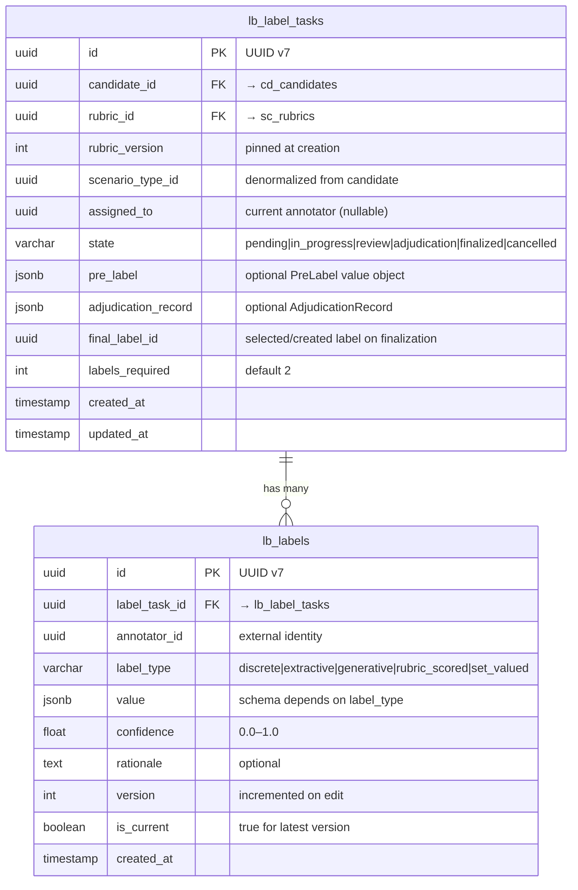

# Labeling Context — Annotation Workflow

## Overview

Build the **Labeling** bounded context — the 3rd context in the Diamond DDD architecture. It manages the annotation workflow from task creation through expert review, disagreement detection, and adjudication. This context orchestrates the core data-labeling pipeline: assigning candidates to annotators, collecting structured labels, measuring inter-annotator agreement, and producing finalized ground-truth labels.

The Labeling context consumes from Scenario (rubrics) and Candidate (candidate data) contexts via outbound ports, and emits events consumed by the Candidate context (`label_task.finalized` → transitions candidate to `labeled`).

## Problem Statement

Diamond needs a structured annotation workflow to produce high-quality labeled data. Without this context, there is no mechanism to:

- Assign candidates to annotators with pinned rubric versions
- Collect typed annotations (discrete, extractive, generative, rubric-scored, set-valued)
- Measure inter-annotator agreement and detect disagreements
- Resolve disagreements through adjudication
- Produce finalized labels that flow into the Dataset context

## Proposed Solution

Implement a full bounded context following the established DDD patterns from Candidate and Scenario contexts:

- **Aggregate Root**: `LabelTask` with a state machine (pending → in_progress → review → finalized/adjudication → finalized, plus cancelled)
- **Entity**: `Label` (append-only, versioned annotations)
- **Value Objects**: `PreLabel`, `AdjudicationRecord`
- **Sequential re-assignment model**: One annotator at a time, task re-assigned after each submission
- **Fixed 2-label minimum** before agreement evaluation
- **Denormalized `scenario_type_id`** on LabelTask for efficient filtering

## Technical Approach

### Architecture

```
src/contexts/labeling/
  index.ts                                    # Composition root
  domain/
    entities/
      LabelTask.ts                            # Aggregate root with state machine
      Label.ts                                # Data interface (append-only entity)
    value-objects/
      PreLabel.ts                             # Optional pre-computed suggestion
      AdjudicationRecord.ts                   # Disagreement resolution record
      LabelValue.ts                           # Discriminated union of 5 label type schemas
    events.ts                                 # TypedDomainEvent definitions
    errors.ts                                 # Context-specific DomainError subclasses
  application/
    ports/
      LabelTaskRepository.ts                  # Outbound: persistence
      LabelRepository.ts                      # Outbound: label persistence
      RubricReader.ts                         # Outbound: cross-context (Scenario)
      CandidateReader.ts                      # Outbound: cross-context (Candidate)
    use-cases/
      ManageLabelTasks.ts                     # Create, transition, list, get
      ManageLabels.ts                         # Submit, list
    handlers/
      (none in Phase 1 — Labeling emits events but does not consume external ones yet)
  infrastructure/
    DrizzleLabelTaskRepository.ts             # Implements LabelTaskRepository
    DrizzleLabelRepository.ts                 # Implements LabelRepository
    ScenarioContextAdapter.ts                 # Implements RubricReader (lazy import)
    CandidateContextAdapter.ts                # Implements CandidateReader (lazy import)

src/db/schema/labeling.ts                     # Tables: lb_label_tasks, lb_labels
app/api/v1/label-tasks/route.ts               # POST + GET (list)
app/api/v1/label-tasks/[id]/route.ts          # GET (single)
app/api/v1/label-tasks/[id]/state/route.ts    # PATCH (transition)
app/api/v1/labels/route.ts                    # POST + GET (list)
```

### ERD



### LabelTask State Machine

```
                    ┌──────────┐
                    │ pending  │──────────────────┐
                    └────┬─────┘                  │
                         │ assign                 │ cancel
                         ▼                        ▼
                    ┌──────────┐            ┌───────────┐
              ┌────▶│in_progress│───────────▶│ cancelled │
              │     └────┬─────┘            └───────────┘
              │          │ first label            ▲
              │          ▼                        │
              │     ┌──────────┐                  │
              │     │  review  │──────────────────┘
              │     └────┬─────┘
              │          │
              │    ┌─────┴──────┐
              │    │            │
              │    ▼            ▼
              │ ┌────────┐  ┌──────────────┐
              │ │finalized│  │ adjudication │──────┐
              │ └────────┘  └──────┬───────┘      │
              │                    │ resolve       │ cancel
              │                    ▼               ▼
              │              ┌────────┐      ┌───────────┐
              │              │finalized│      │ cancelled │
              │              └────────┘      └───────────┘
              │
              │  (re-assign for next annotator)
              └──── review loops back to in_progress
```

**Valid transitions:**

| From           | To             | Trigger                     |
| -------------- | -------------- | --------------------------- |
| `pending`      | `in_progress`  | Assign annotator            |
| `pending`      | `cancelled`    | Manual cancel               |
| `in_progress`  | `review`       | First label submitted       |
| `in_progress`  | `cancelled`    | Manual cancel               |
| `review`       | `in_progress`  | Re-assign to next annotator |
| `review`       | `finalized`    | Agreement ≥ threshold       |
| `review`       | `adjudication` | Agreement < threshold       |
| `review`       | `cancelled`    | Manual cancel               |
| `adjudication` | `finalized`    | Manual resolution           |
| `adjudication` | `cancelled`    | Manual cancel               |

### Label Value Schemas (per label_type)

```typescript
// src/contexts/labeling/domain/value-objects/LabelValue.ts

// discrete: single choice from a set
const discreteValueSchema = z.object({
  choice: z.string().min(1),
});

// extractive: text spans selected from source
const extractiveValueSchema = z.object({
  spans: z
    .array(
      z.object({
        start: z.number().int().nonneg(),
        end: z.number().int().positive(),
        text: z.string(),
      })
    )
    .min(1),
});

// generative: free-text annotation
const generativeValueSchema = z.object({
  text: z.string().min(1),
});

// rubric_scored: scored against rubric criteria
const rubricScoredValueSchema = z.object({
  scores: z
    .array(
      z.object({
        criterion_id: z.string(),
        criterion_name: z.string(),
        score: z.number().min(0).max(10),
        justification: z.string().optional(),
      })
    )
    .min(1),
});

// set_valued: multiple selections
const setValuedValueSchema = z.object({
  values: z.array(z.string().min(1)).min(1),
});

// Discriminated union used at validation time
const LABEL_VALUE_SCHEMAS = {
  discrete: discreteValueSchema,
  extractive: extractiveValueSchema,
  generative: generativeValueSchema,
  rubric_scored: rubricScoredValueSchema,
  set_valued: setValuedValueSchema,
} as const;
```

### AdjudicationRecord Value Object

```typescript
// src/contexts/labeling/domain/value-objects/AdjudicationRecord.ts
interface AdjudicationRecord {
  adjudicator_id: UUID;
  resolution_type: "selected_existing" | "submitted_new";
  selected_label_id?: UUID; // if selected_existing
  new_label_id?: UUID; // if submitted_new
  disagreement_metric: number; // the agreement score that triggered adjudication
  conflicting_label_ids: UUID[]; // labels that disagreed
  rationale: string;
  resolved_at: Date;
}
```

### Agreement Calculation Strategy

Fixed at 2 labels minimum. Agreement metric by label type:

| Label Type      | Metric                            | Threshold Default |
| --------------- | --------------------------------- | ----------------- |
| `discrete`      | Exact match (0 or 1)              | 1.0 (must agree)  |
| `extractive`    | Token-level F1 overlap            | 0.7               |
| `generative`    | Always requires adjudication      | N/A               |
| `rubric_scored` | Weighted mean absolute difference | 0.8 (normalized)  |
| `set_valued`    | Jaccard index                     | 0.7               |

Agreement threshold is stored as a constant in the Labeling context for Phase 1, with a TODO to make it configurable per scenario type in Phase 2.

### Final Label Selection (on finalization)

- **Agreement OK (no adjudication)**: Select the label with the highest `confidence` score. If tied, select the earliest submitted.
- **Adjudication resolved**: Use the label selected/created by the adjudicator (from `AdjudicationRecord`).

### Events

```typescript
// src/contexts/labeling/domain/events.ts

// Emitted when a new label task is created
type LabelTaskCreatedPayload = {
  label_task_id: string;
  candidate_id: string;
  rubric_id: string;
  rubric_version: number;
  scenario_type_id: string;
};
type LabelTaskCreatedEvent = TypedDomainEvent<
  "label_task.created",
  LabelTaskCreatedPayload
>;

// Emitted when an annotator submits a label
type LabelSubmittedPayload = {
  label_id: string;
  label_task_id: string;
  annotator_id: string;
  label_type: string;
};
type LabelSubmittedEvent = TypedDomainEvent<
  "label.submitted",
  LabelSubmittedPayload
>;

// Emitted when agreement check fails
type AdjudicationTriggeredPayload = {
  label_task_id: string;
  candidate_id: string;
  disagreement_metric: number;
  conflicting_label_ids: string[];
};
type AdjudicationTriggeredEvent = TypedDomainEvent<
  "adjudication.triggered",
  AdjudicationTriggeredPayload
>;

// Emitted when task reaches finalized state
// IMPORTANT: Already consumed by Candidate context (onLabelTaskFinalized handler)
type LabelTaskFinalizedPayload = {
  label_task_id: string;
  candidate_id: string;
  final_label_id: string;
  label_distribution: Record<string, number>; // value → count or score distribution
  agreement_score: number;
};
type LabelTaskFinalizedEvent = TypedDomainEvent<
  "label_task.finalized",
  LabelTaskFinalizedPayload
>;

// Emitted when task is cancelled
type LabelTaskCancelledPayload = {
  label_task_id: string;
  candidate_id: string;
  cancelled_from_state: string;
  reason?: string;
};
type LabelTaskCancelledEvent = TypedDomainEvent<
  "label_task.cancelled",
  LabelTaskCancelledPayload
>;
```

### Implementation Phases

#### Phase 1: Domain Foundation (GET-45, GET-46, GET-55)

**GET-45 — Define LabelTask and Label domain models**

Tasks:

- Create `src/contexts/labeling/domain/entities/LabelTask.ts`
  - `LabelTaskData` interface with all fields (id, candidate_id, rubric_id, rubric_version, scenario_type_id, assigned_to, state, pre_label, adjudication_record, final_label_id, labels_required, created_at, updated_at)
  - `LabelTask` class extending `AggregateRoot`
  - Private fields, getters, `toData()` method
- Create `src/contexts/labeling/domain/entities/Label.ts`
  - `LabelData` interface (id, label_task_id, annotator_id, label_type, value, confidence, rationale, version, is_current, created_at)
  - `CreateLabelInput` interface
  - Plain data interface (no class — Label has no state machine)
- Create `src/contexts/labeling/domain/value-objects/LabelValue.ts`
  - Zod schemas for all 5 label types (see above)
  - `LABEL_VALUE_SCHEMAS` map
  - `validateLabelValue(type, value)` helper
- Create `src/contexts/labeling/domain/value-objects/AdjudicationRecord.ts`
  - Interface definition
- Create `src/contexts/labeling/domain/value-objects/PreLabel.ts`
  - Interface definition (placeholder for Phase 2)
- Create `src/contexts/labeling/domain/events.ts`
  - All 5 event type definitions
- Create `src/contexts/labeling/domain/errors.ts`
  - `LabelTaskNotFoundError extends NotFoundError`
  - `LabelNotFoundError extends NotFoundError`
  - `InvalidLabelTypeError extends DomainError`
  - `AgreementCheckError extends DomainError`
  - `TaskNotAssignableError extends DomainError`

Acceptance criteria:

- [ ] LabelTask aggregate root with constructor, getters, toData()
- [ ] Label data interface with all fields
- [ ] All 5 label value Zod schemas validate correctly
- [ ] AdjudicationRecord and PreLabel value objects defined
- [ ] All event types defined with TypedDomainEvent
- [ ] Context-specific error classes created

**GET-46 — Implement LabelTask state machine**

Tasks:

- Add state constants and transition map to `LabelTask.ts`:
  ```typescript
  export const LABEL_TASK_STATES = [
    "pending",
    "in_progress",
    "review",
    "adjudication",
    "finalized",
    "cancelled",
  ] as const;
  export type LabelTaskState = (typeof LABEL_TASK_STATES)[number];
  ```
- Implement `VALID_TRANSITIONS` record (see table above)
- Implement `transitionTo(targetState, metadata?)` method on LabelTask:
  - Validates transition is allowed
  - Throws `InvalidStateTransitionError` if not
  - Updates state and updatedAt
  - Calls `this.addDomainEvent()` with appropriate event type
- Implement `assign(annotatorId)` convenience method:
  - Validates state is `pending` or `review` (re-assignment)
  - Sets assigned_to, transitions to `in_progress`
- Implement `cancel(reason?)` convenience method:
  - Validates state allows cancellation
  - Transitions to `cancelled`, emits `label_task.cancelled`

Acceptance criteria:

- [ ] All valid transitions succeed and emit correct events
- [ ] Invalid transitions throw `InvalidStateTransitionError`
- [ ] `assign()` works from both `pending` and `review` states
- [ ] `cancel()` works from `pending`, `in_progress`, `adjudication`
- [ ] State changes update `updatedAt`

**GET-55 — Implement RubricReader and CandidateReader outbound ports**

Tasks:

- Create `src/contexts/labeling/application/ports/RubricReader.ts`
  ```typescript
  export interface RubricReader {
    getByIdAndVersion(
      rubricId: UUID,
      version: number
    ): Promise<{ id: UUID; version: number; criteria: unknown } | null>;
    getLatestVersion(
      rubricId: UUID
    ): Promise<{ id: UUID; version: number } | null>;
  }
  ```
- Create `src/contexts/labeling/application/ports/CandidateReader.ts`
  ```typescript
  export interface CandidateReader {
    get(
      candidateId: UUID
    ): Promise<{ id: UUID; state: string; scenario_type_id: UUID } | null>;
    isInState(candidateId: UUID, state: string): Promise<boolean>;
  }
  ```
- Create `src/contexts/labeling/infrastructure/ScenarioContextAdapter.ts`
  - Implements `RubricReader` using lazy `await import("@/contexts/scenario")`
  - Wraps calls in try/catch, returns null on NotFoundError
- Create `src/contexts/labeling/infrastructure/CandidateContextAdapter.ts`
  - Implements `CandidateReader` using lazy `await import("@/contexts/candidate")`

Acceptance criteria:

- [ ] Port interfaces defined with clear return types
- [ ] Adapters use lazy dynamic imports (no top-level cross-context imports)
- [ ] Adapters handle NotFoundError gracefully (return null)

---

#### Phase 2: Schema & Repository (GET-47)

**GET-47 — Create LabelTask and Label database schema and repository**

Tasks:

- Create `src/db/schema/labeling.ts` with:
  - `lb_label_tasks` table (see ERD above)
  - `lb_labels` table (see ERD above)
  - Indexes: `lb_label_tasks_state_idx`, `lb_label_tasks_candidate_id_idx`, `lb_label_tasks_assigned_to_idx`, `lb_label_tasks_scenario_type_id_idx`, `lb_labels_label_task_id_idx`, `lb_labels_annotator_id_idx`
  - Unique constraint: `candidate_id` on `lb_label_tasks` (one task per candidate)
  - Relations defined via `relations()`
- Update `src/db/schema/index.ts` to export `"./labeling"`
- Create `src/contexts/labeling/application/ports/LabelTaskRepository.ts`
  ```typescript
  export interface LabelTaskRepository {
    insert(data: LabelTaskData): Promise<LabelTaskData>;
    findById(id: UUID): Promise<LabelTaskData | null>;
    updateState(
      id: UUID,
      state: LabelTaskState,
      updates: Partial<LabelTaskData>
    ): Promise<LabelTaskData>;
    list(
      filter: ListLabelTasksFilter,
      page: number,
      pageSize: number
    ): Promise<{ data: LabelTaskData[]; total: number }>;
  }
  ```
- Create `src/contexts/labeling/application/ports/LabelRepository.ts`
  ```typescript
  export interface LabelRepository {
    insert(data: LabelData): Promise<LabelData>;
    findById(id: UUID): Promise<LabelData | null>;
    listByTaskId(
      taskId: UUID,
      page: number,
      pageSize: number
    ): Promise<{ data: LabelData[]; total: number }>;
    countByTaskId(taskId: UUID): Promise<number>;
    getCurrentByTaskId(taskId: UUID): Promise<LabelData[]>;
  }
  ```
- Create `src/contexts/labeling/infrastructure/DrizzleLabelTaskRepository.ts`
  - Implements `LabelTaskRepository`
  - Filtering by: state, assigned_to, candidate_id, scenario_type_id
  - Pagination with page/pageSize pattern
- Create `src/contexts/labeling/infrastructure/DrizzleLabelRepository.ts`
  - Implements `LabelRepository`
  - `getCurrentByTaskId` filters by `is_current = true`
  - `insert` marks previous labels from same annotator+task as `is_current = false`
- Run `pnpm db:generate` to create migration

Acceptance criteria:

- [ ] Schema compiles and generates clean migration
- [ ] Unique constraint on candidate_id prevents duplicate tasks
- [ ] All repository methods work with proper filtering and pagination
- [ ] Label insert correctly handles version incrementing and is_current flag
- [ ] Schema barrel file updated

---

#### Phase 3: Core API Endpoints (GET-48, GET-49, GET-50, GET-51)

**GET-48 — POST /api/v1/label-tasks (create task)**

Tasks:

- Create `app/api/v1/label-tasks/route.ts` with POST handler
- Zod schema for request body:
  ```typescript
  const createLabelTaskSchema = z.object({
    candidate_id: z.string().uuid(),
    rubric_id: z.string().uuid(),
  });
  ```
- Create `ManageLabelTasks` use-case class in `src/contexts/labeling/application/use-cases/ManageLabelTasks.ts`
  - Constructor injects: `LabelTaskRepository`, `LabelRepository`, `RubricReader`, `CandidateReader`, `EventPublisher`
  - `create(input)` method:
    1. Validate candidate exists and is in `selected` state via CandidateReader
    2. Fetch latest rubric version via RubricReader
    3. Get candidate's scenario_type_id via CandidateReader
    4. Generate ID, create LabelTask in `pending` state
    5. Persist via repository
    6. Emit `label_task.created` event
- Create composition root `src/contexts/labeling/index.ts`
  - Wire repositories, adapters, use-cases
  - Export `manageLabelTasks` and `manageLabels`

Acceptance criteria:

- [ ] POST validates candidate is in `selected` state (returns 404/409 otherwise)
- [ ] POST pins rubric version at creation time
- [ ] POST denormalizes scenario_type_id from candidate
- [ ] Returns 201 with created task
- [ ] Emits `label_task.created` event
- [ ] Duplicate candidate_id returns 409 (unique constraint)

**GET-49 — PATCH /api/v1/label-tasks/:id/state (transition)**

Tasks:

- Create `app/api/v1/label-tasks/[id]/state/route.ts` with PATCH handler
- Zod schema:
  ```typescript
  const transitionSchema = z.object({
    state: z.enum(LABEL_TASK_STATES),
    assigned_to: z.string().uuid().optional(), // required for in_progress
    reason: z.string().optional(), // for cancellation
    adjudication_record: adjudicationRecordSchema.optional(), // for finalize from adjudication
  });
  ```
- `ManageLabelTasks.transition(id, targetState, metadata)` method:
  1. Fetch task from repository
  2. Reconstruct `LabelTask` aggregate
  3. Call appropriate method (assign, transitionTo, cancel)
  4. Persist state change
  5. Publish domain events
- Return 409 for invalid transitions

Acceptance criteria:

- [ ] Assign: requires `assigned_to`, validates pending or review state
- [ ] Cancel: accepts optional `reason`, works from allowed states
- [ ] Finalize from adjudication: requires `adjudication_record`
- [ ] Invalid transitions return 409 with `INVALID_STATE_TRANSITION` code
- [ ] All transitions emit appropriate events

**GET-50 — POST /api/v1/labels (submit label)**

Tasks:

- Create `app/api/v1/labels/route.ts` with POST handler
- Zod schema:
  ```typescript
  const submitLabelSchema = z.object({
    label_task_id: z.string().uuid(),
    annotator_id: z.string().uuid(),
    label_type: z.enum(LABEL_TYPES),
    value: z.unknown(), // validated dynamically based on label_type
    confidence: z.number().min(0).max(1),
    rationale: z.string().optional(),
  });
  ```
- Create `ManageLabels` use-case class in `src/contexts/labeling/application/use-cases/ManageLabels.ts`
  - `submit(input)` method:
    1. Fetch label task, validate state is `in_progress`
    2. Validate `value` against `LABEL_VALUE_SCHEMAS[label_type]`
    3. Check if annotator already has a label for this task → increment version, set previous `is_current = false`
    4. Insert new label with `is_current = true`
    5. If task is in `in_progress` → transition to `review`
    6. Emit `label.submitted` event
    7. Check if label count meets `labels_required` → trigger agreement check

Acceptance criteria:

- [ ] Validates label value against type-specific schema
- [ ] Rejects submission if task not in `in_progress` state
- [ ] Handles label versioning (same annotator re-submitting)
- [ ] Transitions task to `review` on first label
- [ ] Emits `label.submitted` event
- [ ] Returns 201 with created label

**GET-51 — GET endpoints for label-tasks and labels**

Tasks:

- Add GET handler to `app/api/v1/label-tasks/route.ts` (list)
  - Query params: state, assigned_to, candidate_id, scenario_type_id, page, page_size
  - Uses `paginated()` response helper
- Create `app/api/v1/label-tasks/[id]/route.ts` (single)
  - Returns task with current labels included
- Add GET handler to `app/api/v1/labels/route.ts` (list)
  - Required: `label_task_id` query param
  - Optional: `include_history=true` for all versions (default: current only)
  - Uses `paginated()` response helper

Acceptance criteria:

- [ ] List label-tasks supports all 4 filters + pagination
- [ ] Get single label-task includes current labels in response
- [ ] List labels requires label_task_id, defaults to current versions only
- [ ] All endpoints use cursor-based pagination via page/page_size

---

#### Phase 4: Advanced Workflow (GET-52, GET-54)

**GET-52 — Implement adjudication workflow**

Tasks:

- Add agreement checking to `ManageLabels.submit()` (after label count meets threshold):
  1. Get all current labels for the task
  2. Determine agreement metric based on `label_type`
  3. Compute agreement score
  4. If agreement ≥ threshold:
     - Select final label (highest confidence)
     - Transition task to `finalized`
     - Set `final_label_id` on task
  5. If agreement < threshold:
     - Transition task to `adjudication`
     - Emit `adjudication.triggered` event with metric and conflicting label IDs
- Add `ManageLabelTasks.resolveAdjudication(id, record)` method:
  1. Validate task is in `adjudication` state
  2. Store `AdjudicationRecord` on task
  3. If `resolution_type === "selected_existing"`: set `final_label_id` from record
  4. If `resolution_type === "submitted_new"`: create new label, set as final
  5. Transition to `finalized`
- Implement agreement functions in a separate module:
  - `src/contexts/labeling/domain/agreement.ts`
  - `computeAgreement(labels: LabelData[], labelType: LabelType): number`
  - One function per label type

Acceptance criteria:

- [ ] Agreement checked automatically after 2nd label submission
- [ ] Correct metric used per label type
- [ ] Task auto-transitions to `finalized` when agreement is sufficient
- [ ] Task auto-transitions to `adjudication` when agreement is insufficient
- [ ] Manual adjudication resolution works via PATCH /state endpoint
- [ ] Generative labels always trigger adjudication

**GET-54 — Implement label_task.finalized event emission**

Tasks:

- Ensure `label_task.finalized` event is emitted on every path to `finalized`:
  1. Direct finalization (agreement OK after label submission)
  2. Adjudication resolution
- Event payload must include:
  - `label_task_id`, `candidate_id`, `final_label_id`
  - `label_distribution`: computed from all current labels
  - `agreement_score`: the computed agreement metric
- Verify compatibility with existing `onLabelTaskFinalized` handler in Candidate context:
  - Handler at `src/contexts/candidate/application/handlers/onLabelTaskFinalized.ts`
  - Expects `{ candidate_id }` in payload
  - Transitions candidate to `labeled` state
- Register any new event subscriptions in `src/lib/events/registry.ts`

Acceptance criteria:

- [ ] Event emitted on both finalization paths
- [ ] Payload matches schema consumed by Candidate context
- [ ] `label_distribution` accurately reflects all current labels
- [ ] Candidate context handler successfully transitions candidate to `labeled`

---

## Alternative Approaches Considered

### Multi-annotator assignment model

- **Separate assignments table**: More flexible (parallel assignment) but adds complexity. Deferred — sequential re-assignment is sufficient for 2-annotator workflows.
- **One task per annotator**: Would simplify the state machine but makes agreement calculation cross-task, breaking the aggregate boundary.

### Agreement threshold configuration

- **Per scenario type (in Scenario context)**: Would require schema migration in another context. Deferred to Phase 2.
- **Per rubric**: Tightly couples labeling config to rubric authoring. Rejected.

### Label versioning

- **New ID per version**: Simpler queries but loses version lineage. Rejected in favor of `is_current` flag with same-ID versioning for clearer audit trail.

## Acceptance Criteria

### Functional Requirements

- [ ] Full CRUD for label tasks (create, get, list with filters)
- [ ] State machine enforces all valid/invalid transitions
- [ ] Label submission validates value against type-specific schema
- [ ] Agreement calculation runs after required labels are submitted
- [ ] Adjudication workflow triggers on disagreement
- [ ] Manual adjudication resolution works
- [ ] Events emitted at each workflow step
- [ ] Candidate context transitions to `labeled` on task finalization
- [ ] Cancelled state accessible from appropriate states

### Non-Functional Requirements

- [ ] All endpoints wrapped with `withApiMiddleware`
- [ ] Zod validation on all request bodies and query params
- [ ] Pagination on all list endpoints
- [ ] Cross-context reads use lazy dynamic imports
- [ ] No circular import between contexts
- [ ] Labels are append-only (no UPDATE/DELETE on lb_labels)

### Quality Gates

- [ ] `pnpm lint` passes
- [ ] `pnpm build` succeeds
- [ ] `pnpm db:generate` produces clean migration
- [ ] All API endpoints return correct error codes (404, 409, 422)

## Dependencies & Prerequisites

- **Candidate context** must be implemented (GET-45 depends on CandidateReader)
- **Scenario context** must have rubric version support (RubricReader needs it)
- **Event registry** already has `label_task.finalized` subscription — event payload must match

## Risk Analysis & Mitigation

| Risk                                                     | Impact                       | Mitigation                                                                                                                |
| -------------------------------------------------------- | ---------------------------- | ------------------------------------------------------------------------------------------------------------------------- |
| Concurrent label submissions race on state transition    | Data inconsistency           | Phase 1: single-threaded Node.js + sync event bus makes this unlikely. Phase 2: add optimistic locking via version column |
| Agreement metric inadequate for some label types         | Poor adjudication triggering | Start with simple metrics, make them swappable per-type                                                                   |
| Cross-context adapter failures (Scenario/Candidate down) | Task creation blocked        | Adapters return null, use-case throws clear errors                                                                        |
| Label value schemas too rigid                            | Blocks new annotation types  | Schemas are in a single file, easy to extend                                                                              |

## Future Considerations

- **PreLabel integration** (Phase 2): LLM-generated suggestions attached to tasks
- **Configurable agreement thresholds** per scenario type
- **Annotator management**: CRUD for annotator profiles, expertise tracking
- **Batch task creation**: Event-driven from selection_run.completed
- **Optimistic locking**: Version column on lb_label_tasks for concurrency safety
- **Label distribution analytics**: Richer distribution objects per label type

## References & Research

### Internal References

- Candidate context (template): `src/contexts/candidate/`
- Candidate state machine: `src/contexts/candidate/domain/entities/Candidate.ts:5-22`
- Event registry: `src/lib/events/registry.ts`
- Existing onLabelTaskFinalized handler: `src/contexts/candidate/application/handlers/onLabelTaskFinalized.ts`
- Domain building blocks: `src/lib/domain/`
- API middleware: `src/lib/api/middleware.ts`
- Shared IDs: `src/shared/ids.ts`

### Institutional Learnings

- `docs/solutions/integration-issues/candidate-context-ddd-implementation-patterns.md` — state machine pattern, cross-context adapters, idempotent handlers
- `docs/solutions/integration-issues/bounded-context-ddd-implementation-patterns.md` — directory structure, request flow, Drizzle patterns
- `docs/solutions/integration-issues/nextjs16-infrastructure-scaffolding-gotchas.md` — Zod v4, Next.js 16 conventions

### Linear Issues

- Epic: [GET-9](https://linear.app/getbasalt/issue/GET-9)
- Sub-tasks: GET-45, GET-46, GET-47, GET-48, GET-49, GET-50, GET-51, GET-52, GET-54, GET-55
