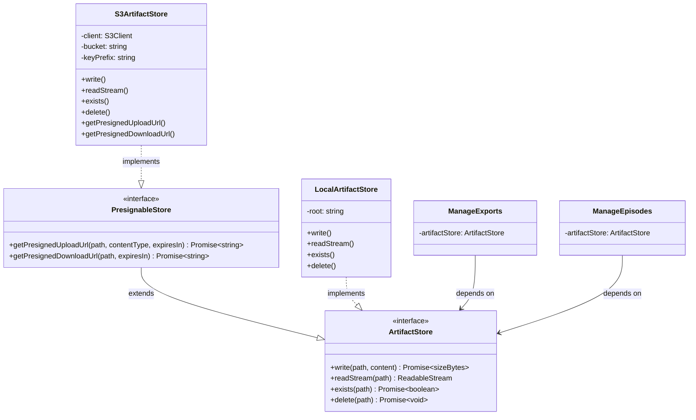

# Configure S3-compatible object store adapter

## Overview

Implement a shared `ArtifactStore` port in `src/lib/storage/` with two adapters: an S3-compatible adapter (for production) and a local filesystem adapter (for development). Both the Export and Ingestion contexts currently have identical, duplicated `ArtifactStore` port definitions and `LocalFilesystemArtifactStore` implementations. This task unifies them into shared infrastructure, adds the S3 adapter with presigned URL support via a separate `PresignableStore` interface, and wires adapter selection implicitly based on environment variables.

## Problem Statement

The Export and Ingestion bounded contexts both define an identical `ArtifactStore` port and duplicate `LocalFilesystemArtifactStore` implementations. The local filesystem adapter is dev-only and unsuitable for production. The project needs cloud object storage (S3-compatible) for durability, scalability, and direct client uploads/downloads via presigned URLs.

**Current state:**

- `src/contexts/export/application/ports/ArtifactStore.ts` — 6-line interface
- `src/contexts/ingestion/application/ports/ArtifactStore.ts` — identical 6-line interface
- `src/contexts/export/infrastructure/LocalFilesystemArtifactStore.ts` — writes to `.exports/`
- `src/contexts/ingestion/infrastructure/LocalFilesystemArtifactStore.ts` — writes to `.ingestion/`
- `src/lib/storage/` — empty directory, reserved for this task

**Problems:**

1. Duplicated port and adapter code across two contexts
2. Local filesystem is not suitable for production (no durability, no horizontal scaling)
3. No presigned URL support for direct client uploads/downloads
4. Inconsistent error handling (ingestion wraps `readStream` in try/catch, export does not)

## Proposed Solution

### Architecture

Unify the `ArtifactStore` port into `src/lib/storage/` as shared infrastructure (mirroring `src/lib/events/`). Provide two adapters and a factory function:

```
src/lib/storage/
  ArtifactStore.ts          # Unified port interface (write/readStream/exists/delete)
  PresignableStore.ts       # Presigned URL interface (extends ArtifactStore)
  LocalArtifactStore.ts     # Local filesystem adapter (dev)
  S3ArtifactStore.ts        # S3-compatible adapter (prod) — implements both interfaces
  createArtifactStore.ts    # Factory: implicit detection from env vars
  index.ts                  # Barrel export
```

Each context's `index.ts` wires the shared adapter with a context-specific key prefix:

```typescript
// src/contexts/export/index.ts
import { createArtifactStore } from "@/lib/storage";
const artifactStore = createArtifactStore({ keyPrefix: "exports" });
```

```typescript
// src/contexts/ingestion/index.ts
import { createArtifactStore } from "@/lib/storage";
const artifactStore = createArtifactStore({ keyPrefix: "ingestion" });
```

### Adapter Selection (Implicit)

If `S3_ENDPOINT` and `S3_BUCKET` environment variables are set, use `S3ArtifactStore`. Otherwise, fall back to `LocalArtifactStore`. Zero config for local dev.

## Technical Approach

### Port Interfaces

**`ArtifactStore`** — core storage operations (unchanged from current shape):

```typescript
// src/lib/storage/ArtifactStore.ts
export interface ArtifactStore {
  write(path: string, content: Buffer): Promise<{ sizeBytes: number }>;
  readStream(path: string): ReadableStream;
  exists(path: string): Promise<boolean>;
  delete(path: string): Promise<void>;
}
```

**`PresignableStore`** — extends `ArtifactStore` with presigned URL generation:

```typescript
// src/lib/storage/PresignableStore.ts
import type { ArtifactStore } from "./ArtifactStore";

export interface PresignableStore extends ArtifactStore {
  getPresignedUploadUrl(
    path: string,
    contentType: string,
    expiresInSeconds?: number
  ): Promise<string>;
  getPresignedDownloadUrl(
    path: string,
    expiresInSeconds?: number
  ): Promise<string>;
}
```

### S3 Adapter Implementation

**Package:** `@aws-sdk/client-s3` + `@aws-sdk/s3-request-presigner`

```typescript
// src/lib/storage/S3ArtifactStore.ts
import {
  S3Client,
  PutObjectCommand,
  GetObjectCommand,
  HeadObjectCommand,
  DeleteObjectCommand,
  NoSuchKey,
  NotFound,
} from "@aws-sdk/client-s3";
import { getSignedUrl } from "@aws-sdk/s3-request-presigner";
import type { PresignableStore } from "./PresignableStore";

export class S3ArtifactStore implements PresignableStore {
  private readonly client: S3Client;
  private readonly bucket: string;
  private readonly keyPrefix: string;

  constructor(config: {
    endpoint: string;
    region: string;
    accessKeyId: string;
    secretAccessKey: string;
    bucket: string;
    keyPrefix?: string;
    forcePathStyle?: boolean;
  }) {
    this.client = new S3Client({
      endpoint: config.endpoint,
      region: config.region,
      forcePathStyle: config.forcePathStyle ?? true,
      credentials: {
        accessKeyId: config.accessKeyId,
        secretAccessKey: config.secretAccessKey,
      },
      // Required for Cloudflare R2 compat with SDK >= v3.729.0
      requestChecksumCalculation: "WHEN_REQUIRED",
      responseChecksumValidation: "WHEN_REQUIRED",
    });
    this.bucket = config.bucket;
    this.keyPrefix = config.keyPrefix ?? "";
  }

  private fullKey(path: string): string {
    return this.keyPrefix ? `${this.keyPrefix}/${path}` : path;
  }

  async write(path: string, content: Buffer): Promise<{ sizeBytes: number }> {
    const key = this.fullKey(path);
    await this.client.send(
      new PutObjectCommand({
        Bucket: this.bucket,
        Key: key,
        Body: content,
        ContentLength: content.byteLength,
      })
    );
    return { sizeBytes: content.byteLength };
  }

  readStream(path: string): ReadableStream {
    const key = this.fullKey(path);
    // Return a ReadableStream that lazily fetches from S3 on pull
    const client = this.client;
    const bucket = this.bucket;
    return new ReadableStream({
      async start(controller) {
        try {
          const response = await client.send(
            new GetObjectCommand({ Bucket: bucket, Key: key })
          );
          if (!response.Body) {
            controller.close();
            return;
          }
          const webStream = response.Body.transformToWebStream();
          const reader = webStream.getReader();
          while (true) {
            const { done, value } = await reader.read();
            if (done) break;
            controller.enqueue(value);
          }
          controller.close();
        } catch (error) {
          controller.error(error);
        }
      },
    });
  }

  async exists(path: string): Promise<boolean> {
    try {
      await this.client.send(
        new HeadObjectCommand({
          Bucket: this.bucket,
          Key: this.fullKey(path),
        })
      );
      return true;
    } catch (error) {
      if (error instanceof NotFound) return false;
      throw error;
    }
  }

  async delete(path: string): Promise<void> {
    await this.client.send(
      new DeleteObjectCommand({
        Bucket: this.bucket,
        Key: this.fullKey(path),
      })
    );
    // DeleteObject is idempotent — succeeds even if key doesn't exist
  }

  async getPresignedUploadUrl(
    path: string,
    contentType: string,
    expiresInSeconds = 900
  ): Promise<string> {
    return getSignedUrl(
      this.client,
      new PutObjectCommand({
        Bucket: this.bucket,
        Key: this.fullKey(path),
        ContentType: contentType,
      }),
      {
        expiresIn: expiresInSeconds,
        signableHeaders: new Set(["content-type"]),
      }
    );
  }

  async getPresignedDownloadUrl(
    path: string,
    expiresInSeconds = 3600
  ): Promise<string> {
    return getSignedUrl(
      this.client,
      new GetObjectCommand({
        Bucket: this.bucket,
        Key: this.fullKey(path),
      }),
      { expiresIn: expiresInSeconds }
    );
  }
}
```

### Local Filesystem Adapter

Unified from the two existing implementations, with consistent error handling (try/catch in readStream):

```typescript
// src/lib/storage/LocalArtifactStore.ts
import { existsSync } from "node:fs";
import { mkdir, readFile, rm, stat, writeFile } from "node:fs/promises";
import { dirname, join } from "node:path";
import type { ArtifactStore } from "./ArtifactStore";

const LOCAL_ROOT = join(process.cwd(), ".artifacts");

export class LocalArtifactStore implements ArtifactStore {
  private readonly root: string;

  constructor(keyPrefix?: string) {
    this.root = keyPrefix ? join(LOCAL_ROOT, keyPrefix) : LOCAL_ROOT;
  }

  async write(path: string, content: Buffer): Promise<{ sizeBytes: number }> {
    const fullPath = join(this.root, path);
    await mkdir(dirname(fullPath), { recursive: true });
    await writeFile(fullPath, content);
    const stats = await stat(fullPath);
    return { sizeBytes: stats.size };
  }

  readStream(path: string): ReadableStream {
    const fullPath = join(this.root, path);
    return new ReadableStream({
      async start(controller) {
        try {
          const data = await readFile(fullPath);
          controller.enqueue(data);
          controller.close();
        } catch (error) {
          controller.error(error);
        }
      },
    });
  }

  async exists(path: string): Promise<boolean> {
    return existsSync(join(this.root, path));
  }

  async delete(path: string): Promise<void> {
    await rm(join(this.root, path), { force: true });
  }
}
```

**Note:** The unified local adapter writes to `.artifacts/{prefix}/` instead of `.exports/` and `.ingestion/` separately. The `.gitignore` will be updated to ignore `.artifacts/`.

### Factory Function

```typescript
// src/lib/storage/createArtifactStore.ts
import type { ArtifactStore } from "./ArtifactStore";
import { LocalArtifactStore } from "./LocalArtifactStore";
import { S3ArtifactStore } from "./S3ArtifactStore";

export function createArtifactStore(opts?: {
  keyPrefix?: string;
}): ArtifactStore {
  const endpoint = process.env.S3_ENDPOINT;
  const bucket = process.env.S3_BUCKET;

  if (endpoint && bucket) {
    return new S3ArtifactStore({
      endpoint,
      bucket,
      region: process.env.S3_REGION ?? "us-east-1",
      accessKeyId: process.env.S3_ACCESS_KEY_ID ?? "",
      secretAccessKey: process.env.S3_SECRET_ACCESS_KEY ?? "",
      forcePathStyle: process.env.S3_FORCE_PATH_STYLE !== "false",
      keyPrefix: opts?.keyPrefix,
    });
  }

  return new LocalArtifactStore(opts?.keyPrefix);
}
```

### Environment Variables

Add to `src/config/env.ts` as an optional S3 config block:

```typescript
const envSchema = z.object({
  DATABASE_URL: z.string().min(1),
  NEXT_PUBLIC_SUPABASE_URL: z.string().min(1),
  NEXT_PUBLIC_SUPABASE_ANON_KEY: z.string().min(1),
  SUPABASE_SERVICE_ROLE_KEY: z.string().min(1),
  API_KEYS: z
    .string()
    .min(1)
    .transform((s) => s.split(",")),
  // S3-compatible object storage (optional — falls back to local filesystem)
  S3_ENDPOINT: z.string().optional(),
  S3_BUCKET: z.string().optional(),
  S3_REGION: z.string().optional(),
  S3_ACCESS_KEY_ID: z.string().optional(),
  S3_SECRET_ACCESS_KEY: z.string().optional(),
  S3_FORCE_PATH_STYLE: z.string().optional(),
});
```

Add to `.env.example`:

```bash
# S3-compatible object storage (optional — omit for local filesystem)
# S3_ENDPOINT=http://localhost:9000
# S3_BUCKET=diamond-artifacts
# S3_REGION=us-east-1
# S3_ACCESS_KEY_ID=minioadmin
# S3_SECRET_ACCESS_KEY=minioadmin
# S3_FORCE_PATH_STYLE=true
```

### Context Wiring Updates

**Export context** (`src/contexts/export/index.ts`):

```typescript
import { createArtifactStore } from "@/lib/storage";
// ... other imports (remove LocalFilesystemArtifactStore import)

const artifactStore = createArtifactStore({ keyPrefix: "exports" });
// ... rest unchanged
```

**Ingestion context** (`src/contexts/ingestion/index.ts`):

```typescript
import { createArtifactStore } from "@/lib/storage";
// ... other imports (remove LocalFilesystemArtifactStore import)

const artifactStore = createArtifactStore({ keyPrefix: "ingestion" });
// ... rest unchanged
```

Both contexts' `application/ports/ArtifactStore.ts` files will be updated to re-export from `@/lib/storage/ArtifactStore` to avoid breaking internal imports:

```typescript
// src/contexts/export/application/ports/ArtifactStore.ts
export type { ArtifactStore } from "@/lib/storage/ArtifactStore";
```

## Implementation Phases

### Phase 1: Shared Port + Local Adapter (Foundation)

**Goal:** Unify the duplicated code without changing behavior.

- [x] Create `src/lib/storage/ArtifactStore.ts` — shared port interface
- [x] Create `src/lib/storage/PresignableStore.ts` — presigned URL interface
- [x] Create `src/lib/storage/LocalArtifactStore.ts` — unified local adapter (from both existing impls, with consistent try/catch in readStream)
- [x] Create `src/lib/storage/createArtifactStore.ts` — factory function
- [x] Create `src/lib/storage/index.ts` — barrel export
- [x] Update `src/contexts/export/application/ports/ArtifactStore.ts` — re-export from shared
- [x] Update `src/contexts/ingestion/application/ports/ArtifactStore.ts` — re-export from shared
- [x] Update `src/contexts/export/index.ts` — use `createArtifactStore({ keyPrefix: "exports" })`
- [x] Update `src/contexts/ingestion/index.ts` — use `createArtifactStore({ keyPrefix: "ingestion" })`
- [x] Delete `src/contexts/export/infrastructure/LocalFilesystemArtifactStore.ts`
- [x] Delete `src/contexts/ingestion/infrastructure/LocalFilesystemArtifactStore.ts`
- [x] Update `.gitignore` — add `/.artifacts` (replaces `/.exports` + `/.ingestion`)
- [x] Verify: `pnpm lint` passes, existing behavior unchanged

**Success criteria:** Both contexts use the shared local adapter. No functional change. Lint passes.

### Phase 2: S3 Adapter + Environment Config

**Goal:** Add the S3 adapter and environment variable configuration.

- [x] `pnpm add @aws-sdk/client-s3 @aws-sdk/s3-request-presigner`
- [x] Create `src/lib/storage/S3ArtifactStore.ts` — implements `PresignableStore`
- [x] Update `src/lib/storage/createArtifactStore.ts` — add S3 branch (implicit detection)
- [x] Update `src/config/env.ts` — add optional S3 env vars
- [x] Update `.env.example` — add commented S3 vars with MinIO defaults
- [x] Update `src/lib/storage/index.ts` — export S3 adapter and PresignableStore
- [x] Verify: `pnpm lint` passes, app starts without S3 vars (falls back to local)

**Success criteria:** With S3 env vars set (e.g., pointing to MinIO), both contexts write/read artifacts to S3. Without env vars, local filesystem works as before.

### Phase 3: Presigned URL Utility (Polish)

**Goal:** Expose a helper to check if the current store supports presigned URLs.

- [x] Create `src/lib/storage/isPresignable.ts` — type guard:

  ```typescript
  import type { ArtifactStore } from "./ArtifactStore";
  import type { PresignableStore } from "./PresignableStore";

  export function isPresignable(
    store: ArtifactStore
  ): store is PresignableStore {
    return (
      "getPresignedUploadUrl" in store && "getPresignedDownloadUrl" in store
    );
  }
  ```

- [x] Export from barrel
- [x] Verify: `pnpm lint` passes

**Success criteria:** Consumers can check `isPresignable(store)` before calling presigned URL methods. API routes that need presigned URLs can import and use this guard.

## Alternative Approaches Considered

### 1. Keep per-context ports (rejected)

Each context keeps its own `ArtifactStore` port with separate S3 adapter instances. Rejected because:

- The two ports are character-for-character identical
- The ingestion plan explicitly anticipated unification at this point
- Maintaining two identical adapters violates DRY without adding DDD value

### 2. Add presigned URLs to ArtifactStore (rejected)

Extend the core interface with `getPresignedUploadUrl?` and `getPresignedDownloadUrl?`. Rejected because:

- Optional methods break Liskov Substitution — callers can't trust the interface
- Local filesystem can't meaningfully implement presigned URLs
- A separate `PresignableStore` interface is cleaner and type-safe

### 3. Explicit `ARTIFACT_STORE_DRIVER` env var (rejected)

Use an explicit env var like `ARTIFACT_STORE_DRIVER=s3|local` to select the adapter. Rejected because:

- Adds one more thing to configure
- Implicit detection (if S3 vars exist → use S3) is simpler and sufficient
- No foreseeable need for a third adapter type

### 4. Supabase Storage instead of raw S3 (rejected)

Use `@supabase/supabase-js` Storage API which the project already has. Rejected because:

- The ticket explicitly asks for S3-compatible adapter (provider-agnostic)
- Supabase Storage API is higher-level and less flexible
- Raw S3 works with MinIO (local), R2, Backblaze, AWS, etc.

## Acceptance Criteria

### Functional Requirements

- [ ] `ArtifactStore` port interface defined in `src/lib/storage/ArtifactStore.ts`
- [ ] `PresignableStore` interface defined in `src/lib/storage/PresignableStore.ts`
- [ ] `LocalArtifactStore` implements `ArtifactStore` — write, readStream, exists, delete
- [ ] `S3ArtifactStore` implements `PresignableStore` — all core methods + presigned URLs
- [ ] `createArtifactStore()` returns local adapter when S3 vars missing
- [ ] `createArtifactStore()` returns S3 adapter when `S3_ENDPOINT` + `S3_BUCKET` are set
- [ ] `keyPrefix` option correctly namespaces paths per context
- [ ] Export context uses shared adapter with `exports` prefix
- [ ] Ingestion context uses shared adapter with `ingestion` prefix
- [ ] Presigned upload URLs enforce content-type via `signableHeaders`
- [ ] Presigned download URLs default to 1-hour expiration
- [ ] Presigned upload URLs default to 15-minute expiration

### Non-Functional Requirements

- [ ] S3 adapter works with any S3-compatible provider (AWS, MinIO, R2)
- [ ] `forcePathStyle: true` by default for non-AWS provider compatibility
- [ ] Checksum calculation set to `WHEN_REQUIRED` for R2 compatibility
- [ ] `readStream` consistently handles errors via `controller.error()`
- [ ] `delete` is idempotent (no error on missing key)
- [ ] No breaking changes to existing Export/Ingestion use case code

### Quality Gates

- [ ] `pnpm lint` passes (ultracite check)
- [ ] App starts and works without any S3 env vars (local fallback)
- [ ] TypeScript strict mode — no type errors
- [ ] No unused imports or dead code from the old per-context adapters

## Dependencies & Prerequisites

**New packages:**

- `@aws-sdk/client-s3` — S3 client (CRUD operations)
- `@aws-sdk/s3-request-presigner` — presigned URL generation

**Existing infrastructure:**

- `src/lib/storage/` directory (exists, empty)
- Export context ArtifactStore port + LocalFilesystemArtifactStore
- Ingestion context ArtifactStore port + LocalFilesystemArtifactStore
- `src/config/env.ts` Zod schema

**Blocked by:** GET-129 (Implement ArtifactStore outbound port) — already implemented in both contexts, so this blocker is effectively resolved.

## Risk Analysis & Mitigation

| Risk                                              | Likelihood | Impact | Mitigation                                                                                                    |
| ------------------------------------------------- | ---------- | ------ | ------------------------------------------------------------------------------------------------------------- |
| Breaking existing Export/Ingestion behavior       | Low        | High   | Re-export ports from contexts to maintain import paths. Factory returns identical local adapter shape.        |
| S3 SDK bundle size bloating client bundle         | Medium     | Medium | S3 is server-only code. Next.js tree-shaking handles this. If needed, add to `serverExternalPackages`.        |
| Local dev confusion (`.exports/` → `.artifacts/`) | Low        | Low    | Update `.gitignore`. Old dirs can be manually deleted.                                                        |
| S3 connection failures in production              | Medium     | High   | AWS SDK has built-in retry (3 attempts, exponential backoff). Errors propagate to API middleware 500 handler. |
| Presigned URL security (leaked URLs)              | Low        | Medium | Short TTLs (15min upload, 1hr download). Content-type enforcement on uploads.                                 |

## Future Considerations

Items explicitly **out of scope** for this ticket but worth tracking:

1. **Presigned URL API endpoints** — Separate ticket to add `POST /api/v1/artifacts/upload-url` and `GET /api/v1/artifacts/{path}/download-url` routes
2. **Upload confirmation flow** — When clients upload directly via presigned URL, server needs a callback/confirmation endpoint to verify and record metadata
3. **Multipart uploads** — The current `write(path, Buffer)` signature loads the entire artifact into memory. For very large exports (>100MB), a streaming write or multipart upload API would be needed
4. **Artifact lifecycle/cleanup** — S3 lifecycle rules or a scheduled job to garbage-collect orphaned artifacts
5. **Migration of existing local artifacts** — Not needed (local artifacts are dev-only data)
6. **Contract tests** — Shared test suite that both adapters pass to verify behavioral equivalence
7. **Observability** — Structured logging of storage operation durations and error rates

## References & Research

### Internal References

- Export ArtifactStore port: `src/contexts/export/application/ports/ArtifactStore.ts`
- Ingestion ArtifactStore port: `src/contexts/ingestion/application/ports/ArtifactStore.ts`
- Export LocalFilesystemArtifactStore: `src/contexts/export/infrastructure/LocalFilesystemArtifactStore.ts`
- Ingestion LocalFilesystemArtifactStore: `src/contexts/ingestion/infrastructure/LocalFilesystemArtifactStore.ts`
- Export composition root: `src/contexts/export/index.ts:15`
- Ingestion composition root: `src/contexts/ingestion/index.ts:11`
- Env config: `src/config/env.ts`
- Shared event bus pattern (analogous): `src/lib/events/InProcessEventBus.ts`
- Ingestion plan (anticipated this task): `docs/plans/2026-02-19-feat-ingestion-artifact-store-outbound-port-plan.md`

### External References

- [AWS SDK v3 S3 Client](https://docs.aws.amazon.com/AWSJavaScriptSDK/v3/latest/client/s3/)
- [AWS SDK v3 S3 Presigner](https://github.com/aws/aws-sdk-js-v3/blob/main/packages/s3-request-presigner/README.md)
- [Cloudflare R2 — SDK v3 Config](https://developers.cloudflare.com/r2/examples/aws/aws-sdk-js-v3/)
- [SDK v3.729.0 checksum compat issue](https://community.cloudflare.com/t/aws-sdk-client-s3-v3-729-0-breaks-uploadpart-and-putobject-r2-s3-api-compatibility/758637)
- [HeadObject throws NotFound (not NoSuchKey)](https://docs.aws.amazon.com/AWSJavaScriptSDK/v3/latest/Package/-aws-sdk-client-s3/Class/NotFound/)

### ERD — Storage Module Relationships



### File Change Summary

| Action | File                                                                       |
| ------ | -------------------------------------------------------------------------- |
| Create | `src/lib/storage/ArtifactStore.ts`                                         |
| Create | `src/lib/storage/PresignableStore.ts`                                      |
| Create | `src/lib/storage/LocalArtifactStore.ts`                                    |
| Create | `src/lib/storage/S3ArtifactStore.ts`                                       |
| Create | `src/lib/storage/createArtifactStore.ts`                                   |
| Create | `src/lib/storage/isPresignable.ts`                                         |
| Create | `src/lib/storage/index.ts`                                                 |
| Modify | `src/contexts/export/application/ports/ArtifactStore.ts` (re-export)       |
| Modify | `src/contexts/ingestion/application/ports/ArtifactStore.ts` (re-export)    |
| Modify | `src/contexts/export/index.ts` (use shared factory)                        |
| Modify | `src/contexts/ingestion/index.ts` (use shared factory)                     |
| Delete | `src/contexts/export/infrastructure/LocalFilesystemArtifactStore.ts`       |
| Delete | `src/contexts/ingestion/infrastructure/LocalFilesystemArtifactStore.ts`    |
| Modify | `src/config/env.ts` (add optional S3 vars)                                 |
| Modify | `.env.example` (add S3 vars)                                               |
| Modify | `.gitignore` (add `.artifacts`, keep `.exports` + `.ingestion`)            |
| Modify | `package.json` (add `@aws-sdk/client-s3`, `@aws-sdk/s3-request-presigner`) |
