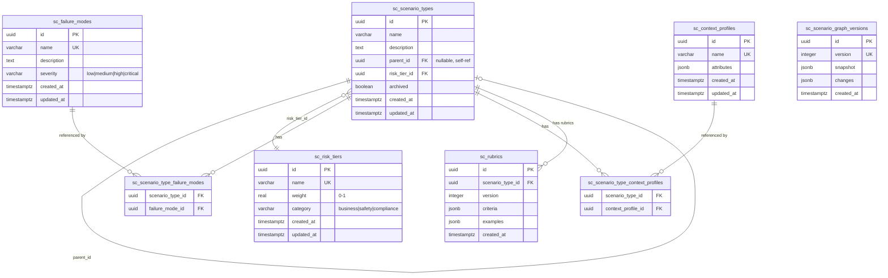

# feat: Scenario Context — Taxonomy & Graph Versioning

## Overview

Build the complete Scenario bounded context — the first bounded context in Diamond 2.0. This establishes the canonical hexagonal architecture pattern that all subsequent contexts will follow.

The Scenario context owns the evaluation taxonomy: **ScenarioType**, **FailureMode**, **RiskTier**, **ContextProfile**, **Rubric** (versioned), and the **ScenarioGraph** (immutable versioned snapshots). Every mutation to the taxonomy produces a new graph version, giving downstream consumers (Candidate, Labeling, Dataset) a stable, pinnable view of the taxonomy at any point in time.

## Problem Statement / Motivation

Diamond needs a structured taxonomy of what matters before it can score, select, or label anything. The Scenario context is the foundation that all other contexts depend on:

- **Candidate** reads the scenario graph to map episodes to ScenarioTypes and fetch risk weights for scoring
- **Labeling** reads rubric definitions (pinned at task assignment time) to know how to evaluate candidates
- **Dataset** reads the graph for coverage computation and lineage tracking

Without this, no other Phase 1 work can proceed.

## Design Decisions

Based on SpecFlow analysis, the following decisions resolve ambiguities in the PRD:

| Decision                                    | Choice                                                                                    | Rationale                                                                    |
| ------------------------------------------- | ----------------------------------------------------------------------------------------- | ---------------------------------------------------------------------------- |
| **Deletion of referenced entities**         | Reject with 409 if referenced                                                             | Safest default. No cascading surprises.                                      |
| **ScenarioType deletion (Phase 1)**         | Soft-delete only (archived flag)                                                          | Hard deletion has cascading cross-context effects. Defer to Phase 2.         |
| **ScenarioType tree structure**             | Forest (multiple roots)                                                                   | Each root = independent top-level category. More flexible.                   |
| **Cycle detection**                         | Validate on every parent_id mutation                                                      | Walk up tree from proposed parent; reject if current node is ancestor.       |
| **Concurrency control**                     | Optimistic locking via version counter on ScenarioGraph                                   | Reject if `expected_version != current_version`.                             |
| **Graph version format**                    | Monotonic integer (stored as integer)                                                     | Simple, orderable, unambiguous.                                              |
| **Graph snapshot contents**                 | Full denormalized snapshot (includes resolved shared entity data)                         | Historical accuracy — renaming a FailureMode doesn't rewrite history.        |
| **Shared entity mutations → graph version** | Yes, changes to FailureModes/RiskTiers/ContextProfiles create new graph versions          | Their semantics affect the graph even though ScenarioType rows don't change. |
| **Rubric inheritance**                      | Walk up tree to root, use first Rubric found. Override = stop traversal. No merging.      | Simple, predictable. Phase 2 can add merging if needed.                      |
| **Multiple rubric_ids**                     | Each Rubric evaluates a different aspect. Labeling context chooses based on label type.   | Matches the PRD's multiple label types (discrete, rubric_scored, etc.).      |
| **Name uniqueness**                         | Global unique for FailureMode, RiskTier, ContextProfile. Sibling-unique for ScenarioType. | Prevents taxonomy ambiguity.                                                 |
| **Batch mutations**                         | Deferred to post-Phase 1                                                                  | Accept overhead during initial bootstrap.                                    |
| **Max tree depth**                          | No hard limit. Document expectation of 3–5 levels.                                        | Practical guidance without artificial constraints.                           |
| **Graph version pruning**                   | Retain all versions indefinitely                                                          | Storage is cheap. Address if it becomes a problem.                           |

## Technical Approach

### Architecture — Canonical Context Pattern

This is the first bounded context, so it establishes the directory layout for all future contexts:

```
src/contexts/scenario/
  domain/
    entities/
      ScenarioType.ts        # Aggregate root
      FailureMode.ts          # Shared reference entity
      RiskTier.ts             # Shared reference entity
      ContextProfile.ts       # Shared reference entity
      Rubric.ts               # Versioned entity
      ScenarioGraph.ts        # Aggregate root (versioning)
    errors.ts                 # Context-specific domain errors
    events.ts                 # Typed domain event definitions
  application/
    use-cases/
      ManageScenarioTypes.ts  # Create, update, archive, list, get
      ManageFailureModes.ts   # CRUD
      ManageRiskTiers.ts      # CRUD
      ManageContextProfiles.ts # CRUD
      ManageRubrics.ts        # Create version, get by version, list
      ReadScenarioGraph.ts    # Get current, get by version, list versions
    ports/
      ScenarioRepository.ts   # Outbound port interface
      RubricRepository.ts     # Outbound port interface
      GraphRepository.ts      # Outbound port interface
  infrastructure/
    DrizzleScenarioRepository.ts
    DrizzleRubricRepository.ts
    DrizzleGraphRepository.ts
  index.ts                    # Public API barrel (what other contexts can import)
```

**Request flow:**

```
HTTP → proxy.ts (Bearer auth)
  → app/api/v1/<resource>/route.ts (thin adapter)
  → withApiMiddleware(handler)
  → Zod validation (parseBody/parseQuery)
  → Use Case (application layer)
  → Domain entities (business rules, events)
  → Repository (Drizzle adapter, persists, publishes events)
```

### Database Schema

New file: `src/db/schema/scenario.ts`, re-exported from `src/db/schema/index.ts`.

All tables prefixed with `sc_`, all in `public` PG schema.

```
sc_scenario_types
  id              UUID PK (v7)
  name            VARCHAR(255) NOT NULL
  description     TEXT NOT NULL DEFAULT ''
  parent_id       UUID NULL → sc_scenario_types(id)
  risk_tier_id    UUID NOT NULL → sc_risk_tiers(id)
  archived        BOOLEAN NOT NULL DEFAULT false
  created_at      TIMESTAMPTZ NOT NULL DEFAULT now()
  updated_at      TIMESTAMPTZ NOT NULL DEFAULT now()
  UNIQUE(parent_id, name)  -- sibling uniqueness (NULL parent = root level)

sc_failure_modes
  id              UUID PK (v7)
  name            VARCHAR(255) NOT NULL UNIQUE
  description     TEXT NOT NULL DEFAULT ''
  severity        VARCHAR(20) NOT NULL CHECK (severity IN ('low','medium','high','critical'))
  created_at      TIMESTAMPTZ NOT NULL DEFAULT now()
  updated_at      TIMESTAMPTZ NOT NULL DEFAULT now()

sc_risk_tiers
  id              UUID PK (v7)
  name            VARCHAR(255) NOT NULL UNIQUE
  weight          REAL NOT NULL CHECK (weight > 0 AND weight <= 1)
  category        VARCHAR(20) NOT NULL CHECK (category IN ('business','safety','compliance'))
  created_at      TIMESTAMPTZ NOT NULL DEFAULT now()
  updated_at      TIMESTAMPTZ NOT NULL DEFAULT now()

sc_context_profiles
  id              UUID PK (v7)
  name            VARCHAR(255) NOT NULL UNIQUE
  attributes      JSONB NOT NULL DEFAULT '{}'
  created_at      TIMESTAMPTZ NOT NULL DEFAULT now()
  updated_at      TIMESTAMPTZ NOT NULL DEFAULT now()

sc_scenario_type_failure_modes          -- join table
  scenario_type_id  UUID NOT NULL → sc_scenario_types(id) ON DELETE CASCADE
  failure_mode_id   UUID NOT NULL → sc_failure_modes(id) ON DELETE RESTRICT
  PK(scenario_type_id, failure_mode_id)

sc_scenario_type_context_profiles       -- join table
  scenario_type_id     UUID NOT NULL → sc_scenario_types(id) ON DELETE CASCADE
  context_profile_id   UUID NOT NULL → sc_context_profiles(id) ON DELETE RESTRICT
  PK(scenario_type_id, context_profile_id)

sc_rubrics
  id                UUID PK (v7)
  scenario_type_id  UUID NOT NULL → sc_scenario_types(id) ON DELETE RESTRICT
  version           INTEGER NOT NULL DEFAULT 1
  criteria          JSONB NOT NULL DEFAULT '[]'
  examples          JSONB NOT NULL DEFAULT '[]'
  created_at        TIMESTAMPTZ NOT NULL DEFAULT now()
  UNIQUE(scenario_type_id, version)   -- monotonic per scenario

sc_scenario_graph_versions
  id              UUID PK (v7)
  version         INTEGER NOT NULL UNIQUE
  snapshot        JSONB NOT NULL           -- full denormalized graph state
  changes         JSONB NOT NULL DEFAULT '[]'  -- what changed from previous
  created_at      TIMESTAMPTZ NOT NULL DEFAULT now()
```

### ERD



### Graph Snapshot Schema

The JSONB `snapshot` column stores a fully denormalized view of the taxonomy at a point in time:

```typescript
type GraphSnapshot = {
  scenarioTypes: Array<{
    id: string;
    name: string;
    description: string;
    parentId: string | null;
    archived: boolean;
    riskTier: { id: string; name: string; weight: number; category: string };
    failureModes: Array<{
      id: string;
      name: string;
      description: string;
      severity: string;
    }>;
    contextProfiles: Array<{
      id: string;
      name: string;
      attributes: Record<string, unknown>;
    }>;
    rubricIds: string[];
  }>;
  failureModes: Array<{
    id: string;
    name: string;
    description: string;
    severity: string;
  }>;
  riskTiers: Array<{
    id: string;
    name: string;
    weight: number;
    category: string;
  }>;
  contextProfiles: Array<{
    id: string;
    name: string;
    attributes: Record<string, unknown>;
  }>;
};
```

### Domain Events

```typescript
// scenario_graph.updated
type ScenarioGraphUpdatedPayload = {
  previousVersion: number;
  newVersion: number;
  changes: Array<{
    changeType: "added" | "modified" | "removed" | "archived";
    entityType:
      | "scenario_type"
      | "failure_mode"
      | "risk_tier"
      | "context_profile";
    entityId: string;
    summary: string;
  }>;
};

// rubric.version_created
type RubricVersionCreatedPayload = {
  rubricId: string;
  scenarioTypeId: string;
  previousVersion: number | null;
  newVersion: number;
  changeSummary: string;
};
```

### Domain Errors (new)

Add to context-specific errors (not the shared DomainError base):

```typescript
class CycleDetectedError extends DomainError       // parent_id creates cycle
class ReferenceIntegrityError extends DomainError   // can't delete, still referenced
class ConcurrencyConflictError extends DomainError  // expected_version mismatch
```

## Implementation Phases

### Phase 1: Schema + Reference Entities (Foundation)

- [ ] Create `src/db/schema/scenario.ts` with all 8 tables
- [ ] Update `src/db/schema/index.ts` barrel export
- [ ] Run `pnpm db:generate` and `pnpm db:push`
- [ ] Create canonical context directory structure under `src/contexts/scenario/`
- [ ] Implement domain entities: FailureMode, RiskTier, ContextProfile (simplest first)
- [ ] Implement repository interfaces (ports) and Drizzle adapters (infrastructure)
- [ ] Implement use cases: CRUD for FailureMode, RiskTier, ContextProfile
- [ ] Add API routes:
  - `app/api/v1/failure-modes/route.ts` (POST, GET list)
  - `app/api/v1/failure-modes/[id]/route.ts` (GET, PUT, DELETE)
  - `app/api/v1/risk-tiers/route.ts` (POST, GET list)
  - `app/api/v1/risk-tiers/[id]/route.ts` (GET, PUT, DELETE)
  - `app/api/v1/context-profiles/route.ts` (POST, GET list)
  - `app/api/v1/context-profiles/[id]/route.ts` (GET, PUT, DELETE)
- [ ] DELETE returns 409 if entity is referenced by any ScenarioType
- [ ] Add Zod validation schemas for all request bodies

**Files created:**

- `src/db/schema/scenario.ts`
- `src/contexts/scenario/domain/entities/FailureMode.ts`
- `src/contexts/scenario/domain/entities/RiskTier.ts`
- `src/contexts/scenario/domain/entities/ContextProfile.ts`
- `src/contexts/scenario/domain/errors.ts`
- `src/contexts/scenario/application/ports/ScenarioRepository.ts`
- `src/contexts/scenario/application/use-cases/ManageFailureModes.ts`
- `src/contexts/scenario/application/use-cases/ManageRiskTiers.ts`
- `src/contexts/scenario/application/use-cases/ManageContextProfiles.ts`
- `src/contexts/scenario/infrastructure/DrizzleScenarioRepository.ts`
- `src/contexts/scenario/index.ts`
- `app/api/v1/failure-modes/route.ts`
- `app/api/v1/failure-modes/[id]/route.ts`
- `app/api/v1/risk-tiers/route.ts`
- `app/api/v1/risk-tiers/[id]/route.ts`
- `app/api/v1/context-profiles/route.ts`
- `app/api/v1/context-profiles/[id]/route.ts`

### Phase 2: ScenarioType + Tree Hierarchy

- [ ] Implement ScenarioType domain entity (extends AggregateRoot)
  - Cycle detection on parent_id assignment
  - Sibling name uniqueness validation
  - Soft-delete (archive) instead of hard delete
- [ ] Implement ScenarioType repository (with join table management for failure_modes, context_profiles)
- [ ] Implement use cases: create, update, archive, get, list
- [ ] Add API routes:
  - `app/api/v1/scenario-types/route.ts` (POST, GET list with filters)
  - `app/api/v1/scenario-types/[id]/route.ts` (GET, PUT, DELETE → archive)
- [ ] List endpoint supports filtering by: `parent_id`, `risk_tier_id`, `archived`, `name` (search)
- [ ] Tree query helper: get subtree for a given node

**Files created:**

- `src/contexts/scenario/domain/entities/ScenarioType.ts`
- `src/contexts/scenario/application/use-cases/ManageScenarioTypes.ts`
- `app/api/v1/scenario-types/route.ts`
- `app/api/v1/scenario-types/[id]/route.ts`

### Phase 3: Rubric Versioning

- [ ] Implement Rubric entity (versioned, immutable per version)
- [ ] Rubric repository with version management
  - Creating a new rubric version: read current max version for scenario_type_id, increment
  - Uses database UNIQUE(scenario_type_id, version) as safety net
- [ ] Rubric inheritance resolution: utility function that walks up ScenarioType tree
- [ ] Emit `rubric.version_created` domain event on new version
- [ ] Add API routes:
  - `app/api/v1/rubrics/route.ts` (POST — creates new version)
  - `app/api/v1/rubrics/[id]/route.ts` (GET — latest version)
  - `app/api/v1/rubrics/[id]/versions/route.ts` (GET — list all versions)
  - `app/api/v1/rubrics/[id]/versions/[version]/route.ts` (GET — specific version)
  - `app/api/v1/scenario-types/[id]/effective-rubrics/route.ts` (GET — resolved via inheritance)

**Files created:**

- `src/contexts/scenario/domain/entities/Rubric.ts`
- `src/contexts/scenario/application/ports/RubricRepository.ts`
- `src/contexts/scenario/application/use-cases/ManageRubrics.ts`
- `src/contexts/scenario/infrastructure/DrizzleRubricRepository.ts`
- `app/api/v1/rubrics/route.ts`
- `app/api/v1/rubrics/[id]/route.ts`
- `app/api/v1/rubrics/[id]/versions/route.ts`
- `app/api/v1/rubrics/[id]/versions/[version]/route.ts`
- `app/api/v1/scenario-types/[id]/effective-rubrics/route.ts`

### Phase 4: ScenarioGraph Versioning

- [ ] Implement ScenarioGraph aggregate root
  - `createSnapshot()`: reads all ScenarioTypes (non-archived), FailureModes, RiskTiers, ContextProfiles, denormalizes into JSONB
  - Optimistic concurrency: version counter, reject on mismatch
- [ ] Graph repository with snapshot persistence
- [ ] Wire graph versioning into all mutation paths:
  - Any ScenarioType create/update/archive
  - Any FailureMode create/update/delete
  - Any RiskTier create/update/delete
  - Any ContextProfile create/update/delete
- [ ] Emit `scenario_graph.updated` domain event with changes array
- [ ] Register events in `src/lib/events/registry.ts`
- [ ] Add API routes:
  - `app/api/v1/scenario-graph/route.ts` (GET — current graph)
  - `app/api/v1/scenario-graph/versions/route.ts` (GET — list versions, paginated)
  - `app/api/v1/scenario-graph/versions/[version]/route.ts` (GET — specific version)

**Files created:**

- `src/contexts/scenario/domain/entities/ScenarioGraph.ts`
- `src/contexts/scenario/application/ports/GraphRepository.ts`
- `src/contexts/scenario/application/use-cases/ReadScenarioGraph.ts`
- `src/contexts/scenario/infrastructure/DrizzleGraphRepository.ts`
- `src/contexts/scenario/domain/events.ts`
- `app/api/v1/scenario-graph/route.ts`
- `app/api/v1/scenario-graph/versions/route.ts`
- `app/api/v1/scenario-graph/versions/[version]/route.ts`

### Phase 5: Integration + Linting

- [ ] Wire event subscriptions in `src/lib/events/registry.ts` (placeholder handlers for Phase 1)
- [ ] Run `pnpm lint` and fix any issues
- [ ] Run `pnpm build` to verify TypeScript compilation
- [ ] Manual smoke test all API endpoints via curl/httpie
- [ ] Update `proxy.ts` public paths if needed (all Scenario endpoints require auth)

## API Surface (Complete)

| Method | Path                                           | Description                                            |
| ------ | ---------------------------------------------- | ------------------------------------------------------ |
| POST   | `/api/v1/failure-modes`                        | Create failure mode                                    |
| GET    | `/api/v1/failure-modes`                        | List failure modes                                     |
| GET    | `/api/v1/failure-modes/:id`                    | Get failure mode                                       |
| PUT    | `/api/v1/failure-modes/:id`                    | Update failure mode                                    |
| DELETE | `/api/v1/failure-modes/:id`                    | Delete (409 if referenced)                             |
| POST   | `/api/v1/risk-tiers`                           | Create risk tier                                       |
| GET    | `/api/v1/risk-tiers`                           | List risk tiers                                        |
| GET    | `/api/v1/risk-tiers/:id`                       | Get risk tier                                          |
| PUT    | `/api/v1/risk-tiers/:id`                       | Update risk tier                                       |
| DELETE | `/api/v1/risk-tiers/:id`                       | Delete (409 if referenced)                             |
| POST   | `/api/v1/context-profiles`                     | Create context profile                                 |
| GET    | `/api/v1/context-profiles`                     | List context profiles                                  |
| GET    | `/api/v1/context-profiles/:id`                 | Get context profile                                    |
| PUT    | `/api/v1/context-profiles/:id`                 | Update context profile                                 |
| DELETE | `/api/v1/context-profiles/:id`                 | Delete (409 if referenced)                             |
| POST   | `/api/v1/scenario-types`                       | Create scenario type                                   |
| GET    | `/api/v1/scenario-types`                       | List (filter: parent_id, risk_tier_id, archived, name) |
| GET    | `/api/v1/scenario-types/:id`                   | Get scenario type (with relations)                     |
| PUT    | `/api/v1/scenario-types/:id`                   | Update scenario type                                   |
| DELETE | `/api/v1/scenario-types/:id`                   | Archive (soft-delete)                                  |
| GET    | `/api/v1/scenario-types/:id/effective-rubrics` | Get inherited rubrics                                  |
| POST   | `/api/v1/rubrics`                              | Create new rubric version                              |
| GET    | `/api/v1/rubrics/:id`                          | Get rubric (latest version)                            |
| GET    | `/api/v1/rubrics/:id/versions`                 | List rubric versions                                   |
| GET    | `/api/v1/rubrics/:id/versions/:version`        | Get specific version                                   |
| GET    | `/api/v1/scenario-graph`                       | Get current graph snapshot                             |
| GET    | `/api/v1/scenario-graph/versions`              | List graph versions                                    |
| GET    | `/api/v1/scenario-graph/versions/:version`     | Get graph at version                                   |

## Acceptance Criteria

### Functional Requirements

- [ ] All 5 entity types have full CRUD via REST API
- [ ] ScenarioType tree supports multiple roots (forest), cycle detection rejects invalid parent_id
- [ ] Deleting a FailureMode/RiskTier/ContextProfile referenced by a ScenarioType returns 409
- [ ] ScenarioType DELETE archives (sets `archived = true`) instead of hard deleting
- [ ] Rubric versions are monotonically increasing per scenario_type_id
- [ ] Creating a new rubric version emits `rubric.version_created` event
- [ ] Every taxonomy mutation (to any entity) creates a new ScenarioGraphVersion
- [ ] Graph versions contain full denormalized snapshots with resolved entity data
- [ ] Graph version creation emits `scenario_graph.updated` event with changes array
- [ ] `GET /scenario-graph` returns the latest version
- [ ] `GET /scenario-graph/versions/:v` returns the exact historical snapshot
- [ ] Rubric inheritance resolves by walking up the tree (first rubric found wins)
- [ ] `GET /scenario-types/:id/effective-rubrics` returns inherited rubrics

### Non-Functional Requirements

- [ ] All endpoints wrapped in `withApiMiddleware` for consistent error handling
- [ ] All request bodies validated with Zod schemas
- [ ] All IDs are UUID v7
- [ ] TypeScript strict mode + noUncheckedIndexedAccess passes
- [ ] Ultracite lint passes (`pnpm lint`)
- [ ] Next.js build succeeds (`pnpm build`)

## Dependencies & Risks

| Risk                                                | Mitigation                                                                                |
| --------------------------------------------------- | ----------------------------------------------------------------------------------------- |
| Graph snapshot size grows with taxonomy             | Full snapshots are fine for hundreds of scenarios. Monitor and add compression if needed. |
| Optimistic concurrency rejected in high-throughput  | Phase 1 is admin-only, low concurrency. Retry logic can be added later.                   |
| Rubric inheritance complexity                       | Keep it simple: first-found, no merging. Document clearly for Labeling context.           |
| First context sets patterns that are hard to change | Review the Phase 1 implementation thoroughly before starting Ingestion context.           |

## References

- PRD sections: 2.2 (ports), 3.2 (Scenario context), 4.1 (events), 5.2 (entities), 6.1 (Phase 1)
- Existing infrastructure: `src/lib/domain/`, `src/lib/events/`, `src/lib/api/`
- Gotchas doc: `docs/solutions/integration-issues/nextjs16-infrastructure-scaffolding-gotchas.md`
- Infrastructure plan: `docs/plans/2026-02-19-feat-infrastructure-project-scaffolding-plan.md`
