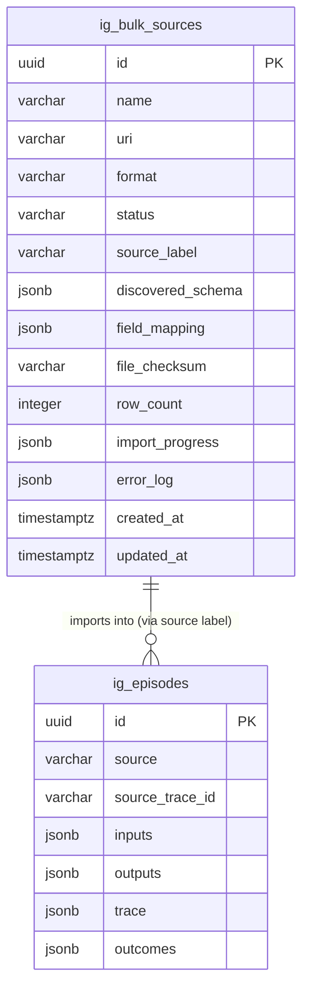

# Universal Dataset Sink (BulkSource)

## Overview

Add a BulkSource capability to the Ingestion context that allows users to import heterogeneous agent trace datasets (CSV, Parquet, JSONL, DuckDB files) with unknown schemas. Diamond uses DuckDB to scan and discover the schema, lets users map columns to Episode fields, optionally preview the result, then batch-ingests all rows through the existing Episode pipeline.

This is the primary onboarding path for Diamond — users bring their data, Diamond normalizes it.

## Problem Statement

Today, Episodes enter Diamond one-at-a-time via `POST /api/v1/episodes` with a known JSON shape. Users with existing agent trace datasets (often thousands to millions of rows in CSV/Parquet/JSONL) have no way to bulk-import them. The data is heterogeneous — no two users have the same column names, types, or structure. Diamond needs a schema-agnostic import pipeline that handles discovery, mapping, and batch ingestion.

## Proposed Solution

A stateful, multi-step import workflow:

1. **Create** — User references a dataset file (local path or S3 URI)
2. **Discover** — DuckDB scans the file, returns columns/types/samples/row count
3. **Map** — User defines how source columns map to Episode fields
4. **Preview** — (Optional) Show first N rows transformed through the mapping
5. **Import** — Batch-ingest all rows through existing `ManageEpisodes.ingest()`
6. **Monitor** — Poll progress until completed

```
┌─────────┐   discover   ┌────────────┐   map    ┌────────┐   import   ┌───────────┐
│ pending │─────────────▶│ discovered │────────▶│ mapped │──────────▶│ importing │
└─────────┘              └────────────┘         └────────┘           └───────────┘
                               ▲                    │ ▲                    │
                               │                    │ │                    │
                               │              update mapping          ┌───┴───┐
                               │                    │ │               │       │
                               │                    ▼ │               ▼       ▼
                               │               ┌────────┐    ┌───────────┐ ┌────────────────────┐
                               └───────────────│ mapped │    │ completed │ │completed_with_errors│
                                 (re-discover) └────────┘    └───────────┘ └────────────────────┘
                                                                              │
                                                                    ┌────────┘
                                                                    ▼
                                                              ┌──────────┐
                                                              │  failed  │
                                                              └──────────┘
                                                                    │
                                                                    │ retry
                                                                    ▼
                                                              ┌────────┐
                                                              │ mapped │
                                                              └────────┘
```

## Technical Approach

### Architecture

BulkSource lives entirely within the **Ingestion bounded context** (`src/contexts/ingestion/`). It introduces a new aggregate root (`BulkSource`) and a new use case (`ManageBulkSources`) while reusing the existing `ManageEpisodes.ingest()` pipeline for per-row processing.

DuckDB (`duckdb-node`) is used as a **read-only adapter** — it scans files to discover schema and streams rows during import. It is not a persistence layer.

### New Files

```
src/contexts/ingestion/
├── domain/
│   ├── entities/
│   │   └── BulkSource.ts                    # BulkSourceData interface
│   └── value-objects/
│       ├── SourceSchema.ts                   # Discovered schema VO
│       └── FieldMapping.ts                   # User-defined mapping VO
├── application/
│   ├── ports/
│   │   ├── BulkSourceRepository.ts           # Persistence port
│   │   └── TabularDataSource.ts              # DuckDB read port
│   └── use-cases/
│       └── ManageBulkSources.ts              # Orchestrator (discover/map/preview/import)
├── infrastructure/
│   ├── DrizzleBulkSourceRepository.ts        # Drizzle adapter
│   ├── DuckDBTabularDataSource.ts            # DuckDB adapter
│   └── connectors/
│       └── MappedRowConnector.ts             # Applies FieldMapping to row → NormalizedEpisode

app/api/v1/bulk-sources/
├── route.ts                                  # POST (create), GET (list)
└── [id]/
    ├── route.ts                              # GET (status)
    ├── discover/route.ts                     # POST (discover schema)
    ├── mapping/route.ts                      # PUT (submit mapping)
    ├── preview/route.ts                      # POST (preview N rows)
    └── import/route.ts                       # POST (start import)
```

### Database Schema

New table `ig_bulk_sources` in `src/db/schema/ingestion.ts`:

```
ig_bulk_sources
├── id                    UUID PK (v7)
├── name                  VARCHAR(255) NOT NULL
├── uri                   VARCHAR(2048) NOT NULL
├── format                VARCHAR(50) NULL (auto-detected: parquet, csv, jsonl, duckdb)
├── status                VARCHAR(50) NOT NULL DEFAULT 'pending'
│                         (pending, discovered, mapped, importing,
│                          completed, completed_with_errors, failed)
├── source_label          VARCHAR(255) NULL
│                         (becomes Episode.source — defaults to "bulk:{id}")
├── discovered_schema     JSONB NULL
│                         ({ columns: [{ name, type, nullable, sample_values }], row_count })
├── field_mapping         JSONB NULL
│                         (user-defined column → Episode field mapping)
├── file_checksum         VARCHAR(128) NULL (SHA-256 at discovery time)
├── row_count             INTEGER NULL
├── import_progress       JSONB NULL
│                         ({ total, processed, succeeded, failed, deduplicated,
│                            started_at, completed_at })
├── error_log             JSONB NULL
│                         ([{ row_number, column, error, value }] — capped at 1000 entries)
├── created_at            TIMESTAMPTZ NOT NULL DEFAULT NOW()
├── updated_at            TIMESTAMPTZ NOT NULL DEFAULT NOW()
```

Indexes:

- `ig_bulk_sources_status_idx` on `(status)`
- `ig_bulk_sources_created_at_idx` on `(created_at)`



### Ports & Adapters

#### TabularDataSource (outbound port)

```typescript
// application/ports/TabularDataSource.ts
interface DiscoveredColumn {
  name: string;
  type: string; // DuckDB type string (VARCHAR, INTEGER, TIMESTAMP, etc.)
  nullable: boolean;
  sampleValues: unknown[]; // first 5 non-null values
}

interface DiscoveredSchema {
  format: string;
  rowCount: number;
  columns: DiscoveredColumn[];
  checksum: string; // SHA-256 of file
}

interface TabularDataSource {
  discover(uri: string): Promise<DiscoveredSchema>;
  readBatch(
    uri: string,
    offset: number,
    limit: number
  ): Promise<Record<string, unknown>[]>;
}
```

#### MappedRowConnector

A new `EpisodeConnector` implementation that is parameterized by `FieldMapping` at construction time. Unlike `GenericJsonConnector` (which has hardcoded field extraction), `MappedRowConnector` applies the user's mapping dynamically:

```typescript
// For each row from DuckDB:
// 1. Extract mapped columns into Episode fields
// 2. Multiple columns mapped to same field → merged into one Record
// 3. Unmapped columns listed in metadata[] → stuffed into metadata
// 4. trace_id column → sourceTraceId (or SHA-256 row hash fallback)
// 5. Complex types (STRUCT, LIST) → JSON-serialized as-is
```

### FieldMapping Shape

```typescript
// domain/value-objects/FieldMapping.ts
interface ColumnRef {
  column: string;
}

interface FieldMapping {
  // Required — at minimum one of these
  inputs: ColumnRef[]; // columns merged into Episode.inputs
  outputs: ColumnRef[]; // columns merged into Episode.outputs

  // Identity
  traceId?: ColumnRef; // dedup key (fallback: row content hash)

  // Optional enrichment
  trace?: ColumnRef[]; // columns merged into Episode.trace
  outcomes?: ColumnRef[]; // columns merged into Episode.outcomes
  occurredAt?: ColumnRef; // single column → Episode.occurredAt
  modelVersion?: ColumnRef; // single column → Episode.modelVersion
  locale?: ColumnRef; // single column → Episode.locale
  planTier?: ColumnRef; // single column → Episode.planTier
  device?: ColumnRef; // single column → Episode.device
  scenarioTypeId?: ColumnRef; // single column → Episode.scenarioTypeId
  hasNegativeFeedback?: ColumnRef; // single column (boolean) → Episode.hasNegativeFeedback
  metadata?: ColumnRef[]; // extra columns → Episode.metadata
}
```

**Multi-column merge rule:** When multiple columns map to `inputs`, they produce `{ col_a: val_a, col_b: val_b }`. When a single column maps to `inputs` and it contains a JSON object, that object is used directly.

### Key Design Decisions

#### 1. Source Label for Dedup Isolation

Each BulkSource gets `source = "bulk:{bulkSourceId}"` by default (overridable via `source_label`). This ensures the `(source, source_trace_id)` unique constraint isolates dedup per import — trace IDs from different files cannot collide.

#### 2. Connector Bypass

BulkSource does **not** use `ConnectorRegistry.resolve()`. Instead, `ManageBulkSources` builds a `NormalizedEpisode` directly from the mapped row via `MappedRowConnector`, then calls a trimmed-down ingest path that accepts a pre-normalized episode. This avoids registering dynamic connectors.

Concretely, extract the core pipeline from `ManageEpisodes.ingest()` into a shared internal method:

```
ingestNormalized(source: string, normalized: NormalizedEpisode, scenarioTypeId?: string)
  → dedup check → PII redact → artifact store → persist → emit event
```

Both `ManageEpisodes.ingest()` (existing API) and `ManageBulkSources.import()` (new bulk) call this shared method.

#### 3. Synchronous In-Process Import (v1)

No job queue infrastructure. The import runs in a long-lived API request with streaming progress updates persisted to the DB. The client polls `GET /bulk-sources/:id` for progress.

To avoid HTTP timeout: the `POST /import` endpoint returns `202 Accepted` immediately after transitioning state to `importing`, then the import runs in a detached async context (fire-and-forget promise with error handling). Progress is written to `import_progress` JSONB every batch.

#### 4. Batch Processing

- **Batch size:** 500 rows (configurable via import request body)
- **Per row:** call `ingestNormalized()` (dedup + PII + artifact + persist + event)
- **Per batch:** update `import_progress` in DB
- **Parallelism:** Sequential within batch for v1 (event bus is synchronous)
- **Memory:** DuckDB streams via `LIMIT/OFFSET` — only one batch in memory at a time

#### 5. Event Storm Mitigation (v1)

Accept per-row `episode.ingested` events for v1. Each event creates a Candidate (existing handler). For a 100K-row import, this means 100K Candidates created sequentially. This is slow but correct.

**Future optimization:** Add a `bulk_import.completed` summary event and a batch Candidate creation path in Phase 2.

#### 6. Partial Success

Three terminal states:

- `completed` — all rows succeeded (or were deduplicated)
- `completed_with_errors` — some rows failed, most succeeded
- `failed` — fatal error (file unreadable, DuckDB crash, etc.)

The `error_log` JSONB stores up to 1000 row-level errors with row number, column, error message, and offending value.

#### 7. File Access (v1 Scope)

Supported URI schemes:

- Local file paths (for development / CLI imports)
- S3 URIs (`s3://bucket/key`) — DuckDB reads these natively with `httpfs` extension

**Out of scope for v1:** File upload endpoint, HTTP URLs, presigned URL generation. Users must place files on accessible storage first.

#### 8. Backward State Transitions

| Transition     | From                    | To           | When                    |
| -------------- | ----------------------- | ------------ | ----------------------- |
| Re-discover    | `discovered`            | `discovered` | File was updated        |
| Update mapping | `mapped`                | `mapped`     | Fix mapping mistake     |
| Retry          | `failed`                | `mapped`     | Fix data/mapping, retry |
| Retry          | `completed_with_errors` | `mapped`     | Fix and re-import       |

**Not allowed:** `importing` → anything (must complete or fail first). `completed` → `mapped` (create a new BulkSource instead).

#### 9. Concurrency Guard

Only one import can run at a time per BulkSource. `POST /import` rejects with 409 if status is `importing`. Uses optimistic locking via `updated_at` check on state transitions.

### API Surface

#### POST /api/v1/bulk-sources

Create a new BulkSource.

```json
// Request
{
  "name": "Agent logs Q1 2026",
  "uri": "s3://my-bucket/traces/q1-2026.parquet",
  "source_label": "agent_logs_q1"  // optional, defaults to "bulk:{id}"
}

// Response 201
{
  "id": "...",
  "name": "Agent logs Q1 2026",
  "uri": "s3://my-bucket/traces/q1-2026.parquet",
  "source_label": "agent_logs_q1",
  "status": "pending",
  "created_at": "..."
}
```

#### POST /api/v1/bulk-sources/:id/discover

Trigger DuckDB schema discovery. Transitions `pending → discovered`.

```json
// Response 200
{
  "id": "...",
  "status": "discovered",
  "discovered_schema": {
    "format": "parquet",
    "row_count": 48231,
    "columns": [
      {
        "name": "conversation_id",
        "type": "VARCHAR",
        "nullable": false,
        "sample_values": ["abc-123", "def-456"]
      },
      {
        "name": "user_message",
        "type": "VARCHAR",
        "nullable": false,
        "sample_values": ["How do I...", "Can you help..."]
      },
      {
        "name": "assistant_reply",
        "type": "VARCHAR",
        "nullable": true,
        "sample_values": ["Sure, here...", null]
      },
      {
        "name": "tool_calls",
        "type": "JSON",
        "nullable": true,
        "sample_values": [{ "name": "search" }]
      },
      {
        "name": "timestamp",
        "type": "TIMESTAMP",
        "nullable": false,
        "sample_values": ["2026-01-15T10:30:00Z"]
      },
      {
        "name": "thumbs_down",
        "type": "BOOLEAN",
        "nullable": true,
        "sample_values": [false, true]
      }
    ]
  },
  "file_checksum": "sha256:abc123..."
}
```

#### PUT /api/v1/bulk-sources/:id/mapping

Submit column → Episode field mapping. Transitions `discovered → mapped` (or `mapped → mapped` for updates).

```json
// Request
{
  "inputs": [{ "column": "user_message" }, { "column": "system_prompt" }],
  "outputs": [{ "column": "assistant_reply" }],
  "trace_id": { "column": "conversation_id" },
  "trace": [{ "column": "tool_calls" }],
  "occurred_at": { "column": "timestamp" },
  "outcomes": [{ "column": "thumbs_down" }],
  "metadata": [{ "column": "session_id" }, { "column": "model" }]
}

// Response 200
{ "id": "...", "status": "mapped", "field_mapping": { ... } }
```

**Validation:** All referenced columns must exist in `discovered_schema`. At least `inputs` and `outputs` must have one column each.

#### POST /api/v1/bulk-sources/:id/preview

Preview first N rows transformed through the mapping (does not persist).

```json
// Request (optional)
{ "limit": 5 }

// Response 200
{
  "rows": [
    {
      "source": "bulk:abc123",
      "source_trace_id": "conversation-xyz",
      "inputs": { "user_message": "How do I...", "system_prompt": "You are..." },
      "outputs": { "assistant_reply": "Sure, here..." },
      "trace": { "tool_calls": [{"name": "search"}] },
      "outcomes": { "thumbs_down": false },
      "occurred_at": "2026-01-15T10:30:00Z",
      "metadata": { "session_id": "sess-1", "model": "gpt-4" }
    }
  ]
}
```

#### POST /api/v1/bulk-sources/:id/import

Start batch import. Returns 202 immediately; import runs asynchronously.

```json
// Request (optional)
{ "batch_size": 500 }

// Response 202
{
  "id": "...",
  "status": "importing",
  "import_progress": { "total": 48231, "processed": 0, "succeeded": 0, "failed": 0, "deduplicated": 0 }
}
```

#### GET /api/v1/bulk-sources/:id

Get BulkSource status and progress.

```json
// Response 200
{
  "id": "...",
  "name": "Agent logs Q1 2026",
  "uri": "s3://...",
  "status": "importing",  // or completed, completed_with_errors, failed
  "discovered_schema": { ... },
  "field_mapping": { ... },
  "import_progress": {
    "total": 48231,
    "processed": 12400,
    "succeeded": 12350,
    "failed": 27,
    "deduplicated": 23,
    "started_at": "2026-02-19T14:00:00Z",
    "completed_at": null
  },
  "error_log": [
    { "row_number": 1042, "error": "PII redaction failed", "detail": "Invalid JSON in column tool_calls" }
  ],
  "created_at": "...",
  "updated_at": "..."
}
```

#### GET /api/v1/bulk-sources

List BulkSources with filtering and pagination.

Query params: `page`, `page_size`, `status` (filter by status).

### Implementation Phases

#### Phase 1: Domain + Schema + Repository (foundation)

- `BulkSourceData` entity interface
- `SourceSchema`, `FieldMapping` value objects with Zod schemas
- `ig_bulk_sources` Drizzle table definition
- `BulkSourceRepository` port + `DrizzleBulkSourceRepository` adapter
- DB migration (`pnpm db:generate && pnpm db:migrate`)
- Domain errors: `BulkSourceNotFoundError`, `InvalidBulkSourceStateError`, `MappingValidationError`, `SchemaDiscoveryError`

**Files:**

- `src/contexts/ingestion/domain/entities/BulkSource.ts`
- `src/contexts/ingestion/domain/value-objects/SourceSchema.ts`
- `src/contexts/ingestion/domain/value-objects/FieldMapping.ts`
- `src/contexts/ingestion/domain/errors.ts` (extend)
- `src/contexts/ingestion/application/ports/BulkSourceRepository.ts`
- `src/contexts/ingestion/infrastructure/DrizzleBulkSourceRepository.ts`
- `src/db/schema/ingestion.ts` (extend)

#### Phase 2: DuckDB Integration (discovery + reading)

- Install `duckdb-node`, add to `serverExternalPackages` and `onlyBuiltDependencies`
- `TabularDataSource` port interface
- `DuckDBTabularDataSource` adapter: `discover()` and `readBatch()`
- Schema discovery: `DESCRIBE SELECT * FROM '{uri}'` + `SELECT COUNT(*) FROM '{uri}'`
- Sample extraction: `SELECT * FROM '{uri}' LIMIT 5`
- File checksum: hash first N bytes or use DuckDB metadata
- Format auto-detection via file extension

**Files:**

- `src/contexts/ingestion/application/ports/TabularDataSource.ts`
- `src/contexts/ingestion/infrastructure/DuckDBTabularDataSource.ts`
- `next.config.ts` (extend `serverExternalPackages`)
- `package.json` (extend `onlyBuiltDependencies`)

#### Phase 3: Mapping + Preview + MappedRowConnector

- `MappedRowConnector`: applies `FieldMapping` to a raw row → `NormalizedEpisode`
- Multi-column merge logic (multiple columns → single Record)
- Complex type handling (STRUCT/LIST → JSON serialization)
- Trace ID fallback (row content hash via SHA-256)
- Preview logic: read N rows, apply mapping, return without persisting

**Files:**

- `src/contexts/ingestion/infrastructure/connectors/MappedRowConnector.ts`

#### Phase 4: ManageBulkSources Use Case

- Extract `ingestNormalized()` from `ManageEpisodes` (shared pipeline)
- `ManageBulkSources` class: `create()`, `discover()`, `submitMapping()`, `preview()`, `startImport()`, `get()`, `list()`
- State machine enforcement (validate transitions)
- Import loop: read batch → map rows → ingest each → update progress → repeat
- Error collection (row-level errors capped at 1000)
- Optimistic locking on state transitions
- Wire into composition root (`src/contexts/ingestion/index.ts`)

**Files:**

- `src/contexts/ingestion/application/use-cases/ManageEpisodes.ts` (refactor: extract `ingestNormalized`)
- `src/contexts/ingestion/application/use-cases/ManageBulkSources.ts`
- `src/contexts/ingestion/index.ts` (extend wiring)

#### Phase 5: API Routes

- All 7 endpoints (create, list, get, discover, mapping, preview, import)
- Zod validation schemas for each request
- `withApiMiddleware` wrapping
- Error mapping for new domain errors

**Files:**

- `app/api/v1/bulk-sources/route.ts`
- `app/api/v1/bulk-sources/[id]/route.ts`
- `app/api/v1/bulk-sources/[id]/discover/route.ts`
- `app/api/v1/bulk-sources/[id]/mapping/route.ts`
- `app/api/v1/bulk-sources/[id]/preview/route.ts`
- `app/api/v1/bulk-sources/[id]/import/route.ts`
- `src/lib/api/middleware.ts` (extend error mapping)

#### Phase 6: Domain Events

- `bulk_source.import_completed` event (summary: BulkSource ID, counts, source label)
- Optional: subscribe in Candidate context for batch notifications

**Files:**

- `src/contexts/ingestion/domain/events.ts` (extend)
- `src/lib/events/registry.ts` (extend)

### Acceptance Criteria

#### Functional Requirements

- [ ] User can create a BulkSource from a local file path or S3 URI
- [ ] DuckDB discovers schema (columns, types, samples, row count) for CSV, Parquet, JSONL
- [ ] User can map discovered columns to Episode fields (inputs, outputs, trace, etc.)
- [ ] Mapping validation rejects references to non-existent columns
- [ ] Mapping validation requires at least one column for `inputs` and `outputs`
- [ ] Preview shows first N rows transformed through the mapping without persisting
- [ ] Import processes rows in batches, creating Episodes via existing pipeline
- [ ] Each imported Episode gets PII redaction, artifact storage, dedup check, and event emission
- [ ] Dedup uses `source_label + trace_id` (or row hash fallback)
- [ ] Progress is queryable via GET endpoint during import
- [ ] Import handles partial failure gracefully (keeps succeeded rows, reports errors)
- [ ] State machine enforces valid transitions with optimistic locking
- [ ] Re-mapping and retry are supported after failure

#### Non-Functional Requirements

- [ ] Import of 10K rows completes within 5 minutes
- [ ] DuckDB schema discovery completes within 10 seconds for files up to 1GB
- [ ] Memory usage stays bounded (one batch in memory at a time)
- [ ] No N+1 query patterns in repository layer

### Dependencies & Risks

| Risk                                            | Mitigation                                                       |
| ----------------------------------------------- | ---------------------------------------------------------------- |
| `duckdb-node` binary compatibility with Next.js | Add to `serverExternalPackages`; test in CI                      |
| Large file imports blocking the event loop      | Async import with `await` between batches (yields to event loop) |
| Event storm from 100K+ episodes                 | Accept for v1; document limitation; plan batch events for v2     |
| DuckDB S3 access requires credentials           | Pass AWS credentials via DuckDB `SET` commands or env vars       |
| File format detection failures                  | Fall back to explicit `format` field in create request           |

### Future Considerations

- **File upload endpoint** — `POST /bulk-sources/upload` with multipart form data or presigned URL
- **HTTP URL support** — DuckDB can read from HTTP, but auth and timeout handling needed
- **Batch Candidate creation** — `bulk_import.completed` event triggers batch candidate insert
- **Column type coercion** — Auto-detect date formats, boolean representations, JSON strings
- **Mapping templates** — Save and reuse mappings across BulkSources with similar schemas
- **Streaming progress** — SSE or WebSocket for real-time progress instead of polling
- **Import cancellation** — `POST /bulk-sources/:id/cancel` to stop mid-import

### References

#### Internal References

- Episode entity: `src/contexts/ingestion/domain/entities/Episode.ts`
- ManageEpisodes use case: `src/contexts/ingestion/application/use-cases/ManageEpisodes.ts`
- Connector interface: `src/contexts/ingestion/infrastructure/connectors/types.ts`
- GenericJsonConnector: `src/contexts/ingestion/infrastructure/connectors/GenericJsonConnector.ts`
- ConnectorRegistry: `src/contexts/ingestion/infrastructure/connectors/ConnectorRegistry.ts`
- Ingestion composition root: `src/contexts/ingestion/index.ts`
- DB schema: `src/db/schema/ingestion.ts`
- API middleware: `src/lib/api/middleware.ts`
- Event bus: `src/lib/events/InProcessEventBus.ts`
- ArtifactStore: `src/lib/storage/ArtifactStore.ts`
- Domain errors: `src/lib/domain/DomainError.ts`

#### Institutional Learnings

- `docs/solutions/integration-issues/ingestion-context-episode-intake-patterns.md`
- `docs/solutions/integration-issues/bounded-context-ddd-implementation-patterns.md`
- `docs/solutions/integration-issues/nextjs16-infrastructure-scaffolding-gotchas.md`
- `docs/solutions/integration-issues/export-context-serialization-export-jobs-patterns.md`
