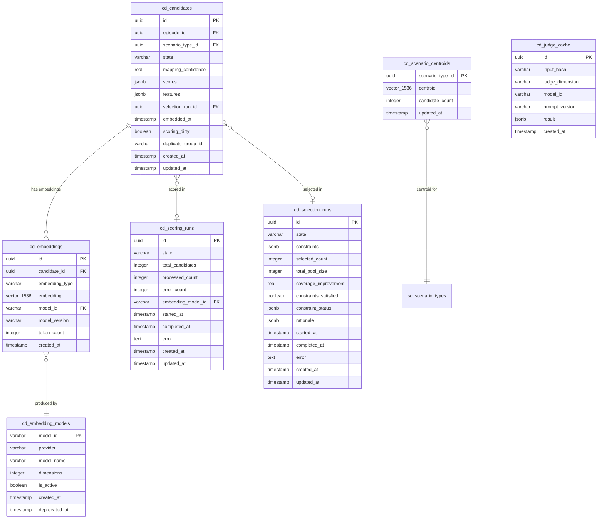

# Phase 2 — Intelligence: Automated Scoring, Selection & ML Infrastructure

## Overview

Phase 2 replaces manual candidate picking with a budgeted, multi-objective optimization pipeline. Episodes flow in (Phase 1), get embedded, scored across 8 dimensions, deduplicated, clustered, and selected for labeling — all orchestrated by an async job queue backed by PostgreSQL.

**Key outcome:** Given a budget of N candidates, Diamond automatically selects the N most valuable candidates that maximize coverage, diversity, and risk representation while minimizing redundancy and cost.

## Problem Statement

Phase 1 candidates sit in `raw` state with empty `scores` and `features` fields. Users must manually inspect episodes and guess which ones to label. This doesn't scale: at 10k+ candidates, no human can assess coverage gaps, redundancy, or risk distribution. The selection algorithm (greedy submodular maximization) needs a complete scoring pipeline feeding it.

## Architecture Overview

```
                          ┌─────────────────────────────────────────────┐
                          │           Phase 2 Pipeline                  │
                          │                                             │
  episode.ingested        │  ┌──────────┐   ┌──────────┐   ┌────────┐ │
  ─────────────────────►  │  │ Embedding│──►│ Scoring  │──►│Selection│ │
  candidate.created       │  │ Pipeline │   │ Engine   │   │ Engine  │ │
                          │  └──────────┘   └──────────┘   └────────┘ │
                          │       │              │              │       │
                          │       ▼              ▼              ▼       │
                          │  ┌──────────┐   ┌──────────┐   ┌────────┐ │
                          │  │ Dedup    │   │ Cluster  │   │ Label  │ │
                          │  │ Engine   │   │ Detection│   │ Queue  │ │
                          │  └──────────┘   └──────────┘   └────────┘ │
                          │                                             │
                          │  ┌──────────────────────────────────────┐  │
                          │  │  pg-boss  (Async Job Queue)          │  │
                          │  └──────────────────────────────────────┘  │
                          └─────────────────────────────────────────────┘
```

## Technical Approach

### Design Decisions

| Decision | Choice | Rationale |
|----------|--------|-----------|
| Job queue | pg-boss (PostgreSQL-native) | No new infra (no Redis), SKIP LOCKED, retries, dead-letter queues |
| Embeddings | OpenAI text-embedding-3-small, 1536 dims | Best cost/quality ratio at $0.02/1M tokens; Drizzle has native `vector()` |
| Vector index | pgvector HNSW with cosine distance | Sub-2ms queries at 100k scale, no training step needed |
| Clustering | HDBSCAN via Python subprocess | scikit-learn 1.3+ has built-in HDBSCAN; no viable JS implementation |
| Submodular optimizer | Custom TypeScript implementation | Algorithm is ~30 lines; no JS library exists; lazy greedy with heap for 10-100x speedup |
| Score normalization | Adaptive (rank → robust min-max → quantile) | Handles cold-start (few candidates) through steady-state (thousands) |
| "Embedded" tracking | `embeddedAt: timestamp | null` flag, NOT a new state | Avoids breaking the existing `raw → scored` state machine |
| Worker deployment | Separate long-running Node.js process | Next.js routes are ephemeral; pg-boss workers need persistent connections |
| Normalization timing | Computed at selection time, not stored | Raw scores stored on candidate; normalization is ephemeral over current pool |
| Concurrency control | Singleton scoring/selection runs via pg-boss unique job keys | Prevents overlapping runs; selection rejects if scoring is active |

### Event Flow DAG

```
episode.ingested
  └─► candidate.created (existing handler)
        └─► [pg-boss] embedding.compute
              ├─► candidate.embedded (new event)
              │     └─► [pg-boss] scoring.compute
              │           ├─► auto scenario mapping (inline)
              │           ├─► redundancy_penalty via pgvector similarity (inline)
              │           ├─► feature extraction (inline)
              │           └─► candidate.scored (new event)
              └─► [pg-boss] dedup.check (parallel, writes redundancy flag)

scenario_graph.updated (existing event, new handler)
  └─► mark affected candidates dirty → [pg-boss] scoring.recompute

User triggers POST /api/v1/scoring/run
  └─► [pg-boss] scoring_run.execute (batch all dirty/unscored)
        └─► scoring_run.completed

User triggers POST /api/v1/selection/run
  └─► [pg-boss] selection_run.execute (greedy submodular)
        └─► selection_run.completed
              └─► Labeling context creates LabelTasks

[Periodic cron] cluster.detect
  └─► [pg-boss] cluster.hdbscan (Python subprocess)
        └─► unmapped_cluster.detected (per cluster)
              └─► Scenario context surfaces suggestion
```

---

## Implementation Phases

### Phase 2A: ML Infrastructure Foundation (GET-180)

**Goal:** Async job queue, pgvector setup, embedding pipeline — the plumbing everything else builds on.

#### 2A.1 — pg-boss Job Queue Abstraction

**New files:**

```
src/lib/jobs/
  JobQueue.ts              # Port interface
  PgBossJobQueue.ts        # pg-boss adapter
  index.ts                 # Composition root, exports singleton
  worker.ts                # Standalone worker entry point
```

**Port interface** (`src/lib/jobs/JobQueue.ts`):

```typescript
export interface JobDefinition<TData = unknown> {
  name: string;
  data: TData;
  options?: {
    retryLimit?: number;
    retryDelay?: number;
    retryBackoff?: boolean;
    expireInSeconds?: number;
    priority?: number;
    singletonKey?: string; // prevents duplicate jobs
    startAfterSeconds?: number;
  };
}

export interface JobHandler<TData = unknown> {
  (job: { id: string; data: TData }): Promise<void>;
}

export interface JobQueue {
  send<TData>(definition: JobDefinition<TData>): Promise<string>;
  work<TData>(
    name: string,
    handler: JobHandler<TData>,
    options?: { batchSize?: number; pollingIntervalSeconds?: number }
  ): Promise<void>;
  schedule(name: string, cron: string, data?: unknown): Promise<void>;
  getQueueSize(name: string): Promise<number>;
  stop(): Promise<void>;
}
```

**Worker process** (`src/lib/jobs/worker.ts`):
- Standalone `node` entry point (not a Next.js API route)
- Initializes pg-boss with its own `pg` connection pool (separate from Drizzle's postgres.js)
- Registers all job handlers
- Handles graceful shutdown (SIGTERM/SIGINT)
- Add `"worker": "tsx src/lib/jobs/worker.ts"` script to `package.json`

**Dependencies:** `pg-boss@^12`, `pg@^8` (pg-boss requires node-postgres, not postgres.js)

**Database setup:**
- pg-boss creates its own `pgboss` schema automatically on start
- No Drizzle migration needed for pg-boss internals

<details>
<summary>pg-boss connection strategy</summary>

pg-boss uses `pg` (node-postgres) internally, not `postgres.js`. Two options:

1. **Separate pool (recommended):** Let pg-boss manage its own `pg` pool via connection string. Simple, battle-tested.
2. **Adapter wrapper:** Write a thin adapter around postgres.js `sql.unsafe()`. Riskier, less tested.

Choose option 1 for reliability. The app will have two connection pools:
- Drizzle → postgres.js (existing)
- pg-boss → pg (new, ~5 connections)

</details>

#### 2A.2 — pgvector Extension & Embedding Schema

**Migration:** Generate custom migration via `npx drizzle-kit generate --custom`:

```sql
-- 0001_add_pgvector_extension.sql
CREATE EXTENSION IF NOT EXISTS vector;
```

**Schema changes** (`src/db/schema/candidate.ts`):

```typescript
import { vector } from "drizzle-orm/pg-core";

// New table: cd_embeddings
export const cdEmbeddings = pgTable(
  "cd_embeddings",
  {
    id: uuid("id").primaryKey(),
    candidateId: uuid("candidate_id").notNull().references(() => cdCandidates.id),
    embeddingType: varchar("embedding_type", { length: 50 }).notNull(), // "request", "conversation", "answer", "combined"
    embedding: vector("embedding", { dimensions: 1536 }).notNull(),
    modelId: varchar("model_id", { length: 100 }).notNull(), // "oai-te3s-1536"
    modelVersion: varchar("model_version", { length: 50 }).notNull(),
    tokenCount: integer("token_count"),
    createdAt: timestamp("created_at", { withTimezone: true }).notNull().defaultNow(),
  },
  (t) => [
    index("cd_embeddings_candidate_id_idx").on(t.candidateId),
    index("cd_embeddings_hnsw_idx").using("hnsw", t.embedding.op("vector_cosine_ops")),
    // Unique: one embedding per candidate per type per model
    uniqueIndex("cd_embeddings_candidate_type_model_uniq").on(t.candidateId, t.embeddingType, t.modelId),
  ]
);

// New table: cd_embedding_models (registry)
export const cdEmbeddingModels = pgTable("cd_embedding_models", {
  id: varchar("model_id", { length: 100 }).primaryKey(), // "oai-te3s-1536"
  provider: varchar("provider", { length: 50 }).notNull(), // "openai"
  modelName: varchar("model_name", { length: 100 }).notNull(), // "text-embedding-3-small"
  dimensions: integer("dimensions").notNull(), // 1536
  isActive: boolean("is_active").notNull().default(true),
  createdAt: timestamp("created_at", { withTimezone: true }).notNull().defaultNow(),
  deprecatedAt: timestamp("deprecated_at", { withTimezone: true }),
});

// Add to cd_candidates table:
// embeddedAt: timestamp (null = not yet embedded)
// scoringDirty: boolean (true = needs re-scoring)
```

**Candidate entity changes:**
- Add `embeddedAt: Date | null` field to `CandidateData` interface
- Add `scoringDirty: boolean` field for incremental processing (GET-188)
- Add `markEmbedded()` and `markDirty()` methods to `Candidate` aggregate

#### 2A.3 — Embedding Pipeline

**New port** (`src/contexts/candidate/application/ports/EmbeddingProvider.ts`):

```typescript
export interface EmbeddingResult {
  embedding: number[];
  tokenCount: number;
  modelId: string;
  modelVersion: string;
}

export interface EmbeddingProvider {
  embed(texts: string[]): Promise<EmbeddingResult[]>;
  getModelId(): string;
  getDimensions(): number;
}
```

**New adapter** (`src/contexts/candidate/infrastructure/OpenAIEmbeddingProvider.ts`):
- Uses `openai` SDK v4+
- Batches texts (max 2048 items, max 300k tokens per request)
- Concurrency control via `p-limit` (3-5 parallel requests)
- Exponential backoff on 429 errors via `p-retry`
- Configurable model and dimensions via env vars: `OPENAI_API_KEY`, `EMBEDDING_MODEL`, `EMBEDDING_DIMENSIONS`

**New handler** (`src/contexts/candidate/application/handlers/onCandidateCreated.ts`):
- Subscribes to `candidate.created`
- Queues `embedding.compute` job via `JobQueue`

**Job handler** (registered in worker):
- Reads episode content via `EpisodeReader` port
- Calls `EmbeddingProvider.embed()` with concatenated input/output text
- Stores embedding in `cd_embeddings` table
- Updates `Candidate.embeddedAt`
- Emits `candidate.embedded` event

**Dependencies:** `openai@^4`, `p-limit@^6`, `p-retry@^6`, `gpt-tokenizer` (token counting)

#### 2A.4 — Embedding Model Registry (GET-182)

**Use case** (`src/contexts/candidate/application/use-cases/ManageEmbeddingModels.ts`):
- `register(modelId, provider, modelName, dimensions)` — add model to registry
- `getActive()` — return the current active model
- `deprecate(modelId)` — mark as deprecated, flag all embeddings from this model as stale
- `listModels()` — list all registered models

**Migration strategy:** When active model changes:
1. Mark old model as deprecated
2. Mark all candidates with old-model embeddings as `scoringDirty = true`
3. Re-embedding queued as batch job
4. Similarity queries filter by `modelId` to avoid cross-model comparisons

---

### Phase 2B: Scoring Engine (GET-183 through GET-188)

**Goal:** Compute the 8-dimensional score vector for each candidate.

#### 2B.1 — Feature Extraction

**New value object** (`src/contexts/candidate/domain/value-objects/FeatureSet.ts`):

```typescript
import { z } from "zod";

export const FeatureSetSchema = z.object({
  turnCount: z.number().int().nonnegative(),
  toolCallCount: z.number().int().nonnegative(),
  hasNegativeFeedback: z.boolean(),
  inputTokenCount: z.number().int().nonnegative(),
  outputTokenCount: z.number().int().nonnegative(),
  language: z.string().nullable(), // ISO 639-1
  modelVersion: z.string().nullable(),
  episodeAgeHours: z.number().nonnegative(),
  userPlanTier: z.string().nullable(),
  toolErrorRate: z.number().min(0).max(1),
});

export type FeatureSet = z.infer<typeof FeatureSetSchema>;
```

**Port** (`src/contexts/candidate/application/ports/FeatureExtractor.ts`):

```typescript
export interface FeatureExtractor {
  extract(episodeContent: EpisodeContent): FeatureSet;
}
```

**Adapter** (`src/contexts/candidate/infrastructure/EpisodeFeatureExtractor.ts`):
- Reads episode inputs/outputs/trace
- Computes each feature from episode data
- Pure function — no external API calls

#### 2B.2 — Score Dimensions

**New value object** (`src/contexts/candidate/domain/value-objects/ScoreVector.ts`):

```typescript
import { z } from "zod";

export const ScoreVectorSchema = z.object({
  coverageGain: z.number(), // How much new coverage this candidate adds
  riskWeight: z.number(),   // From scenario's RiskTier weight
  novelty: z.number(),      // Cosine distance to nearest neighbor in embedding space
  uncertainty: z.number(),  // Model confidence proxy (low confidence = high uncertainty = valuable)
  driftSignal: z.number(),  // Is this scenario pattern trending up in production?
  failureLikelihood: z.number(), // Predicted probability of model failure
  redundancyPenalty: z.number(), // Similarity to already-selected/existing candidates (negative)
  costEstimate: z.number(), // Expected annotation complexity
});

export type ScoreVector = z.infer<typeof ScoreVectorSchema>;
```

**Each dimension implemented as a separate scorer:**

| Dimension | Implementation | Depends On |
|-----------|---------------|------------|
| `coverageGain` | Count candidates per scenario type vs. existing dataset; gap = high gain | ScenarioReader, DatasetReader |
| `riskWeight` | Look up mapped scenario's RiskTier.weight | ScenarioReader |
| `novelty` | Cosine distance to K nearest neighbors in embedding space | pgvector query |
| `uncertainty` | Proxy: model confidence from trace, tool error rate, negative feedback | FeatureSet |
| `driftSignal` (GET-184) | Frequency of scenario type in recent vs. historical episodes | EpisodeReader (temporal query) |
| `failureLikelihood` (GET-185) | has_negative_feedback, low confidence, high tool error rate | FeatureSet |
| `redundancyPenalty` | Cosine similarity to already-selected candidates and existing dataset | pgvector query |
| `costEstimate` (GET-186) | turn_count, tool_call_count, output_token_count → complexity heuristic | FeatureSet |

**Port** (`src/contexts/candidate/application/ports/ScoringEngine.ts`):

```typescript
export interface ScoringContext {
  candidate: CandidateData;
  features: FeatureSet;
  embedding: number[];
  scenarioMapping: ScenarioMapping | null;
}

export interface ScoringEngine {
  score(ctx: ScoringContext): Promise<ScoreVector>;
  scoreBatch(contexts: ScoringContext[]): Promise<Map<UUID, ScoreVector>>;
}
```

**Adapter** (`src/contexts/candidate/infrastructure/CompositeScoringEngine.ts`):
- Orchestrates all 8 dimension scorers
- Each scorer is a pure function or port call
- Batch mode for efficiency (single pgvector query for all novelty scores, single DB query for all coverage gains)

#### 2B.3 — Score Normalization & Calibration (GET-183)

**Port** (`src/contexts/candidate/application/ports/ScoreNormalizer.ts`):

```typescript
export interface NormalizationParams {
  strategy: "rank" | "robust_minmax" | "quantile";
  stats: DimensionStats; // per-dimension: count, min, max, p5, p95, mean, variance
}

export interface ScoreNormalizer {
  computeParams(rawScores: ScoreVector[]): NormalizationParams;
  normalize(raw: ScoreVector, params: NormalizationParams): ScoreVector;
}
```

**Adapter** (`src/contexts/candidate/infrastructure/AdaptiveScoreNormalizer.ts`):
- n < 30: rank normalization (`rank / (n-1)`)
- 30 <= n < 200: robust min-max (clip at p5/p95, scale to [0,1])
- n >= 200: quantile normalization (uniform distribution)
- Computed at selection time over the current scored pool — **not stored**
- Raw scores always persisted on the candidate

#### 2B.4 — ScoringRun Aggregate

**New entity** (`src/contexts/candidate/domain/entities/ScoringRun.ts`):

```typescript
export const SCORING_RUN_STATES = ["pending", "processing", "completed", "failed"] as const;
export type ScoringRunState = (typeof SCORING_RUN_STATES)[number];

export interface ScoringRunData {
  id: UUID;
  state: ScoringRunState;
  totalCandidates: number;
  processedCount: number;
  errorCount: number;
  embeddingModelId: string;
  startedAt: Date | null;
  completedAt: Date | null;
  error: string | null;
  createdAt: Date;
  updatedAt: Date;
}
```

**Schema** (`src/db/schema/candidate.ts`):

```typescript
export const cdScoringRuns = pgTable("cd_scoring_runs", {
  id: uuid("id").primaryKey(),
  state: varchar("state", { length: 20 }).notNull().default("pending"),
  totalCandidates: integer("total_candidates").notNull().default(0),
  processedCount: integer("processed_count").notNull().default(0),
  errorCount: integer("error_count").notNull().default(0),
  embeddingModelId: varchar("embedding_model_id", { length: 100 }).notNull(),
  startedAt: timestamp("started_at", { withTimezone: true }),
  completedAt: timestamp("completed_at", { withTimezone: true }),
  error: text("error"),
  createdAt: timestamp("created_at", { withTimezone: true }).notNull().defaultNow(),
  updatedAt: timestamp("updated_at", { withTimezone: true }).notNull().defaultNow(),
});
```

#### 2B.5 — Incremental Scoring Pipeline (GET-188)

**Dirty tracking:**
- `cd_candidates.scoring_dirty` boolean column (default `true` for new candidates)
- Set to `true` when:
  - Candidate is newly created (`onCandidateCreated`)
  - Embedding model changes (`ManageEmbeddingModels.deprecate()`)
  - Scenario graph updated affecting this candidate's mapped scenario
- Scoring run only processes candidates where `scoring_dirty = true`

**Event handler** (`src/contexts/candidate/application/handlers/onScenarioGraphUpdated.ts`) (GET-187):
- Subscribes to `scenario_graph.updated`
- Reads `changes` payload to identify affected scenario type IDs
- Marks all candidates with those scenario types as `scoringDirty = true`
- Optionally queues a re-scoring job

#### 2B.6 — Auto Scenario Mapping

**Port** (`src/contexts/candidate/application/ports/ScenarioMapper.ts`):

```typescript
export interface MappingResult {
  scenarioTypeId: UUID;
  confidence: number;
}

export interface ScenarioMapper {
  map(embedding: number[]): Promise<MappingResult | null>;
  updateCentroids(): Promise<void>;
}
```

**Adapter** (`src/contexts/candidate/infrastructure/EmbeddingScenarioMapper.ts`):
- Maintains scenario type centroids (average embedding of all mapped candidates per type)
- Centroids stored in `cd_scenario_centroids` table (pgvector column)
- On map: cosine similarity between candidate embedding and all centroids
- Best match above threshold (configurable, default 0.7) → assign with confidence score
- Below threshold → leave unmapped
- Centroids recomputed after each scoring run batch

**Schema:**

```typescript
export const cdScenarioCentroids = pgTable("cd_scenario_centroids", {
  scenarioTypeId: uuid("scenario_type_id").primaryKey(),
  centroid: vector("centroid", { dimensions: 1536 }).notNull(),
  candidateCount: integer("candidate_count").notNull().default(0),
  updatedAt: timestamp("updated_at", { withTimezone: true }).notNull().defaultNow(),
});
```

#### 2B.7 — Scoring API Routes

```
app/api/v1/scoring/run/route.ts          → POST (trigger), GET (list runs)
app/api/v1/scoring/runs/[id]/route.ts    → GET (status + progress)
app/api/v1/candidates/[id]/scores/route.ts  → GET (score vector)
app/api/v1/candidates/[id]/features/route.ts → GET (feature set)
```

---

### Phase 2C: Semantic Deduplication & Clustering (GET-181, GET-184)

#### 2C.1 — Semantic Deduplication Engine (GET-181)

**Implementation:** Inline during scoring, not a separate pipeline step.

When computing `redundancyPenalty` for a candidate:
1. pgvector cosine similarity query: find K nearest neighbors (K=10)
2. If any neighbor has similarity > threshold (default 0.95): flag as near-duplicate
3. `redundancyPenalty` = max similarity to any already-selected candidate or existing dataset member
4. Store duplicate group ID on candidate if detected (for UI display)

**Schema addition:**

```typescript
// Add to cd_candidates:
duplicateGroupId: varchar("duplicate_group_id", { length: 100 }),
```

**Configuration:**
- `DEDUP_SIMILARITY_THRESHOLD` env var (default 0.95 for near-exact, 0.85 for semantic)
- Threshold configurable per selection run as well

#### 2C.2 — HDBSCAN Cluster Detection

**Python script** (`scripts/cluster.py`):
- Reads embeddings as JSON from stdin (or temp file for large datasets)
- Runs `sklearn.cluster.HDBSCAN(min_cluster_size=5, min_samples=3)`
- Outputs cluster labels, probabilities, and exemplar indices as JSON
- Version-pinned in `requirements.txt`: `scikit-learn>=1.3,<2.0`

**pg-boss job:**
- `cluster.detect` — cron-scheduled (daily or on-demand)
- Fetches all unmapped candidate embeddings from DB
- Writes to temp file if > 10k rows
- Spawns `python3 scripts/cluster.py` subprocess
- Parses output → for each cluster, emit `unmapped_cluster.detected` event with:
  - cluster_id (generated)
  - episode_count
  - representative_episode_ids (3-5 closest to centroid)
  - centroid_summary (TBD: could use LLM to summarize)

**Event handler** (`src/contexts/scenario/application/handlers/onUnmappedClusterDetected.ts`):
- Receives cluster detection event
- Creates a "suggestion" record in the Scenario context for domain expert review
- No automatic scenario creation — human-in-the-loop

**Error handling:**
- Python subprocess timeout: 10 minutes (configurable)
- OOM: catch subprocess exit code, log, mark job as failed
- Pool too small (< 15 unmapped candidates): skip clustering, no-op

#### 2C.3 — Drift Signal Dimension (GET-184)

**Implementation in `DriftSignalScorer`:**

```typescript
// For each candidate's mapped scenario type:
// 1. Count episodes in last 7 days with this scenario type
// 2. Count episodes in previous 7 days with this scenario type
// 3. drift_signal = recent_count / (historical_count + 1) - 1
//    Positive = trending up, negative = trending down, 0 = stable
```

- Requires `EpisodeReader` port to query temporal distribution
- Unmapped candidates: drift_signal = 0 (neutral)

---

### Phase 2D: Selection Engine (related to GET-189)

#### 2D.1 — SelectionRun Aggregate

**Entity** (`src/contexts/candidate/domain/entities/SelectionRun.ts`):

```typescript
export const SELECTION_RUN_STATES = ["pending", "processing", "completed", "failed"] as const;

export interface SelectionConstraints {
  budget: number; // max candidates to select (integer count)
  scenarioMinimums?: Record<string, number>; // scenarioTypeId → min count
  riskTierQuotas?: Record<string, number>;   // riskTierName → min count
  freshnessRequirement?: number;              // max episode age in days
  excludeStates?: CandidateState[];          // states to exclude from pool (default: selected, labeled, validated, released)
}

export interface SelectionRationale {
  candidateId: UUID;
  rank: number;
  marginalGain: number;
  topContributingDimensions: { dimension: string; contribution: number }[];
}

export interface SelectionRunData {
  id: UUID;
  state: SelectionRunState;
  constraints: SelectionConstraints;
  selectedCount: number;
  totalPoolSize: number;
  coverageImprovement: number;
  constraintsSatisfied: boolean;
  constraintStatus: Record<string, { required: number; achieved: number; satisfied: boolean }>;
  rationale: SelectionRationale[];
  startedAt: Date | null;
  completedAt: Date | null;
  error: string | null;
  createdAt: Date;
  updatedAt: Date;
}
```

**Schema** (`src/db/schema/candidate.ts`):

```typescript
export const cdSelectionRuns = pgTable("cd_selection_runs", {
  id: uuid("id").primaryKey(),
  state: varchar("state", { length: 20 }).notNull().default("pending"),
  constraints: jsonb("constraints").notNull(),
  selectedCount: integer("selected_count").notNull().default(0),
  totalPoolSize: integer("total_pool_size").notNull().default(0),
  coverageImprovement: real("coverage_improvement"),
  constraintsSatisfied: boolean("constraints_satisfied"),
  constraintStatus: jsonb("constraint_status"),
  rationale: jsonb("rationale"), // SelectionRationale[]
  startedAt: timestamp("started_at", { withTimezone: true }),
  completedAt: timestamp("completed_at", { withTimezone: true }),
  error: text("error"),
  createdAt: timestamp("created_at", { withTimezone: true }).notNull().defaultNow(),
  updatedAt: timestamp("updated_at", { withTimezone: true }).notNull().defaultNow(),
});
```

#### 2D.2 — Greedy Submodular Optimizer

**Port** (`src/contexts/candidate/application/ports/SelectionOptimizer.ts`):

```typescript
export interface SelectionCandidate {
  id: UUID;
  scores: ScoreVector;           // raw scores
  normalizedScores: ScoreVector; // normalized at selection time
  scenarioTypeId: UUID | null;
  riskTier: string | null;
  embedding: number[];
}

export interface SelectionWeights {
  coverage: number;    // default 1.0
  risk: number;        // default 1.0
  novelty: number;     // default 0.8
  uncertainty: number; // default 0.6
  drift: number;       // default 0.5
  failure: number;     // default 0.7
  redundancy: number;  // default 0.9 (penalty)
  cost: number;        // default 0.3 (penalty)
}

export interface SelectionResult {
  selected: SelectionRationale[];
  constraintStatus: Record<string, { required: number; achieved: number; satisfied: boolean }>;
  coverageImprovement: number;
}

export interface SelectionOptimizer {
  select(
    pool: SelectionCandidate[],
    constraints: SelectionConstraints,
    weights: SelectionWeights,
    existingDataset: UUID[] // IDs of candidates already in current dataset
  ): SelectionResult;
}
```

**Adapter** (`src/contexts/candidate/infrastructure/GreedySubmodularOptimizer.ts`):

```
Algorithm: Lazy Greedy Submodular Maximization
1. Initialize selected = {}, heap = max-heap of (upper_bound, candidate)
2. For each candidate, compute initial marginal_gain, push to heap
3. While |selected| < budget AND heap is not empty:
   a. Pop top candidate c from heap
   b. Recompute exact marginal_gain(c | selected)
   c. If marginal_gain(c) >= next candidate's upper_bound in heap:
      - Check constraint satisfaction
      - If adding c violates a hard constraint, skip
      - Add c to selected with rationale
   d. Else: push c back with updated upper_bound, repeat from (a)
4. Return selected + constraint status + coverage improvement

Marginal gain = Σ (w_i × dimension_i(c | selected)) for positive dimensions
             - Σ (w_j × dimension_j(c | selected)) for penalty dimensions
```

**Constraint handling:**
- Per-scenario minimums: prioritize under-covered scenarios in early rounds
- Risk tier quotas: same approach, check quotas before skipping
- If constraints are infeasible: produce partial result + per-constraint status showing what was achieved vs. required
- Budget = 0: return empty selection (not an error)
- Budget > pool: select entire pool (not an error)

**Dependencies:** `@datastructures-js/priority-queue` for the max-heap

#### 2D.3 — Label Queue & Event Integration

After selection completes:
1. Candidates in selection → `transitionTo("selected")` with `selectionRunId` set
2. Emit `selection_run.completed` event with run ID and candidate count
3. Handler in Labeling context (`onSelectionRunCompleted`):
   - Reads selected candidates from Candidate context
   - Creates `LabelTask` for each selected candidate with appropriate rubric version
   - Tasks ordered by selection rank (priority)

#### 2D.4 — Selection API Routes

```
app/api/v1/selection/run/route.ts             → POST (trigger with budget + constraints + weights)
app/api/v1/selection/runs/[id]/route.ts       → GET (status + results)
app/api/v1/selection/runs/[id]/queue/route.ts → GET (label queue from this run)
```

#### 2D.5 — Selection Quality Evaluation (GET-189)

**Backtesting port** (`src/contexts/candidate/application/ports/SelectionEvaluator.ts`):

```typescript
export interface SelectionQualityMetrics {
  coverageDelta: number;        // coverage before vs. after selection
  diversityScore: number;       // average pairwise distance between selected
  riskCoverage: Record<string, number>; // per risk tier
  scenarioCoverage: Record<string, number>; // per scenario type
  redundancyIndex: number;      // avg similarity between selected pairs
  budgetUtilization: number;    // selected / budget
}

export interface SelectionEvaluator {
  evaluate(runId: UUID): Promise<SelectionQualityMetrics>;
}
```

---

### Phase 2E: Coverage Dashboard & LLM Judge Foundation

#### 2E.1 — Coverage API (Cross-Context Read)

**Port** (`src/contexts/candidate/application/ports/CoverageComputer.ts`):

```typescript
export interface CoverageReport {
  totalScenarioTypes: number;
  coveredScenarioTypes: number;
  scenarioCoveragePct: number;
  byScenarioType: { id: UUID; name: string; count: number; pct: number }[];
  byFailureMode: { id: UUID; name: string; count: number; pct: number }[];
  byRiskTier: { name: string; count: number; pct: number }[];
  gaps: { scenarioTypeId: UUID; name: string; candidateCount: number; datasetCount: number }[];
}

export interface CoverageComputer {
  compute(): Promise<CoverageReport>;
}
```

**Implementation:** Adapter reads from ScenarioReader, CandidateRepository, and DatasetReader. Computed on demand — no materialized view in Phase 2.

**API routes:**

```
app/api/v1/coverage/route.ts        → GET (full coverage report)
app/api/v1/coverage/gaps/route.ts   → GET (under-covered scenarios)
```

#### 2E.2 — LLM Judge Infrastructure Foundation (GET-190)

**Port** (`src/contexts/candidate/application/ports/LLMJudge.ts`):

```typescript
export interface JudgeInput {
  candidateId: UUID;
  episodeContent: EpisodeContent;
  scenarioType: string | null;
  judgeDimension: string; // "failure_likelihood", "uncertainty", etc.
}

export interface JudgeResult {
  score: number;
  confidence: number;
  reasoning: string;
  modelId: string;
  modelVersion: string;
  tokenCost: { input: number; output: number };
  cachedAt: Date | null;
}

export interface LLMJudge {
  judge(input: JudgeInput): Promise<JudgeResult>;
  judgeBatch(inputs: JudgeInput[]): Promise<Map<UUID, JudgeResult>>;
}
```

**Phase 2 scope:** Define the port only. No adapter implementation. Scoring dimensions that will eventually use LLM judges (`failureLikelihood`, `uncertainty`) start with heuristic implementations in Phase 2 and can be swapped to LLM-backed adapters later.

**Cache schema** (for future use):

```typescript
export const cdJudgeCache = pgTable("cd_judge_cache", {
  id: uuid("id").primaryKey(),
  inputHash: varchar("input_hash", { length: 64 }).notNull(), // SHA-256 of canonicalized input
  judgeDimension: varchar("judge_dimension", { length: 50 }).notNull(),
  modelId: varchar("model_id", { length: 100 }).notNull(),
  promptVersion: varchar("prompt_version", { length: 50 }).notNull(),
  result: jsonb("result").notNull(),
  createdAt: timestamp("created_at", { withTimezone: true }).notNull().defaultNow(),
}, (t) => [
  uniqueIndex("cd_judge_cache_uniq").on(t.inputHash, t.judgeDimension, t.modelId, t.promptVersion),
]);
```

---

## ERD: Phase 2 Schema Additions



## Acceptance Criteria

### Functional Requirements

- [ ] Candidates automatically get embeddings after creation (via pg-boss job)
- [ ] Scoring run computes all 8 dimensions for dirty candidates
- [ ] Score normalization adapts to pool size (rank / min-max / quantile)
- [ ] Auto scenario mapping assigns candidates to scenario types based on embedding similarity
- [ ] Semantic deduplication flags near-duplicate candidates with redundancy penalty
- [ ] HDBSCAN clustering detects unmapped clusters and surfaces suggestions
- [ ] Selection run produces optimal label queue given budget and constraints
- [ ] Selection handles infeasible constraints gracefully (partial result + status)
- [ ] Coverage API returns per-scenario-type and per-failure-mode coverage
- [ ] All long-running operations are async (pg-boss) with progress tracking via status API
- [ ] Embedding model changes trigger re-embedding of affected candidates
- [ ] Scenario graph changes trigger re-scoring of affected candidates

### Non-Functional Requirements

- [ ] Scoring run handles 10k+ candidates without timeout
- [ ] Selection run completes for 10k scored candidates in < 30 seconds
- [ ] pgvector similarity queries return in < 5ms for 100k embeddings
- [ ] pg-boss jobs retry on transient failures with exponential backoff
- [ ] Failed jobs land in dead-letter queue with error details
- [ ] Worker process handles graceful shutdown (SIGTERM)

### Quality Gates

- [ ] All new ports have corresponding interface + at least one adapter
- [ ] New domain events registered in event registry
- [ ] New API routes use `withApiMiddleware`, Zod validation, standard response helpers
- [ ] New DB columns have appropriate indexes
- [ ] Context-specific errors registered in middleware error mapping
- [ ] Candidate aggregate has optimistic concurrency control for scoring transitions

## Dependencies & Prerequisites

| Dependency | Status | Impact |
|-----------|--------|--------|
| Phase 1 complete | ~99% done | Candidates, episodes, scenarios, labeling all work |
| pgvector PostgreSQL extension | Install needed | `brew install pgvector` + `CREATE EXTENSION vector` |
| pg-boss npm package | New dependency | `pg-boss@^12`, `pg@^8` |
| OpenAI API key | Config needed | `OPENAI_API_KEY` env var |
| Python 3.9+ with scikit-learn | Install needed | For HDBSCAN clustering subprocess |
| p-limit, p-retry, gpt-tokenizer | New dependencies | Embedding pipeline rate limiting |
| @datastructures-js/priority-queue | New dependency | Lazy greedy optimizer heap |

## Risk Analysis & Mitigation

| Risk | Likelihood | Impact | Mitigation |
|------|-----------|--------|------------|
| OpenAI API rate limits during bulk embedding | Medium | Medium | Batch with p-limit, exponential backoff, OpenAI Batch API for large jobs |
| pg-boss in Next.js environment complexity | Medium | High | Separate worker process, not in API routes |
| Python subprocess reliability (HDBSCAN) | Low | Medium | Timeout, error handling, skip if pool too small |
| Embedding model deprecation by OpenAI | Low | High | Model registry + re-embedding job; version field on all embeddings |
| Score normalization instability on small pools | Medium | Low | Adaptive strategy; rank-based for n < 30 |
| Concurrent scoring/selection race conditions | Medium | High | Singleton jobs via pg-boss unique keys; reject selection if scoring active |
| pgvector index performance degradation at scale | Low | Medium | HNSW handles 100k well; monitor query times; re-tune m/ef_construction if needed |

## Implementation Order

The phases are ordered by dependency:

```
Phase 2A (Infrastructure) → Phase 2B (Scoring) → Phase 2C (Dedup/Clustering)
                                                         ↓
                                                   Phase 2D (Selection)
                                                         ↓
                                                   Phase 2E (Coverage + LLM Judge port)
```

**Estimated order of PRs:**

1. pg-boss setup + worker process (2A.1)
2. pgvector migration + embedding schema (2A.2)
3. Embedding pipeline + OpenAI adapter (2A.3)
4. Embedding model registry (2A.4)
5. FeatureSet value object + extractor (2B.1)
6. ScoreVector value object + 8 dimension scorers (2B.2)
7. Score normalization (2B.3)
8. ScoringRun aggregate + API routes (2B.4, 2B.7)
9. Incremental scoring / dirty tracking (2B.5)
10. Auto scenario mapping (2B.6)
11. Semantic deduplication (2C.1)
12. HDBSCAN clustering (2C.2)
13. Drift signal dimension (2C.3)
14. SelectionRun aggregate + optimizer (2D.1, 2D.2)
15. Label queue integration (2D.3)
16. Selection API routes (2D.4)
17. Selection quality evaluation (2D.5)
18. Coverage API (2E.1)
19. LLM Judge port definition + cache schema (2E.2)

## References & Research

### Internal References
- Candidate entity: `src/contexts/candidate/domain/entities/Candidate.ts`
- Event bus: `src/lib/events/InProcessEventBus.ts`
- Event registry: `src/lib/events/registry.ts`
- API middleware: `src/lib/api/middleware.ts`
- DB schema pattern: `src/db/schema/candidate.ts`
- Export job pattern (async model): `src/contexts/export/application/use-cases/ManageExports.ts`
- PRD Phase 2 section: `PRD.md` (lines 1209-1287)

### External References
- [Drizzle ORM pgvector guide](https://orm.drizzle.team/docs/guides/vector-similarity-search)
- [pg-boss documentation](https://github.com/timgit/pg-boss)
- [OpenAI Embeddings API](https://platform.openai.com/docs/api-reference/embeddings)
- [OpenAI Batch API](https://developers.openai.com/api/docs/guides/batch/)
- [pgvector HNSW indexes](https://github.com/pgvector/pgvector)
- [Greedy submodular maximization](https://homes.cs.washington.edu/~marcotcr/blog/greedy-submodular/)
- [scikit-learn HDBSCAN](https://scikit-learn.org/stable/modules/generated/sklearn.cluster.HDBSCAN.html)

### Documented Learnings
- Event bus Phase 1 limitation: `docs/solutions/integration-issues/export-context-serialization-export-jobs-patterns.md`
- Cross-context adapter pattern: `docs/solutions/integration-issues/dataset-context-versioned-suites-release-gates-patterns.md`
- Next.js 16 + Drizzle gotchas: `docs/solutions/integration-issues/nextjs16-infrastructure-scaffolding-gotchas.md`
- DDD implementation patterns: `docs/solutions/integration-issues/bounded-context-ddd-implementation-patterns.md`

### Linear Issues
- GET-180: ML Infrastructure — Async Job Queue & Compute Layer
- GET-181: Semantic deduplication engine
- GET-182: Embedding model registry & version tracking
- GET-183: Score normalization & calibration layer
- GET-184: drift_signal score dimension
- GET-185: failure_likelihood score dimension
- GET-186: cost_estimate score dimension
- GET-187: ScenarioGraphUpdated → Candidate re-score event handler
- GET-188: Incremental scoring pipeline (delta processing)
- GET-189: Selection quality evaluation & backtesting
- GET-190: LLM Judge Infrastructure
