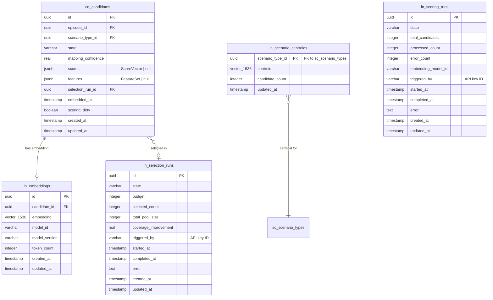

# Phase 2 — Intelligence: Automated Scoring, Selection & ML Infrastructure

## Enhancement Summary

**Deepened on:** 2026-02-20
**Review agents used:** TypeScript Reviewer, Architecture Strategist, Performance Oracle, Security Sentinel, Code Simplicity Reviewer, Data Integrity Guardian, Pattern Recognition Specialist, Best Practices Researcher (pg-boss, submodular optimization)

### Key Improvements

1. **Extract Intelligence bounded context** — Scoring, selection, embeddings, and clustering move out of Candidate into a new `src/contexts/intelligence/` context to prevent a "God context" anti-pattern
2. **Simplify MVP scope** — Reduce from 8 to 5 scoring dimensions, use rank-only normalization, budget-only constraints, defer LLM judge cache and embedding model registry table
3. **Type-safe job registry** — Replace generic `JobQueue<TData>` with a `JobRegistry` mapped type ensuring compile-time send/work payload matching
4. **Sparse similarity for optimizer** — Use pgvector-delegated redundancy computation instead of loading all embeddings into memory (prevents OOM at 50k+ candidates)
5. **Security hardening** — `execFile` for Python subprocess, Zod validation on all job payloads, error sanitization to prevent API key leakage, rate limiting on cost-generating endpoints

### Critical Issues Discovered

| Issue                                          | Severity | Resolution                                                          |
| ---------------------------------------------- | -------- | ------------------------------------------------------------------- |
| Candidate context becoming God context         | High     | Extract Intelligence bounded context                                |
| Event bus split-brain (Next.js vs. worker)     | High     | Chain jobs directly via pg-boss, not cross-process events           |
| Python subprocess injection risk               | Critical | Mandate `execFile`, absolute paths, strict parameter typing         |
| Loading all embeddings into optimizer memory   | High     | Delegate redundancy to pgvector queries via `RedundancyOracle` port |
| HNSW index creation locks table                | High     | Use `CREATE INDEX CONCURRENTLY` in custom migration                 |
| OpenAI API key in error logs/DLQ               | High     | Error sanitization utility stripping secrets                        |
| No rate limiting on scoring/selection triggers | High     | Rate limiter middleware + singleton job enforcement at API layer    |
| `sec-fetch-site` auth bypass is spoofable      | High     | Fix in proxy.ts before Phase 2 (pre-existing)                       |

### Scope Simplifications (YAGNI)

| Item                                         | Action                                    | Impact                      |
| -------------------------------------------- | ----------------------------------------- | --------------------------- |
| `cd_embedding_models` table                  | Replace with config constant              | -1 table, -1 use case       |
| `cd_judge_cache` table + `LLMJudge` port     | Defer to future phase                     | -1 table, -1 port           |
| `driftSignal` dimension (GET-184)            | Defer — needs historical baseline         | -1 scorer                   |
| `costEstimate` dimension (GET-186)           | Defer — needs real labeling data          | -1 scorer                   |
| Adaptive normalization (3-tier)              | Rank-only for Phase 2                     | -1 port, -1 adapter         |
| `SelectionWeights` (8 configurable)          | Hardcode equal weights                    | Simpler API                 |
| `SelectionConstraints` (4 constraint types)  | Budget-only for Phase 2 MVP               | -60 LOC constraint checking |
| `SelectionEvaluator` / backtesting (GET-189) | Defer — needs labeled outcomes            | -1 port                     |
| `duplicate_group_id` column                  | Remove — redundancyPenalty score suffices | -1 column                   |
| `embeddingType` multi-type                   | Single "combined" type                    | Simpler schema              |

---

## Overview

Phase 2 replaces manual candidate picking with a budgeted, multi-objective optimization pipeline. Episodes flow in (Phase 1), get embedded, scored across 8 dimensions, deduplicated, clustered, and selected for labeling — all orchestrated by an async job queue backed by PostgreSQL.

**Key outcome:** Given a budget of N candidates, Diamond automatically selects the N most valuable candidates that maximize coverage, diversity, and risk representation while minimizing redundancy and cost.

## Problem Statement

Phase 1 candidates sit in `raw` state with empty `scores` and `features` fields. Users must manually inspect episodes and guess which ones to label. This doesn't scale: at 10k+ candidates, no human can assess coverage gaps, redundancy, or risk distribution. The selection algorithm (greedy submodular maximization) needs a complete scoring pipeline feeding it.

## Architecture Overview

```
                          ┌─────────────────────────────────────────────┐
                          │           Phase 2 Pipeline                  │
                          │                                             │
  episode.ingested        │  ┌──────────┐   ┌──────────┐   ┌────────┐ │
  ─────────────────────►  │  │ Embedding│──►│ Scoring  │──►│Selection│ │
  candidate.created       │  │ Pipeline │   │ Engine   │   │ Engine  │ │
                          │  └──────────┘   └──────────┘   └────────┘ │
                          │       │              │              │       │
                          │       ▼              ▼              ▼       │
                          │  ┌──────────┐   ┌──────────┐   ┌────────┐ │
                          │  │ Dedup    │   │ Cluster  │   │ Label  │ │
                          │  │ Engine   │   │ Detection│   │ Queue  │ │
                          │  └──────────┘   └──────────┘   └────────┘ │
                          │                                             │
                          │  ┌──────────────────────────────────────┐  │
                          │  │  pg-boss  (Async Job Queue)          │  │
                          │  └──────────────────────────────────────┘  │
                          └─────────────────────────────────────────────┘
```

## Architectural Decision: Extract Intelligence Bounded Context

### Research Insight — Architecture Review

The Architecture Strategist and Pattern Recognition reviews both flagged the Candidate context as a **God context risk**. After Phase 2, the Candidate context would own 6+ distinct sub-domains (embedding management, scoring engine, selection optimization, coverage computation, clustering orchestration, LLM judge infrastructure) that are only loosely related to the Candidate aggregate's core responsibility (tracking candidate state).

**Decision:** Extract a new **Intelligence** bounded context (`src/contexts/intelligence/`, prefix `in_`).

```
src/contexts/intelligence/
  domain/
    entities/ScoringRun.ts
    entities/SelectionRun.ts
    value-objects/ScoreVector.ts
    value-objects/FeatureSet.ts
    errors.ts
    events.ts
  application/
    ports/
      EmbeddingProvider.ts
      EmbeddingRepository.ts
      ScoringRunRepository.ts
      SelectionRunRepository.ts
      FeatureExtractor.ts
      ScoringEngine.ts
      ScenarioMapper.ts
      SelectionOptimizer.ts
      CandidateReader.ts       # reads from Candidate context
      ScenarioReader.ts        # reads from Scenario context
      EpisodeReader.ts         # reads from Ingestion context
      DatasetReader.ts         # reads from Dataset context
    use-cases/
      ManageScoringRuns.ts
      ManageSelectionRuns.ts
      ManageEmbeddings.ts
      ComputeCoverage.ts
    handlers/
      onCandidateCreated.ts    # queues embedding job
      onScenarioGraphUpdated.ts # marks candidates dirty
  infrastructure/
    OpenAIEmbeddingProvider.ts
    DrizzleScoringRunRepository.ts
    DrizzleSelectionRunRepository.ts
    DrizzleEmbeddingRepository.ts
    CompositeScoringEngine.ts
    EmbeddingScenarioMapper.ts
    GreedySubmodularOptimizer.ts
    CandidateContextAdapter.ts
    ScenarioContextAdapter.ts
    IngestionContextAdapter.ts
    DatasetContextAdapter.ts
  index.ts                     # composition root
```

**Context map:**

```
Ingestion ──[Conformist]──▶ Candidate ──[Open Host]──▶ Intelligence
                                                            │
Scenario  ──[Open Host]──────────────────────────────▶ Intelligence
                                                            │
Intelligence ──[Conformist]──▶ Labeling (via selection_run.completed)
Intelligence ──[message]──▶ Scenario (unmapped_cluster.detected)
```

The Candidate context stays lean (state machine, basic CRUD). Intelligence reads candidates via a `CandidateReader` port and writes scores back by publishing `candidate.scored` events that a Candidate context handler processes.

**Candidate context keeps:** `Candidate` aggregate, `ManageCandidates`, `CandidateRepository`, `onEpisodeIngested` handler

**Intelligence context gets:** Everything else in Phase 2 (embeddings, scoring, selection, clustering, coverage, mapping)

### Research Insight — Event Bus Split-Brain

The Architecture review identified a critical issue: the `InProcessEventBus` is an in-memory singleton. The Next.js process and the pg-boss worker process have **separate instances**. Events published in the worker won't reach handlers in the Next.js process.

**Resolution:** Do NOT use domain events for cross-process communication. Instead:

- **Within Next.js process:** Use in-process event bus (existing pattern) to trigger pg-boss job enqueueing
- **Within worker process:** Chain jobs directly via pg-boss (embedding job completes → enqueue scoring job). No domain events for pipeline orchestration.
- **Worker → Next.js:** Job completion writes state to DB (ScoringRun.state = "completed"). Next.js reads via API. No event needed.
- Domain events like `selection_run.completed` → Labeling context: If both run in the same process, the in-process bus works. If separate, use pg-boss `onComplete` to enqueue a `labeling.create_tasks` job.

**Simplified event flow (no cross-process domain events):**

```
[Next.js] POST /api/v1/scoring/run
  → pg-boss.send("scoring_run.execute")

[Worker] scoring_run.execute job:
  → For each dirty candidate:
    → If not embedded: pg-boss.send("embedding.compute")
    → If embedded: compute scores inline
  → Update ScoringRun state to "completed"

[Worker] embedding.compute job:
  → Call OpenAI → Store embedding → Mark candidate embedded
  → pg-boss.send("scoring.compute", { candidateId })

[Worker] scoring.compute job:
  → Extract features → Compute 5 dimensions → Update candidate scores
  → Mark candidate as scored

[Next.js] POST /api/v1/selection/run
  → pg-boss.send("selection_run.execute")

[Worker] selection_run.execute job:
  → Load scored candidates → Run greedy optimizer → Transition to "selected"
  → pg-boss.send("labeling.create_tasks", { selectionRunId })
```

---

## Technical Approach

### Design Decisions

| Decision             | Choice                                                       | Rationale                                                                               |
| -------------------- | ------------------------------------------------------------ | --------------------------------------------------------------------------------------- | --------------------------------------------------------- |
| Job queue            | pg-boss (PostgreSQL-native)                                  | No new infra (no Redis), SKIP LOCKED, retries, dead-letter queues                       |
| Embeddings           | OpenAI text-embedding-3-small, 1536 dims                     | Best cost/quality ratio at $0.02/1M tokens; Drizzle has native `vector()`               |
| Vector index         | pgvector HNSW with cosine distance                           | Sub-2ms queries at 100k scale, no training step needed                                  |
| Clustering           | HDBSCAN via Python subprocess                                | scikit-learn 1.3+ has built-in HDBSCAN; no viable JS implementation                     |
| Submodular optimizer | Custom TypeScript implementation                             | Algorithm is ~30 lines; no JS library exists; lazy greedy with heap for 10-100x speedup |
| Score normalization  | Adaptive (rank → robust min-max → quantile)                  | Handles cold-start (few candidates) through steady-state (thousands)                    |
| "Embedded" tracking  | `embeddedAt: timestamp                                       | null` flag, NOT a new state                                                             | Avoids breaking the existing `raw → scored` state machine |
| Worker deployment    | Separate long-running Node.js process                        | Next.js routes are ephemeral; pg-boss workers need persistent connections               |
| Normalization timing | Computed at selection time, not stored                       | Raw scores stored on candidate; normalization is ephemeral over current pool            |
| Concurrency control  | Singleton scoring/selection runs via pg-boss unique job keys | Prevents overlapping runs; selection rejects if scoring is active                       |

### Research Insights — Design Decisions

**Type-Safe Job Registry (TypeScript Review):**

Replace the generic `JobQueue<TData>` with a mapped type registry that enforces payload matching at compile time:

```typescript
export interface JobRegistry {
  "embedding.compute": { candidateId: string };
  "scoring.compute": { candidateId: string; runId: string };
  "scoring_run.execute": { runId: string };
  "selection_run.execute": { runId: string; budget: number };
  "cluster.detect": { minClusterSize?: number };
  "labeling.create_tasks": { selectionRunId: string };
}

export interface JobQueue {
  send<K extends keyof JobRegistry>(
    name: K,
    data: JobRegistry[K],
    options?: JobOptions
  ): Promise<string>;
  work<K extends keyof JobRegistry>(
    name: K,
    handler: (job: { id: string; data: JobRegistry[K] }) => Promise<void>,
    options?: WorkerOptions
  ): Promise<void>;
}
```

**pg-boss Worker Architecture (Best Practices Research):**

- **Send-only client in Next.js:** Initialize pg-boss with `{ supervise: false, schedule: false, migrate: false }` in `instrumentation.ts` for enqueueing only
- **Full worker as separate process:** `scripts/worker.ts` run via `pnpm tsx --watch` in dev, compiled JS + PM2 in production
- **Health endpoint:** HTTP server on `:9090` with `/health` (liveness) and `/metrics` (queue stats) backed by pg-boss `wip` event
- **Queue creation with DLQ:** Each job type gets a queue with retry policy + dead-letter queue
- **Graceful shutdown:** `boss.stop({ graceful: true, timeout: 30_000 })` on SIGTERM

```typescript
// src/lib/jobs/client.ts — send-only client for Next.js
import PgBoss from "pg-boss";
let _boss: PgBoss | null = null;
export async function getJobClient(): Promise<PgBoss> {
  if (!_boss) {
    _boss = new PgBoss({
      connectionString:
        process.env.PGBOSS_DATABASE_URL ?? process.env.DATABASE_URL!,
      schema: "pgboss",
      application_name: "diamond-api",
      supervise: false,
      schedule: false,
      migrate: false,
      max: 3,
    });
    _boss.on("error", console.error);
    await _boss.start();
  }
  return _boss;
}
```

**Reduced Scoring Dimensions (Simplicity Review):**

Start with 5 dimensions instead of 8. Defer `driftSignal` (needs historical baseline), `costEstimate` (needs labeling data), and merge `uncertainty` + `failureLikelihood` into `failureProbability`:

| Dimension            | Phase 2 MVP | Rationale                              |
| -------------------- | :---------: | -------------------------------------- |
| `coverageGain`       |     Yes     | Core value prop                        |
| `riskWeight`         |     Yes     | Maps to existing risk tiers            |
| `novelty`            |     Yes     | Primary use of embeddings              |
| `redundancyPenalty`  |     Yes     | Other primary use of embeddings        |
| `failureProbability` |     Yes     | Merged uncertainty + failure heuristic |
| `driftSignal`        |    Defer    | Needs historical baseline              |
| `costEstimate`       |    Defer    | Needs real labeling data               |

**Rank-Only Normalization (Simplicity Review):**

Use rank normalization (`rank / (n-1)`) for all pool sizes. It is correct for any n, has zero tunable parameters, and maps every dimension uniformly to [0,1]. Replace the 3-tier adaptive strategy with a 15-line pure function. Add robust min-max/quantile when production data shows it matters.

**Budget-Only Constraints (Simplicity Review):**

`SelectionConstraints = { budget: number }` for Phase 2 MVP. Per-scenario minimums, risk tier quotas, and freshness requirements are powerful but premature without empirical weight tuning. Add when users request them.

### Event Flow DAG

```
episode.ingested
  └─► candidate.created (existing handler)
        └─► [pg-boss] embedding.compute
              ├─► candidate.embedded (new event)
              │     └─► [pg-boss] scoring.compute
              │           ├─► auto scenario mapping (inline)
              │           ├─► redundancy_penalty via pgvector similarity (inline)
              │           ├─► feature extraction (inline)
              │           └─► candidate.scored (new event)
              └─► [pg-boss] dedup.check (parallel, writes redundancy flag)

scenario_graph.updated (existing event, new handler)
  └─► mark affected candidates dirty → [pg-boss] scoring.recompute

User triggers POST /api/v1/scoring/run
  └─► [pg-boss] scoring_run.execute (batch all dirty/unscored)
        └─► scoring_run.completed

User triggers POST /api/v1/selection/run
  └─► [pg-boss] selection_run.execute (greedy submodular)
        └─► selection_run.completed
              └─► Labeling context creates LabelTasks

[Periodic cron] cluster.detect
  └─► [pg-boss] cluster.hdbscan (Python subprocess)
        └─► unmapped_cluster.detected (per cluster)
              └─► Scenario context surfaces suggestion
```

---

## Implementation Phases

### Phase 2A: ML Infrastructure Foundation (GET-180)

**Goal:** Async job queue, pgvector setup, embedding pipeline — the plumbing everything else builds on.

#### 2A.1 — pg-boss Job Queue Abstraction

**New files:**

```
src/lib/jobs/
  JobQueue.ts              # Port interface
  PgBossJobQueue.ts        # pg-boss adapter
  index.ts                 # Composition root, exports singleton
  worker.ts                # Standalone worker entry point
```

**Port interface** (`src/lib/jobs/JobQueue.ts`):

```typescript
export interface JobDefinition<TData = unknown> {
  name: string;
  data: TData;
  options?: {
    retryLimit?: number;
    retryDelay?: number;
    retryBackoff?: boolean;
    expireInSeconds?: number;
    priority?: number;
    singletonKey?: string; // prevents duplicate jobs
    startAfterSeconds?: number;
  };
}

export interface JobHandler<TData = unknown> {
  (job: { id: string; data: TData }): Promise<void>;
}

export interface JobQueue {
  send<TData>(definition: JobDefinition<TData>): Promise<string>;
  work<TData>(
    name: string,
    handler: JobHandler<TData>,
    options?: { batchSize?: number; pollingIntervalSeconds?: number }
  ): Promise<void>;
  schedule(name: string, cron: string, data?: unknown): Promise<void>;
  getQueueSize(name: string): Promise<number>;
  stop(): Promise<void>;
}
```

**Worker process** (`src/lib/jobs/worker.ts`):

- Standalone `node` entry point (not a Next.js API route)
- Initializes pg-boss with its own `pg` connection pool (separate from Drizzle's postgres.js)
- Registers all job handlers
- Handles graceful shutdown (SIGTERM/SIGINT)
- Add `"worker": "tsx src/lib/jobs/worker.ts"` script to `package.json`

**Dependencies:** `pg-boss@^12`, `pg@^8` (pg-boss requires node-postgres, not postgres.js)

**Database setup:**

- pg-boss creates its own `pgboss` schema automatically on start
- No Drizzle migration needed for pg-boss internals

<details>
<summary>pg-boss connection strategy</summary>

pg-boss uses `pg` (node-postgres) internally, not `postgres.js`. Two options:

1. **Separate pool (recommended):** Let pg-boss manage its own `pg` pool via connection string. Simple, battle-tested.
2. **Adapter wrapper:** Write a thin adapter around postgres.js `sql.unsafe()`. Riskier, less tested.

Choose option 1 for reliability. The app will have two connection pools:

- Drizzle → postgres.js (existing)
- pg-boss → pg (new, ~5 connections)

</details>

#### Research Insights — pg-boss Production Configuration

**Queue definitions with dead-letter queues:**

```typescript
// src/lib/jobs/queues.ts
export const QUEUES = {
  EMBEDDING_COMPUTE: "embedding.compute",
  EMBEDDING_DLQ: "embedding.dlq",
  SCORING_COMPUTE: "scoring.compute",
  SCORING_DLQ: "scoring.dlq",
  SCORING_RUN: "scoring_run.execute",
  SELECTION_RUN: "selection_run.execute",
  CLUSTER_DETECT: "cluster.detect",
  LABELING_CREATE: "labeling.create_tasks",
} as const;

export async function createQueues(boss: PgBoss): Promise<void> {
  await boss.createQueue(QUEUES.EMBEDDING_COMPUTE, {
    retryLimit: 3,
    retryDelay: 30,
    retryBackoff: true,
    expireInSeconds: 300, // 5 min per embedding
    deadLetter: QUEUES.EMBEDDING_DLQ,
  });
  await boss.createQueue(QUEUES.SCORING_RUN, {
    retryLimit: 2,
    retryDelay: 60,
    retryBackoff: true,
    expireInSeconds: 3600, // 1 hour for full scoring run
    deadLetter: QUEUES.SCORING_DLQ,
  });
  // ... similar for other queues
}
```

**Process supervision (PM2 for local dev, systemd for production):**

```javascript
// ecosystem.config.cjs
module.exports = {
  apps: [
    {
      name: "diamond-worker",
      script: "scripts/worker.ts",
      interpreter: "node_modules/.bin/tsx",
      instances: 1,
      kill_timeout: 35000,
    },
  ],
};
```

**package.json scripts:**

```json
{
  "worker:dev": "tsx --watch scripts/worker.ts",
  "worker:start": "node dist/worker/scripts/worker.js",
  "worker:health": "curl -s http://localhost:9090/health | jq"
}
```

#### 2A.2 — pgvector Extension & Embedding Schema

**Migration:** Generate custom migration via `npx drizzle-kit generate --custom`:

```sql
-- 0001_add_pgvector_extension.sql
CREATE EXTENSION IF NOT EXISTS vector;
```

**Schema changes** (`src/db/schema/candidate.ts`):

```typescript
import { vector } from "drizzle-orm/pg-core";

// New table: cd_embeddings
export const cdEmbeddings = pgTable(
  "cd_embeddings",
  {
    id: uuid("id").primaryKey(),
    candidateId: uuid("candidate_id")
      .notNull()
      .references(() => cdCandidates.id),
    embeddingType: varchar("embedding_type", { length: 50 }).notNull(), // "request", "conversation", "answer", "combined"
    embedding: vector("embedding", { dimensions: 1536 }).notNull(),
    modelId: varchar("model_id", { length: 100 }).notNull(), // "oai-te3s-1536"
    modelVersion: varchar("model_version", { length: 50 }).notNull(),
    tokenCount: integer("token_count"),
    createdAt: timestamp("created_at", { withTimezone: true })
      .notNull()
      .defaultNow(),
  },
  (t) => [
    index("cd_embeddings_candidate_id_idx").on(t.candidateId),
    index("cd_embeddings_hnsw_idx").using(
      "hnsw",
      t.embedding.op("vector_cosine_ops")
    ),
    // Unique: one embedding per candidate per type per model
    uniqueIndex("cd_embeddings_candidate_type_model_uniq").on(
      t.candidateId,
      t.embeddingType,
      t.modelId
    ),
  ]
);

// New table: cd_embedding_models (registry)
export const cdEmbeddingModels = pgTable("cd_embedding_models", {
  id: varchar("model_id", { length: 100 }).primaryKey(), // "oai-te3s-1536"
  provider: varchar("provider", { length: 50 }).notNull(), // "openai"
  modelName: varchar("model_name", { length: 100 }).notNull(), // "text-embedding-3-small"
  dimensions: integer("dimensions").notNull(), // 1536
  isActive: boolean("is_active").notNull().default(true),
  createdAt: timestamp("created_at", { withTimezone: true })
    .notNull()
    .defaultNow(),
  deprecatedAt: timestamp("deprecated_at", { withTimezone: true }),
});

// Add to cd_candidates table:
// embeddedAt: timestamp (null = not yet embedded)
// scoringDirty: boolean (true = needs re-scoring)
```

**Candidate entity changes:**

- Add `embeddedAt: Date | null` field to `CandidateData` interface
- Add `scoringDirty: boolean` field for incremental processing (GET-188)
- Add `markEmbedded()` and `markDirty()` methods to `Candidate` aggregate

#### Research Insights — Data Integrity for pgvector Schema

**HNSW Index — Must use `CREATE INDEX CONCURRENTLY` (Data Integrity Review):**

Standard `CREATE INDEX` acquires `ACCESS EXCLUSIVE` lock, blocking all reads/writes. For a table that may already have data, use a custom migration:

```sql
-- Generated via: npx drizzle-kit generate --custom
CREATE INDEX CONCURRENTLY IF NOT EXISTS cd_embeddings_hnsw_idx
  ON in_embeddings USING hnsw (embedding vector_cosine_ops)
  WITH (m = 16, ef_construction = 128);
```

Note: `CREATE INDEX CONCURRENTLY` cannot run inside a transaction. Ensure the migration runner does not wrap this in a transaction block.

**Set `ef_construction=128` from the start (Performance Review).** Default `ef_construction=64` gives suboptimal recall at 50k+ vectors. The build time difference is negligible at our scale.

**Upsert pattern for concurrent embedding writes (Data Integrity Review):**

pg-boss singleton keys prevent duplicate jobs, but edge cases (retry after partial completion, worker crash) can cause duplicate inserts. Use `ON CONFLICT DO UPDATE`:

```typescript
await db
  .insert(inEmbeddings)
  .values({
    id: generateId(),
    candidateId,
    embeddingType: "combined",
    embedding,
    modelId,
    modelVersion,
    tokenCount,
  })
  .onConflictDoUpdate({
    target: [inEmbeddings.candidateId, inEmbeddings.modelId],
    set: { embedding, tokenCount, updatedAt: new Date() },
  });
```

**Add `updatedAt` to `in_embeddings`** for upsert visibility.

**Partial indexes for work-queue columns (Performance Review):**

```sql
CREATE INDEX in_candidates_scoring_dirty_idx ON cd_candidates (id) WHERE scoring_dirty = true;
CREATE INDEX in_candidates_not_embedded_idx ON cd_candidates (id) WHERE embedded_at IS NULL;
```

These stay small (only relevant rows) and accelerate the most common query patterns.

**Simplified schema (Simplicity Review):** Remove `embeddingType` multi-type — use single "combined" embedding per candidate. Remove `cd_embedding_models` table — use a config constant. This simplifies the unique constraint to just `(candidateId, modelId)`.

**Add missing foreign keys (Data Integrity Review):**

- `in_embeddings.candidate_id` → `cd_candidates.id` with `ON DELETE RESTRICT`
- `in_scenario_centroids.scenario_type_id` → `sc_scenario_types.id` with `ON DELETE CASCADE`

**First migration backfill note:** When `scoring_dirty DEFAULT true` is added to `cd_candidates`, all existing candidates become dirty. The first scoring run will process the entire backlog — document this as expected behavior.

#### 2A.3 — Embedding Pipeline

**New port** (`src/contexts/candidate/application/ports/EmbeddingProvider.ts`):

```typescript
export interface EmbeddingResult {
  embedding: number[];
  tokenCount: number;
  modelId: string;
  modelVersion: string;
}

export interface EmbeddingProvider {
  embed(texts: string[]): Promise<EmbeddingResult[]>;
  getModelId(): string;
  getDimensions(): number;
}
```

**New adapter** (`src/contexts/candidate/infrastructure/OpenAIEmbeddingProvider.ts`):

- Uses `openai` SDK v4+
- Batches texts (max 2048 items, max 300k tokens per request)
- Concurrency control via `p-limit` (3-5 parallel requests)
- Exponential backoff on 429 errors via `p-retry`
- Configurable model and dimensions via env vars: `OPENAI_API_KEY`, `EMBEDDING_MODEL`, `EMBEDDING_DIMENSIONS`

**New handler** (`src/contexts/candidate/application/handlers/onCandidateCreated.ts`):

- Subscribes to `candidate.created`
- Queues `embedding.compute` job via `JobQueue`

**Job handler** (registered in worker):

- Reads episode content via `EpisodeReader` port
- Calls `EmbeddingProvider.embed()` with concatenated input/output text
- Stores embedding in `cd_embeddings` table
- Updates `Candidate.embeddedAt`
- Emits `candidate.embedded` event

**Dependencies:** `openai@^4`, `p-limit@^6`, `p-retry@^6`, `gpt-tokenizer` (token counting)

#### 2A.4 — Embedding Model Configuration (Simplified from GET-182)

**Simplified (per Simplicity Review):** Replace the `cd_embedding_models` database table with a config constant:

```typescript
// src/contexts/intelligence/infrastructure/OpenAIEmbeddingProvider.ts
export const EMBEDDING_CONFIG = {
  modelId: "oai-te3s-1536",
  provider: "openai",
  modelName: "text-embedding-3-small",
  dimensions: 1536,
} as const;
```

The `modelId` string is still stored on each embedding row for future migration. If a model swap is ever needed:

1. Update the constant
2. Query `WHERE model_id != '<new_model_id>'` to find stale embeddings
3. Mark those candidates as `scoringDirty = true`
4. Re-embedding runs as a batch job

No registry table, no `ManageEmbeddingModels` use case, no deprecation workflow. **Add the full registry when a second model is actually needed.**

#### Research Insights — Embedding Pipeline Security

**PII check gate (Security Review):** Before embedding, verify the candidate's episode passed PII redaction. Refuse to embed candidates whose episodes have a redaction failure flag — otherwise raw PII is sent to OpenAI.

**Error sanitization (Security Review):** The OpenAI SDK can include `Authorization: Bearer sk-...` in error objects. Wrap the adapter in try/catch that strips secrets before re-throwing:

```typescript
try {
  return await this.client.embeddings.create({ model, input: texts });
} catch (error) {
  throw new EmbeddingProviderError(
    sanitizeError(error), // strips Authorization headers, API keys
    { candidateCount: texts.length, model }
  );
}
```

**Spend cap (Security Review):** Add `OPENAI_DAILY_TOKEN_LIMIT` env var. Track cumulative tokens per day in the embedding adapter. Halt the pipeline if exceeded — prevents runaway costs during bulk re-embedding.

---

### Phase 2B: Scoring Engine (GET-183 through GET-188)

**Goal:** Compute the 8-dimensional score vector for each candidate.

#### 2B.1 — Feature Extraction

**New value object** (`src/contexts/candidate/domain/value-objects/FeatureSet.ts`):

```typescript
import { z } from "zod";

export const FeatureSetSchema = z.object({
  turnCount: z.number().int().nonnegative(),
  toolCallCount: z.number().int().nonnegative(),
  hasNegativeFeedback: z.boolean(),
  inputTokenCount: z.number().int().nonnegative(),
  outputTokenCount: z.number().int().nonnegative(),
  language: z.string().nullable(), // ISO 639-1
  modelVersion: z.string().nullable(),
  episodeAgeHours: z.number().nonnegative(),
  userPlanTier: z.string().nullable(),
  toolErrorRate: z.number().min(0).max(1),
});

export type FeatureSet = z.infer<typeof FeatureSetSchema>;
```

**Port** (`src/contexts/candidate/application/ports/FeatureExtractor.ts`):

```typescript
export interface FeatureExtractor {
  extract(episodeContent: EpisodeContent): FeatureSet;
}
```

**Adapter** (`src/contexts/candidate/infrastructure/EpisodeFeatureExtractor.ts`):

- Reads episode inputs/outputs/trace
- Computes each feature from episode data
- Pure function — no external API calls

#### 2B.2 — Score Dimensions (5 for Phase 2 MVP)

**New value object** (`src/contexts/intelligence/domain/value-objects/ScoreVector.ts`):

```typescript
import { z } from "zod";

export const ScoreVectorSchema = z
  .object({
    coverageGain: z.number().nonnegative(), // How much new coverage this candidate adds
    riskWeight: z.number().nonnegative(), // From scenario's RiskTier weight
    novelty: z.number().min(0).max(1), // Cosine distance to nearest neighbor in embedding space
    failureProbability: z.number().min(0).max(1), // Merged uncertainty + failure likelihood heuristic
    redundancyPenalty: z.number().min(0).max(1), // Similarity to already-selected/existing candidates (penalty)
  })
  .readonly();

export type ScoreVector = z.infer<typeof ScoreVectorSchema>;
```

**Each dimension implemented as a separate `DimensionScorer` (Architecture Review recommendation — Interface Segregation):**

```typescript
export interface DimensionScorer {
  readonly dimension: keyof ScoreVector;
  score(ctx: ScoringContext): Promise<number>;
  scoreBatch?(contexts: ScoringContext[]): Promise<Map<UUID, number>>;
}
```

| Dimension            | Implementation                                                                 | Depends On                    |
| -------------------- | ------------------------------------------------------------------------------ | ----------------------------- |
| `coverageGain`       | Count candidates per scenario type vs. existing dataset; gap = high gain       | ScenarioReader, DatasetReader |
| `riskWeight`         | Look up mapped scenario's RiskTier.weight                                      | ScenarioReader                |
| `novelty`            | Cosine distance to K nearest neighbors in embedding space                      | pgvector query                |
| `failureProbability` | has_negative_feedback, low confidence, high tool error rate (merged heuristic) | FeatureSet                    |
| `redundancyPenalty`  | Cosine similarity to already-selected candidates and existing dataset          | pgvector query                |

**Deferred to Phase 3 (need historical data):**

| Dimension                | Why Deferred                                                          |
| ------------------------ | --------------------------------------------------------------------- |
| `driftSignal` (GET-184)  | Needs meaningful historical baseline that a fresh system doesn't have |
| `costEstimate` (GET-186) | Annotation cost poorly estimated without actual labeling data         |

**Port** (`src/contexts/intelligence/application/ports/ScoringEngine.ts`):

```typescript
export interface ScoringContext {
  candidate: CandidateData;
  features: FeatureSet;
  embedding: ReadonlyArray<number>;
  scenarioMapping: ScenarioMapping | null;
}

export interface ScoringEngine {
  score(ctx: ScoringContext): Promise<ScoreVector>;
  scoreBatch(contexts: ScoringContext[]): Promise<Map<UUID, ScoreVector>>;
}
```

**Adapter** (`src/contexts/intelligence/infrastructure/CompositeScoringEngine.ts`):

- Composes `DimensionScorer[]` — each scorer is independently testable
- Batch mode for efficiency (single pgvector query for all novelty scores, single DB query for all coverage gains)
- Adding/removing dimensions = adding/removing a scorer from the array

#### Research Insights — Scoring Performance

**Batch drift signal computation (Performance Review):** When `driftSignal` is added in Phase 3, compute all drift signals in a single `GROUP BY` query, not per-candidate:

```sql
SELECT scenario_type_id,
  COUNT(*) FILTER (WHERE occurred_at >= NOW() - INTERVAL '7 days') AS recent,
  COUNT(*) FILTER (WHERE occurred_at >= NOW() - INTERVAL '14 days'
                     AND occurred_at < NOW() - INTERVAL '7 days') AS historical
FROM ig_episodes
WHERE scenario_type_id IS NOT NULL AND occurred_at >= NOW() - INTERVAL '14 days'
GROUP BY scenario_type_id;
```

**Process scoring runs in batches of 100-500 (Performance Review).** Do NOT hold a single transaction for the entire run. Commit per batch, update `processedCount`, and enable resumability on failure.

**TypeScript type safety for scores (TypeScript Review):**

- Replace `Record<string, unknown>` on `CandidateData.scores` with `ScoreVector | null` (null when state is "raw")
- Replace `Record<string, unknown>` on `CandidateData.features` with `FeatureSet | null`
- Add `.$type<ScoreVector>()` to the `jsonb("scores")` Drizzle column
- Validate with `ScoreVectorSchema.parse()` at the repository hydration boundary

#### 2B.3 — Score Normalization (Simplified — GET-183 absorbed)

**Simplified per Simplicity Review.** No port/adapter — a pure function in the selection engine:

```typescript
// src/contexts/intelligence/domain/services/normalizeScores.ts
export function normalizeByRank(
  scores: ReadonlyArray<ScoreVector>,
  dimension: keyof ScoreVector
): number[] {
  const sorted = scores
    .map((s, i) => ({ i, v: s[dimension] }))
    .sort((a, b) => a.v - b.v);
  const result = new Array<number>(scores.length);
  for (let rank = 0; rank < sorted.length; rank++) {
    result[sorted[rank]!.i] =
      sorted.length > 1 ? rank / (sorted.length - 1) : 0.5;
  }
  return result;
}
```

- Rank normalization maps every dimension to [0, 1] uniformly
- Correct for any pool size (no cold-start issues)
- Zero tunable parameters
- Computed at selection time over the current scored pool — **not stored**
- Raw scores always persisted on the candidate
- Upgrade to robust min-max or quantile when production data shows rank is insufficient

#### 2B.4 — ScoringRun Aggregate

**Must extend `AggregateRoot` with full state machine guard (Pattern Recognition Review):**

**New entity** (`src/contexts/intelligence/domain/entities/ScoringRun.ts`):

```typescript
export const SCORING_RUN_STATES = [
  "pending",
  "processing",
  "completed",
  "failed",
] as const;
export type ScoringRunState = (typeof SCORING_RUN_STATES)[number];

export interface ScoringRunData {
  id: UUID;
  state: ScoringRunState;
  totalCandidates: number;
  processedCount: number;
  errorCount: number;
  embeddingModelId: string;
  triggeredBy: string | null; // API key ID for audit trail
  startedAt: Date | null;
  completedAt: Date | null;
  error: string | null;
  createdAt: Date;
  updatedAt: Date;
}

const VALID_TRANSITIONS: Record<ScoringRunState, ScoringRunState[]> = {
  pending: ["processing"],
  processing: ["completed", "failed"],
  completed: [],
  failed: [],
};

// Class MUST extend AggregateRoot (Pattern Recognition Review):
// - transitionTo() with VALID_TRANSITIONS guard
// - toData() for persistence
// - addDomainEvent() on state changes (scoring_run.started, scoring_run.completed, scoring_run.failed)
```

**Schema** (`src/db/schema/intelligence.ts`):

```typescript
export const cdScoringRuns = pgTable("cd_scoring_runs", {
  id: uuid("id").primaryKey(),
  state: varchar("state", { length: 20 }).notNull().default("pending"),
  totalCandidates: integer("total_candidates").notNull().default(0),
  processedCount: integer("processed_count").notNull().default(0),
  errorCount: integer("error_count").notNull().default(0),
  embeddingModelId: varchar("embedding_model_id", { length: 100 }).notNull(),
  startedAt: timestamp("started_at", { withTimezone: true }),
  completedAt: timestamp("completed_at", { withTimezone: true }),
  error: text("error"),
  createdAt: timestamp("created_at", { withTimezone: true })
    .notNull()
    .defaultNow(),
  updatedAt: timestamp("updated_at", { withTimezone: true })
    .notNull()
    .defaultNow(),
});
```

#### 2B.5 — Incremental Scoring Pipeline (GET-188)

**Dirty tracking:**

- `cd_candidates.scoring_dirty` boolean column (default `true` for new candidates)
- Set to `true` when:
  - Candidate is newly created (`onCandidateCreated`)
  - Embedding model changes (`ManageEmbeddingModels.deprecate()`)
  - Scenario graph updated affecting this candidate's mapped scenario
- Scoring run only processes candidates where `scoring_dirty = true`

**Event handler** (`src/contexts/candidate/application/handlers/onScenarioGraphUpdated.ts`) (GET-187):

- Subscribes to `scenario_graph.updated`
- Reads `changes` payload to identify affected scenario type IDs
- Marks all candidates with those scenario types as `scoringDirty = true`
- Optionally queues a re-scoring job

#### 2B.6 — Auto Scenario Mapping

**Port** (`src/contexts/candidate/application/ports/ScenarioMapper.ts`):

```typescript
export interface MappingResult {
  scenarioTypeId: UUID;
  confidence: number;
}

export interface ScenarioMapper {
  map(embedding: number[]): Promise<MappingResult | null>;
  updateCentroids(): Promise<void>;
}
```

**Adapter** (`src/contexts/candidate/infrastructure/EmbeddingScenarioMapper.ts`):

- Maintains scenario type centroids (average embedding of all mapped candidates per type)
- Centroids stored in `cd_scenario_centroids` table (pgvector column)
- On map: cosine similarity between candidate embedding and all centroids
- Best match above threshold (configurable, default 0.7) → assign with confidence score
- Below threshold → leave unmapped
- Centroids recomputed after each scoring run batch

**Schema:**

```typescript
export const cdScenarioCentroids = pgTable("cd_scenario_centroids", {
  scenarioTypeId: uuid("scenario_type_id").primaryKey(),
  centroid: vector("centroid", { dimensions: 1536 }).notNull(),
  candidateCount: integer("candidate_count").notNull().default(0),
  updatedAt: timestamp("updated_at", { withTimezone: true })
    .notNull()
    .defaultNow(),
});
```

#### 2B.7 — Scoring API Routes

```
app/api/v1/scoring/run/route.ts          → POST (trigger), GET (list runs)
app/api/v1/scoring/runs/[id]/route.ts    → GET (status + progress)
app/api/v1/candidates/[id]/scores/route.ts  → GET (score vector)
app/api/v1/candidates/[id]/features/route.ts → GET (feature set)
```

---

### Phase 2C: Semantic Deduplication & Clustering (GET-181, GET-184)

#### 2C.1 — Semantic Deduplication Engine (GET-181)

**Implementation:** Inline during scoring, not a separate pipeline step.

When computing `redundancyPenalty` for a candidate:

1. pgvector cosine similarity query: find K nearest neighbors (K=10)
2. If any neighbor has similarity > threshold (default 0.95): flag as near-duplicate
3. `redundancyPenalty` = max similarity to any already-selected candidate or existing dataset member
4. Store duplicate group ID on candidate if detected (for UI display)

**Schema addition:**

```typescript
// Add to cd_candidates:
duplicateGroupId: varchar("duplicate_group_id", { length: 100 }),
```

**Configuration:**

- `DEDUP_SIMILARITY_THRESHOLD` env var (default 0.95 for near-exact, 0.85 for semantic)
- Threshold configurable per selection run as well

#### 2C.2 — HDBSCAN Cluster Detection

**Python script** (`scripts/cluster.py`):

- Reads embeddings as JSON from stdin (or temp file for large datasets)
- Runs `sklearn.cluster.HDBSCAN(min_cluster_size=5, min_samples=3)`
- Outputs cluster labels, probabilities, and exemplar indices as JSON
- Version-pinned in `requirements.txt`: `scikit-learn>=1.3,<2.0`

**pg-boss job:**

- `cluster.detect` — cron-scheduled (daily or on-demand)
- Fetches all unmapped candidate embeddings from DB
- Writes to temp file if > 10k rows
- Spawns `python3 scripts/cluster.py` subprocess
- Parses output → for each cluster, emit `unmapped_cluster.detected` event with:
  - cluster_id (generated)
  - episode_count
  - representative_episode_ids (3-5 closest to centroid)
  - centroid_summary (TBD: could use LLM to summarize)

**Event handler** (`src/contexts/scenario/application/handlers/onUnmappedClusterDetected.ts`):

- Receives cluster detection event
- Creates a "suggestion" record in the Scenario context for domain expert review
- No automatic scenario creation — human-in-the-loop

**Error handling:**

- Python subprocess timeout: 10 minutes (configurable)
- OOM: catch subprocess exit code, log, mark job as failed
- Pool too small (< 15 unmapped candidates): skip clustering, no-op

#### 2C.3 — Drift Signal Dimension (GET-184)

**Implementation in `DriftSignalScorer`:**

```typescript
// For each candidate's mapped scenario type:
// 1. Count episodes in last 7 days with this scenario type
// 2. Count episodes in previous 7 days with this scenario type
// 3. drift_signal = recent_count / (historical_count + 1) - 1
//    Positive = trending up, negative = trending down, 0 = stable
```

- Requires `EpisodeReader` port to query temporal distribution
- Unmapped candidates: drift_signal = 0 (neutral)

---

### Phase 2D: Selection Engine (related to GET-189)

#### 2D.1 — SelectionRun Aggregate

**Entity** (`src/contexts/candidate/domain/entities/SelectionRun.ts`):

```typescript
export const SELECTION_RUN_STATES = [
  "pending",
  "processing",
  "completed",
  "failed",
] as const;

export interface SelectionConstraints {
  budget: number; // max candidates to select (integer count)
  scenarioMinimums?: Record<string, number>; // scenarioTypeId → min count
  riskTierQuotas?: Record<string, number>; // riskTierName → min count
  freshnessRequirement?: number; // max episode age in days
  excludeStates?: CandidateState[]; // states to exclude from pool (default: selected, labeled, validated, released)
}

export interface SelectionRationale {
  candidateId: UUID;
  rank: number;
  marginalGain: number;
  topContributingDimensions: { dimension: string; contribution: number }[];
}

export interface SelectionRunData {
  id: UUID;
  state: SelectionRunState;
  constraints: SelectionConstraints;
  selectedCount: number;
  totalPoolSize: number;
  coverageImprovement: number;
  constraintsSatisfied: boolean;
  constraintStatus: Record<
    string,
    { required: number; achieved: number; satisfied: boolean }
  >;
  rationale: SelectionRationale[];
  startedAt: Date | null;
  completedAt: Date | null;
  error: string | null;
  createdAt: Date;
  updatedAt: Date;
}
```

**Schema** (`src/db/schema/candidate.ts`):

```typescript
export const cdSelectionRuns = pgTable("cd_selection_runs", {
  id: uuid("id").primaryKey(),
  state: varchar("state", { length: 20 }).notNull().default("pending"),
  constraints: jsonb("constraints").notNull(),
  selectedCount: integer("selected_count").notNull().default(0),
  totalPoolSize: integer("total_pool_size").notNull().default(0),
  coverageImprovement: real("coverage_improvement"),
  constraintsSatisfied: boolean("constraints_satisfied"),
  constraintStatus: jsonb("constraint_status"),
  rationale: jsonb("rationale"), // SelectionRationale[]
  startedAt: timestamp("started_at", { withTimezone: true }),
  completedAt: timestamp("completed_at", { withTimezone: true }),
  error: text("error"),
  createdAt: timestamp("created_at", { withTimezone: true })
    .notNull()
    .defaultNow(),
  updatedAt: timestamp("updated_at", { withTimezone: true })
    .notNull()
    .defaultNow(),
});
```

#### 2D.2 — Greedy Submodular Optimizer

**Port** (`src/contexts/candidate/application/ports/SelectionOptimizer.ts`):

```typescript
export interface SelectionCandidate {
  id: UUID;
  scores: ScoreVector; // raw scores
  normalizedScores: ScoreVector; // normalized at selection time
  scenarioTypeId: UUID | null;
  riskTier: string | null;
  embedding: number[];
}

export interface SelectionWeights {
  coverage: number; // default 1.0
  risk: number; // default 1.0
  novelty: number; // default 0.8
  uncertainty: number; // default 0.6
  drift: number; // default 0.5
  failure: number; // default 0.7
  redundancy: number; // default 0.9 (penalty)
  cost: number; // default 0.3 (penalty)
}

export interface SelectionResult {
  selected: SelectionRationale[];
  constraintStatus: Record<
    string,
    { required: number; achieved: number; satisfied: boolean }
  >;
  coverageImprovement: number;
}

export interface SelectionOptimizer {
  select(
    pool: SelectionCandidate[],
    constraints: SelectionConstraints,
    weights: SelectionWeights,
    existingDataset: UUID[] // IDs of candidates already in current dataset
  ): SelectionResult;
}
```

**Adapter** (`src/contexts/candidate/infrastructure/GreedySubmodularOptimizer.ts`):

```
Algorithm: Lazy Greedy Submodular Maximization
1. Initialize selected = {}, heap = max-heap of (upper_bound, candidate)
2. For each candidate, compute initial marginal_gain, push to heap
3. While |selected| < budget AND heap is not empty:
   a. Pop top candidate c from heap
   b. Recompute exact marginal_gain(c | selected)
   c. If marginal_gain(c) >= next candidate's upper_bound in heap:
      - Check constraint satisfaction
      - If adding c violates a hard constraint, skip
      - Add c to selected with rationale
   d. Else: push c back with updated upper_bound, repeat from (a)
4. Return selected + constraint status + coverage improvement

Marginal gain = Σ (w_i × dimension_i(c | selected)) for positive dimensions
             - Σ (w_j × dimension_j(c | selected)) for penalty dimensions
```

**Constraint handling:**

- Per-scenario minimums: prioritize under-covered scenarios in early rounds
- Risk tier quotas: same approach, check quotas before skipping
- If constraints are infeasible: produce partial result + per-constraint status showing what was achieved vs. required
- Budget = 0: return empty selection (not an error)
- Budget > pool: select entire pool (not an error)

**Dependencies:** `@datastructures-js/priority-queue` for the max-heap

#### Research Insights — Selection Engine Performance & Algorithms

**Critical: Remove embeddings from `SelectionCandidate` (Performance Review):**

At 10k candidates with 1536-dim embeddings, loading all embeddings into memory requires ~300-400 MB (with V8 object overhead). At 50k+, this hits the V8 heap limit.

**Solution:** Delegate redundancy computation to pgvector via a `RedundancyOracle` port:

```typescript
export interface RedundancyOracle {
  /** Compute max cosine similarity between candidate and the selected set */
  computeRedundancy(
    candidateId: UUID,
    selectedIds: ReadonlyArray<UUID>
  ): Promise<number>;
  /** Batch: compute redundancy for multiple candidates at once */
  computeRedundancyBatch(
    candidateIds: ReadonlyArray<UUID>,
    selectedIds: ReadonlyArray<UUID>
  ): Promise<Map<UUID, number>>;
}
```

The pgvector adapter runs a single SQL query per batch:

```sql
SELECT e1.candidate_id,
       MAX(1 - (e1.embedding <=> e2.embedding)) AS max_similarity
FROM in_embeddings e1
CROSS JOIN LATERAL (
  SELECT embedding FROM in_embeddings e2
  WHERE e2.candidate_id = ANY($selectedIds)
  ORDER BY e1.embedding <=> e2.embedding
  LIMIT 1
) e2
WHERE e1.candidate_id = ANY($candidateIds)
GROUP BY e1.candidate_id;
```

This keeps embeddings in PostgreSQL (where the HNSW index accelerates the search) and the optimizer works with scalar scores only (~50 MB for 10k candidates vs ~400 MB with embeddings).

**Lazy greedy implementation detail (Submodular Optimization Research):**

The stale bound check is the key to performance. The algorithm pops the top entry from the heap. If its upper bound was computed in the current round, it is the true maximum. If stale, recompute and re-insert. By submodularity, an element's marginal gain can only decrease as the selected set grows, so the stale bound is a valid upper bound.

```typescript
// Pseudocode for the core loop:
for (let round = 1; round <= budget; round++) {
  while (true) {
    const top = heap.pop();
    if (top.computedAtRound === round) {
      // Fresh — this IS the true maximum
      selected.add(top.index);
      break;
    }
    // Stale — recompute exact marginal gain
    top.upperBound = marginalGain(top.index, selected);
    top.computedAtRound = round;
    heap.push(top); // re-insert with updated priority
  }
}
```

In practice, after the first few rounds, only 1-3 recomputations per round are needed (not all n), giving ~100x speedup over naive greedy.

**For n > 100k: Consider stochastic greedy (Submodular Optimization Research).**

Sample a random subset of size `(n/k) * log(1/epsilon)` at each round. Gives `(1 - 1/e - epsilon)` approximation with `O(n * log(1/epsilon))` total evaluations.

**Multi-objective coverage function (Submodular Optimization Research):**

Rather than just weighting raw score dimensions, consider a **facility location + categorical coverage** objective:

```
f(S) = w_embed * FacilityLocation(S)     // embedding-space diversity
     + w_cat * CategoricalCoverage(S)     // scenario type / failure mode coverage
```

Where `FacilityLocation(S) = sum_y max_{x in S} sim(x, y)` — each ground-set item is "covered" by its nearest representative in S. This naturally captures diversity. `CategoricalCoverage(S)` counts newly covered scenario types.

This is more principled than the weighted sum of individual scores because it directly optimizes for the selection property we care about (diverse, high-coverage subsets).

**Sparse similarity via ANN (Submodular Optimization Research):**

For facility location, pre-compute only top-K=50 nearest neighbors per item using the HNSW index. Build a reverse-neighbor index. Marginal gain computation becomes O(avg_reverse_neighbors) per step instead of O(n). Storage drops from O(n^2) to O(n \* K).

#### 2D.3 — Label Queue & Event Integration

After selection completes:

1. Candidates in selection → `transitionTo("selected")` with `selectionRunId` set
2. Emit `selection_run.completed` event with run ID and candidate count
3. Handler in Labeling context (`onSelectionRunCompleted`):
   - Reads selected candidates from Candidate context
   - Creates `LabelTask` for each selected candidate with appropriate rubric version
   - Tasks ordered by selection rank (priority)

#### 2D.4 — Selection API Routes

```
app/api/v1/selection/run/route.ts             → POST (trigger with budget + constraints + weights)
app/api/v1/selection/runs/[id]/route.ts       → GET (status + results)
app/api/v1/selection/runs/[id]/queue/route.ts → GET (label queue from this run)
```

#### 2D.5 — Selection Quality Evaluation (GET-189)

**Backtesting port** (`src/contexts/candidate/application/ports/SelectionEvaluator.ts`):

```typescript
export interface SelectionQualityMetrics {
  coverageDelta: number; // coverage before vs. after selection
  diversityScore: number; // average pairwise distance between selected
  riskCoverage: Record<string, number>; // per risk tier
  scenarioCoverage: Record<string, number>; // per scenario type
  redundancyIndex: number; // avg similarity between selected pairs
  budgetUtilization: number; // selected / budget
}

export interface SelectionEvaluator {
  evaluate(runId: UUID): Promise<SelectionQualityMetrics>;
}
```

---

### Phase 2E: Coverage Dashboard & LLM Judge Foundation

#### 2E.1 — Coverage API (Cross-Context Read)

**Port** (`src/contexts/candidate/application/ports/CoverageComputer.ts`):

```typescript
export interface CoverageReport {
  totalScenarioTypes: number;
  coveredScenarioTypes: number;
  scenarioCoveragePct: number;
  byScenarioType: { id: UUID; name: string; count: number; pct: number }[];
  byFailureMode: { id: UUID; name: string; count: number; pct: number }[];
  byRiskTier: { name: string; count: number; pct: number }[];
  gaps: {
    scenarioTypeId: UUID;
    name: string;
    candidateCount: number;
    datasetCount: number;
  }[];
}

export interface CoverageComputer {
  compute(): Promise<CoverageReport>;
}
```

**Implementation:** Adapter reads from ScenarioReader, CandidateRepository, and DatasetReader. Computed on demand — no materialized view in Phase 2.

**API routes:**

```
app/api/v1/coverage/route.ts        → GET (full coverage report)
app/api/v1/coverage/gaps/route.ts   → GET (under-covered scenarios)
```

#### 2E.2 — LLM Judge Infrastructure (GET-190) — DEFERRED

**Deferred per Simplicity Review.** The LLM judge port, cache schema, and adapter are future-phase work. The scoring dimensions that would use LLM judges (`failureProbability`) start with heuristic implementations in Phase 2. When an LLM-backed adapter is needed, define the port then — the heuristic scorer's interface is the same regardless of implementation.

**No tables, no ports, no code in Phase 2.** This avoids speculative schema design for a caching strategy we can't know until we build the judge.

---

## ERD: Phase 2 Schema Additions (Simplified)



**Removed from Phase 2 MVP (per Simplicity Review):**

- `cd_embedding_models` table → config constant
- `cd_judge_cache` table → deferred
- `duplicate_group_id` column → redundancyPenalty score suffices
- `constraint_status` / `rationale` JSONB on selection runs → aggregate metrics only
- `embeddingType` column → single "combined" embedding

**Schema prefix:** `in_` for Intelligence context tables (not `cd_`), following the convention of one prefix per bounded context.

## Security Hardening (from Security Review)

### Pre-Phase 2 Prerequisites

These must be addressed before merging any Phase 2 code:

1. **Fix `sec-fetch-site` auth bypass in `proxy.ts`** — The header is trivially spoofable via curl. Either remove the bypass or implement proper session-based auth for browser clients.

2. **Add error sanitization utility** — Shared function that strips `sk-*`, `Bearer *`, connection strings, and file paths from error messages. Used in API middleware, job handlers, and run error columns.

```typescript
// src/lib/api/sanitize.ts
const SECRET_PATTERNS = [
  /sk-[a-zA-Z0-9]{20,}/g, // OpenAI keys
  /Bearer\s+[^\s]+/g, // Auth headers
  /postgres:\/\/[^\s]+/g, // Connection strings
];

export function sanitizeError(error: unknown): string {
  let message = error instanceof Error ? error.message : String(error);
  for (const pattern of SECRET_PATTERNS) {
    message = message.replace(pattern, "[REDACTED]");
  }
  return message;
}
```

3. **Zod validation on all job payloads** — Wrapper function analogous to `withApiMiddleware`:

```typescript
export function withJobValidation<T>(
  schema: z.ZodSchema<T>,
  handler: (data: T) => Promise<void>
): (job: { id: string; data: unknown }) => Promise<void> {
  return async (job) => {
    const data = schema.parse(job.data);
    await handler(data);
  };
}
```

### During Phase 2 Implementation

4. **Python subprocess: use `execFile`, not `exec` or `spawn` with `shell: true`** — `execFile` does not invoke a shell, preventing argument injection.

5. **Hardcode Python script path as absolute** — Resolve from `import.meta.url`. Never accept from config.

6. **Generate temp file paths with `crypto.randomUUID()`** — Never incorporate DB-sourced strings into filenames.

7. **Rate limiting on POST endpoints** — Max 1 scoring/selection run per minute. Reject at API layer (before pg-boss enqueue) if a run is already `pending` or `processing`.

8. **`triggeredBy` audit field** — Record the API key ID on scoring/selection runs for attribution.

9. **PII redaction gate** — Embedding job refuses candidates whose episodes have PII redaction failures.

10. **OpenAI spend cap** — `OPENAI_DAILY_TOKEN_LIMIT` env var enforced in embedding adapter.

## Acceptance Criteria

### Functional Requirements

- [ ] Candidates automatically get embeddings after creation (via pg-boss job)
- [ ] Scoring run computes all 5 dimensions for dirty candidates
- [ ] Score normalization via rank normalization at selection time
- [ ] Auto scenario mapping assigns candidates to scenario types based on embedding similarity
- [ ] Semantic deduplication via redundancyPenalty score dimension (pgvector cosine similarity)
- [ ] HDBSCAN clustering detects unmapped clusters and surfaces suggestions
- [ ] Selection run produces optimal label queue given budget
- [ ] Coverage API returns per-scenario-type and per-failure-mode coverage
- [ ] All long-running operations are async (pg-boss) with progress tracking via status API
- [ ] Scenario graph changes trigger re-scoring of affected candidates
- [ ] PII redaction check gates embedding (no embedding of unredacted episodes)
- [ ] Error sanitization strips secrets from all logged/stored errors

### Non-Functional Requirements

- [ ] Scoring run handles 10k+ candidates without timeout (batched, 100-500 per commit)
- [ ] Selection run completes for 10k scored candidates in < 30 seconds
- [ ] pgvector similarity queries return in < 5ms for 100k embeddings (HNSW ef_construction=128)
- [ ] pg-boss jobs retry on transient failures with exponential backoff
- [ ] Failed jobs land in dead-letter queue with sanitized error details
- [ ] Worker process handles graceful shutdown (SIGTERM, 30s timeout)
- [ ] Worker health endpoint at `:9090/health` reports liveness
- [ ] Rate limiting on POST /scoring/run and POST /selection/run (max 1/min)

### Quality Gates

- [ ] Intelligence context follows bounded context conventions (domain/, application/, infrastructure/, index.ts)
- [ ] ScoringRun and SelectionRun extend AggregateRoot with VALID_TRANSITIONS and domain event emission
- [ ] ManageScoringRuns and ManageSelectionRuns use case classes with constructor-injected ports
- [ ] All new ports have corresponding interface + at least one adapter
- [ ] ScoringRunRepository, SelectionRunRepository, EmbeddingRepository ports defined
- [ ] New domain events registered in event registry
- [ ] New API routes use `withApiMiddleware`, Zod validation, standard response helpers
- [ ] New DB columns have appropriate indexes (partial indexes for work-queue columns)
- [ ] Context-specific errors registered in middleware error mapping
- [ ] Candidate aggregate has optimistic concurrency control (version column) for scoring transitions
- [ ] HNSW index created with `CREATE INDEX CONCURRENTLY`
- [ ] Embedding writes use upsert (`ON CONFLICT DO UPDATE`)
- [ ] Python subprocess invoked via `execFile` with absolute path
- [ ] `triggeredBy` audit field on all run aggregates
- [ ] `$type<T>()` on all JSONB Drizzle columns

## Dependencies & Prerequisites

| Dependency                        | Status           | Impact                                              |
| --------------------------------- | ---------------- | --------------------------------------------------- |
| Phase 1 complete                  | ~99% done        | Candidates, episodes, scenarios, labeling all work  |
| pgvector PostgreSQL extension     | Install needed   | `brew install pgvector` + `CREATE EXTENSION vector` |
| pg-boss npm package               | New dependency   | `pg-boss@^12`, `pg@^8`                              |
| OpenAI API key                    | Config needed    | `OPENAI_API_KEY` env var                            |
| Python 3.9+ with scikit-learn     | Install needed   | For HDBSCAN clustering subprocess                   |
| p-limit, p-retry, gpt-tokenizer   | New dependencies | Embedding pipeline rate limiting                    |
| @datastructures-js/priority-queue | New dependency   | Lazy greedy optimizer heap                          |

## Risk Analysis & Mitigation (Enhanced)

| Risk                                             | Likelihood | Impact   | Mitigation                                                                                |
| ------------------------------------------------ | ---------- | -------- | ----------------------------------------------------------------------------------------- |
| OpenAI API rate limits during bulk embedding     | Medium     | Medium   | Batch with p-limit, exponential backoff, OpenAI Batch API for large jobs                  |
| OpenAI API key leaked in error logs              | High       | High     | Error sanitization utility stripping secret patterns (pre-req PR)                         |
| pg-boss in Next.js environment complexity        | Medium     | High     | Separate worker process, not in API routes; send-only client in Next.js                   |
| Python subprocess injection                      | Low        | Critical | `execFile` (no shell), absolute paths, `crypto.randomUUID()` temp files                   |
| Event bus split-brain (Next.js vs. worker)       | High       | High     | Chain jobs via pg-boss, not cross-process domain events                                   |
| Embedding model deprecation by OpenAI            | Low        | High     | modelId on all embeddings; re-embedding as batch job; config constant (no registry table) |
| Concurrent scoring/selection race conditions     | Medium     | High     | Singleton jobs via pg-boss unique keys; optimistic concurrency on Candidate aggregate     |
| Selection engine OOM at 50k+ candidates          | Medium     | High     | Delegate redundancy to pgvector (RedundancyOracle); no embeddings in optimizer memory     |
| HDBSCAN JSON serialization bottleneck at 100k    | Medium     | Medium   | Consider binary format (NumPy .npy) or direct PostgreSQL access from Python               |
| HDBSCAN timeout at 100k (O(n^2) distance)        | Medium     | Medium   | UMAP dimensionality reduction (1536 → 50 dims) before HDBSCAN; standard practice          |
| HNSW index lock during creation                  | Medium     | High     | `CREATE INDEX CONCURRENTLY` in custom migration                                           |
| Coverage API N+1 queries                         | Medium     | Medium   | Single `GROUP BY` + `FILTER` SQL query; composite index on (scenario_type_id, state)      |
| Unbounded API cost via repeated scoring triggers | Medium     | High     | Rate limiting (1/min), reject if run already active, OPENAI_DAILY_TOKEN_LIMIT             |
| `sec-fetch-site` auth bypass (pre-existing)      | High       | High     | Fix in proxy.ts before Phase 2; do not rely on browser-only headers for auth              |
| Score normalization instability on small pools   | Medium     | Low      | Rank-based normalization works for all pool sizes                                         |
| Connection pool exhaustion (3 pools)             | Low        | Medium   | Document allocation: Drizzle 10 + pg-boss 5 + reserve 5 = 20 of 100                       |

## Implementation Order (Simplified — 12 PRs)

The phases are ordered by dependency:

```
Phase 2A (Infrastructure) → Phase 2B (Scoring) → Phase 2C (Dedup/Clustering)
                                                         ↓
                                                   Phase 2D (Selection)
                                                         ↓
                                                   Phase 2E (Coverage)
```

**PR order:**

| #   | PR                                                                               | Phase     | Linear Issue(s)  | Dependencies |
| --- | -------------------------------------------------------------------------------- | --------- | ---------------- | ------------ |
| 1   | Security hardening (error sanitization, rate limiting, proxy.ts fix)             | Pre-req   | —                | None         |
| 2   | Intelligence context scaffold + pg-boss setup + worker process                   | 2A.1      | GET-180          | PR 1         |
| 3   | pgvector migration + embedding schema (`in_embeddings`)                          | 2A.2      | GET-180          | PR 2         |
| 4   | Embedding pipeline + OpenAI adapter                                              | 2A.3      | GET-180          | PR 3         |
| 5   | FeatureSet value object + extractor                                              | 2B.1      | —                | PR 4         |
| 6   | ScoreVector (5 dims) + dimension scorers + rank normalization                    | 2B.2-2B.3 | GET-183, GET-185 | PR 5         |
| 7   | ScoringRun aggregate + API routes + incremental scoring                          | 2B.4-2B.7 | GET-188          | PR 6         |
| 8   | Auto scenario mapping + centroids table                                          | 2B.6      | GET-187          | PR 7         |
| 9   | Semantic dedup (via redundancyPenalty)                                           | 2C.1      | GET-181          | PR 7         |
| 10  | HDBSCAN clustering (Python subprocess)                                           | 2C.2      | —                | PR 4         |
| 11  | SelectionRun aggregate + greedy optimizer + label queue integration + API routes | 2D.1-2D.4 | —                | PR 7, 9      |
| 12  | Coverage API                                                                     | 2E.1      | —                | PR 8         |

**Deferred to Phase 3 (6 tickets moved):**

- GET-182: Embedding model registry table (config constant suffices)
- GET-183: Adaptive normalization (rank-only for now — absorbed into PR 6)
- GET-184: drift_signal dimension (needs historical baseline)
- GET-186: cost_estimate dimension (needs labeling data)
- GET-189: Selection quality evaluation / backtesting (needs labeled outcomes)
- GET-190: LLM Judge infrastructure (port + cache deferred)

## References & Research

### Internal References

- Candidate entity: `src/contexts/candidate/domain/entities/Candidate.ts`
- Event bus: `src/lib/events/InProcessEventBus.ts`
- Event registry: `src/lib/events/registry.ts`
- API middleware: `src/lib/api/middleware.ts`
- DB schema pattern: `src/db/schema/candidate.ts`
- Export job pattern (async model): `src/contexts/export/application/use-cases/ManageExports.ts`
- PRD Phase 2 section: `PRD.md` (lines 1209-1287)

### External References

- [Drizzle ORM pgvector guide](https://orm.drizzle.team/docs/guides/vector-similarity-search) — native `vector()` support, distance functions, index definitions
- [pg-boss documentation](https://github.com/timgit/pg-boss) — v12, requires Node >=22.12, uses `pg` (not postgres.js)
- [pg-boss deep dive (LogSnag)](https://logsnag.com/blog/deep-dive-into-background-jobs-with-pg-boss-and-typescript) — production patterns, queue configuration
- [OpenAI Embeddings API](https://platform.openai.com/docs/api-reference/embeddings) — text-embedding-3-small, 1536 dims, $0.02/1M tokens
- [OpenAI Batch API](https://developers.openai.com/api/docs/guides/batch/) — 50% discount, async, 24h completion
- [pgvector HNSW indexes](https://github.com/pgvector/pgvector) — v0.8.1, m=16/ef_construction=128 recommended
- [Greedy submodular maximization](https://homes.cs.washington.edu/~marcotcr/blog/greedy-submodular/) — (1-1/e) approximation guarantee
- [Lazy greedy (submodlib docs)](https://submodlib.readthedocs.io/en/latest/optimizers/lazyGreedy.html) — stale bound check implementation
- [Stochastic greedy (Mirzasoleiman et al., 2015)](https://arxiv.org/abs/1409.7938) — O(n log(1/epsilon)) for n>100k
- [SubZeroCore: Submodular Coreset Selection (2025)](https://arxiv.org/abs/2509.21748) — facility location + density weighting
- [apricot: Submodular selection library (Python)](https://github.com/jmschrei/apricot) — reference implementation
- [scikit-learn HDBSCAN](https://scikit-learn.org/stable/modules/generated/sklearn.cluster.HDBSCAN.html) — built-in since v1.3
- [PM2 with tsx](https://futurestud.io/tutorials/pm2-use-tsx-to-start-your-app) — worker process supervision
- [Next.js instrumentation.ts](https://nextjs.org/docs/app/guides/instrumentation) — send-only client warm-up, NOT for workers

### Documented Learnings

- Event bus Phase 1 limitation: `docs/solutions/integration-issues/export-context-serialization-export-jobs-patterns.md`
- Cross-context adapter pattern: `docs/solutions/integration-issues/dataset-context-versioned-suites-release-gates-patterns.md`
- Next.js 16 + Drizzle gotchas: `docs/solutions/integration-issues/nextjs16-infrastructure-scaffolding-gotchas.md`
- DDD implementation patterns: `docs/solutions/integration-issues/bounded-context-ddd-implementation-patterns.md`

### Linear Issues — Phase 2 MVP

- GET-180: ML Infrastructure — Async Job Queue & Compute Layer
- GET-181: Semantic deduplication engine (via redundancyPenalty dimension)
- GET-185: failure_likelihood score dimension (merged as failureProbability)
- GET-187: ScenarioGraphUpdated → Candidate re-score event handler
- GET-188: Incremental scoring pipeline (delta processing)

### Linear Issues — Deferred to Phase 3

- GET-182: Embedding model registry & version tracking (config constant suffices for Phase 2)
- GET-183: Score normalization & calibration layer (rank-only absorbed into scoring)
- GET-184: drift_signal score dimension (needs historical baseline)
- GET-186: cost_estimate score dimension (needs labeling data)
- GET-189: Selection quality evaluation & backtesting (needs labeled outcomes)
- GET-190: LLM Judge Infrastructure (port + cache deferred)
