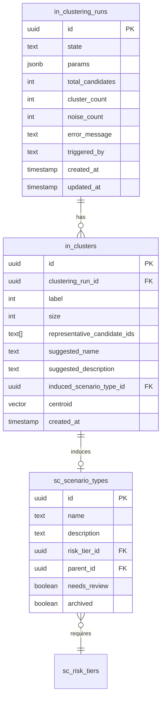

# Wire Scenario Induction Pipeline

## Overview

The system has Levels 0-2 working (OTel traces -> episodes -> candidates -> embeddings -> scores) and Level 3-4 infrastructure built but disconnected. The HDBSCAN cluster detector exists but is never triggered. The Scenario context has types, rubrics, and risk tiers but no data. The centroid-based mapper exists but has no centroids to map against.

This plan wires the missing bridge: **clusters -> scenario induction -> centroid seeding -> auto-mapping**.

## Problem Statement

Episodes are data. Scenarios are abstractions over data. The engine currently operates in data space (novelty, density, deduplication) but benchmarking requires abstraction space (generalization, canonicalization, reproducibility).

Concretely:

- `HdbscanClusterDetector` exists but isn't composed, exported, or triggerable via API
- `UnmappedClusterDetectedEvent` is defined but no handler is registered
- `sc_risk_tiers` table is empty -- can't create scenario types without one
- No persistent storage for cluster run results
- No LLM summarization to auto-name clusters
- `EmbeddingScenarioMapper.updateCentroids()` works but has no scenario types to compute centroids for

## Proposed Solution

Five phases, each independently shippable:

1. **Seed risk tiers** -- unblock scenario type creation
2. **Persist cluster runs** -- add `in_clustering_runs` and `in_clusters` tables
3. **API endpoint** -- `POST /api/v1/clustering/runs` triggers HDBSCAN
4. **LLM auto-naming** -- summarize representative episodes into scenario names
5. **Auto-create scenario types** -- bridge clusters to the Scenario context with `needsReview` flag

## Technical Approach

### Architecture

```
POST /api/v1/clustering/runs
  |
  v
ManageClusteringRuns.create()
  |
  v
HdbscanClusterDetector.detect()  (unmapped candidates)
  |
  v
Persist ClusteringRun + Clusters to DB
  |
  v
For each cluster:
  LlmClusterSummarizer.summarize(representative_ids)
    -> { suggestedName, suggestedDescription, suggestedRiskCategory }
  |
  v
  manageScenarioTypes.create({ name, description, riskTierId, needsReview: true })
  |
  v
  scenario_graph.updated event fires
    -> onScenarioGraphUpdated marks candidates scoringDirty
  |
  v
EmbeddingScenarioMapper.updateCentroids()
  -> seeds centroids for new scenario types
  |
  v
Remap cluster members: set scenarioTypeId + mappingConfidence on candidates
```

### Implementation Phases

#### Phase 1: Seed Default Risk Tiers

**Why first:** `sc_risk_tiers` is empty. `ScenarioType` requires a `riskTierId`. Nothing downstream works without this.

**Tasks:**

- [x] Create seed script `src/db/seeds/risk-tiers.ts` with 4 default tiers:
  - `critical` (weight: 1.0, category: `safety`)
  - `high` (weight: 0.75, category: `compliance`)
  - `medium` (weight: 0.5, category: `business`)
  - `low` (weight: 0.25, category: `business`)
- [x] Add `pnpm db:seed` script to `package.json` that runs the seed
- [x] Use `INSERT ... ON CONFLICT DO NOTHING` for idempotency (seed can be re-run safely)
- [x] Use UUIDv7 for IDs, matching project convention

**Files:**

- `src/db/seeds/risk-tiers.ts` (new)
- `package.json` (add script)

**Acceptance criteria:**

- [ ] `pnpm db:seed` populates 4 risk tiers
- [ ] Re-running seed is a no-op
- [ ] `manageRiskTiers.list()` returns all 4

---

#### Phase 2: Persist Clustering Runs

**Why:** HDBSCAN currently returns results in-memory. We need to store runs and their clusters for history, review, and linking to induced scenarios.

**Tasks:**

- [ ] Add tables to `src/db/schema/intelligence.ts`:
  - `in_clustering_runs`: id, state (`pending`|`running`|`completed`|`failed`), params (jsonb: `{ minClusterSize, minSamples, algorithm }`), totalCandidates, clusterCount, noiseCount, errorMessage, triggeredBy, timestamps
  - `in_clusters`: id, clusteringRunId (FK), label (integer cluster_id from HDBSCAN), size, representativeCandidateIds (text[] -- stores UUIDs of representative episodes), suggestedName, suggestedDescription, inducedScenarioTypeId (nullable FK to `sc_scenario_types`), centroid (vector 1536)
- [ ] Create `ClusteringRun` entity in `src/contexts/intelligence/domain/entities/ClusteringRun.ts`
  - State machine: `pending -> running -> completed | failed`
  - Method: `complete(clusters)`, `fail(error)`
- [ ] Create `Cluster` value object in `src/contexts/intelligence/domain/value-objects/Cluster.ts`
  - Fields: id, label, size, representativeCandidateIds, suggestedName, suggestedDescription, inducedScenarioTypeId
- [ ] Create `ClusteringRunRepository` port and Drizzle implementation
- [ ] Add domain events: `clustering_run.completed`, `clustering_run.failed`
- [ ] Run `pnpm db:generate` and `pnpm db:migrate`

**Files:**

- `src/db/schema/intelligence.ts` (edit -- add 2 tables)
- `src/contexts/intelligence/domain/entities/ClusteringRun.ts` (new)
- `src/contexts/intelligence/domain/value-objects/Cluster.ts` (new)
- `src/contexts/intelligence/domain/events.ts` (edit -- add events)
- `src/contexts/intelligence/application/ports/ClusteringRunRepository.ts` (new)
- `src/contexts/intelligence/infrastructure/DrizzleClusteringRunRepository.ts` (new)

**Acceptance criteria:**

- [ ] Tables created with proper FKs and indexes
- [ ] ClusteringRun entity state machine enforced
- [ ] Repository persists run + clusters in single transaction

---

#### Phase 3: Clustering API Endpoint

**Why:** Need a trigger to run HDBSCAN. Synchronous for MVP (documented limitation).

**Tasks:**

- [ ] Create `ManageClusteringRuns` use case in `src/contexts/intelligence/application/use-cases/ManageClusteringRuns.ts`
  - `create(params?)`: creates run (pending), transitions to running, calls `HdbscanClusterDetector.detect()`, persists clusters, transitions to completed, publishes events
  - `get(id)`: returns run with clusters
  - `list(page, pageSize)`: paginated list of runs
  - Handles failure: catches detector errors, transitions to failed state
- [ ] Compose `HdbscanClusterDetector` in the Intelligence composition root (`src/contexts/intelligence/index.ts`) -- it's currently not exported
- [ ] Compose `ManageClusteringRuns` in composition root
- [ ] Create API route `app/api/v1/clustering/runs/route.ts`:
  - `POST`: triggers a new clustering run, returns 201 with run ID
  - `GET`: lists past runs with pagination
- [ ] Create API route `app/api/v1/clustering/runs/[id]/route.ts`:
  - `GET`: returns run detail with clusters
- [ ] Wire `EmbeddingScenarioMapper` into composition root (also currently not exported)

**Files:**

- `src/contexts/intelligence/application/use-cases/ManageClusteringRuns.ts` (new)
- `src/contexts/intelligence/index.ts` (edit -- compose detector, mapper, use case)
- `app/api/v1/clustering/runs/route.ts` (new)
- `app/api/v1/clustering/runs/[id]/route.ts` (new)

**Acceptance criteria:**

- [ ] `POST /api/v1/clustering/runs` triggers HDBSCAN and returns run with clusters
- [ ] `GET /api/v1/clustering/runs` lists runs with pagination
- [ ] `GET /api/v1/clustering/runs/:id` returns run detail with cluster data
- [ ] Failure states are captured (insufficient candidates, Python subprocess errors)
- [ ] Min 15 embeddings required; returns empty result below threshold

---

#### Phase 4: LLM Cluster Summarization

**Why:** Clusters are unnamed ("Cluster 0", "Cluster 1"). Need human-readable scenario names derived from representative episodes.

**Tasks:**

- [ ] Define `ClusterSummarizer` port in `src/contexts/intelligence/application/ports/ClusterSummarizer.ts`:
  ```typescript
  interface ClusterSummary {
    suggestedName: string; // e.g. "Tool failure recovery"
    suggestedDescription: string; // 2-3 sentence description
    suggestedRiskCategory: "business" | "safety" | "compliance";
  }
  export interface ClusterSummarizer {
    summarize(representativeEpisodeIds: UUID[]): Promise<ClusterSummary>;
  }
  ```
- [ ] Implement `LlmClusterSummarizer` in `src/contexts/intelligence/infrastructure/LlmClusterSummarizer.ts`:
  - Reads episode data for representative candidates (via port, not direct import)
  - Sends structured prompt to LLM: "Given these agent execution traces, name and describe the abstract task class they represent"
  - Uses `z.object()` schema for structured output parsing
  - Fallback: if LLM fails, returns `{ suggestedName: "Cluster {label}", suggestedDescription: "Auto-detected cluster of {size} episodes", suggestedRiskCategory: "business" }`
- [ ] Define `EpisodeReader` port for cross-context read (Intelligence -> Ingestion):
  ```typescript
  export interface EpisodeReadView {
    id: UUID;
    rawData: unknown;
    metadata: unknown;
  }
  export interface EpisodeReader {
    getMany(ids: UUID[]): Promise<EpisodeReadView[]>;
  }
  ```
- [ ] Implement `IngestionContextAdapter` for episode reads (lazy import pattern)
- [ ] Integrate summarizer into `ManageClusteringRuns.create()` -- after detection, before persistence
- [ ] Add LLM provider configuration (API key from env, model selection)

**Files:**

- `src/contexts/intelligence/application/ports/ClusterSummarizer.ts` (new)
- `src/contexts/intelligence/infrastructure/LlmClusterSummarizer.ts` (new)
- `src/contexts/intelligence/application/ports/EpisodeReader.ts` (new)
- `src/contexts/intelligence/infrastructure/adapters/IngestionContextAdapter.ts` (new)
- `src/contexts/intelligence/application/use-cases/ManageClusteringRuns.ts` (edit)
- `src/contexts/intelligence/index.ts` (edit -- compose summarizer + adapter)

**Acceptance criteria:**

- [ ] Each cluster gets a human-readable name and description
- [ ] Graceful fallback when LLM is unavailable
- [ ] Episode data read via port (no direct Ingestion imports)
- [ ] Summarization results persisted to `in_clusters.suggestedName/suggestedDescription`

---

#### Phase 5: Auto-Create Scenario Types + Centroid Seeding

**Why:** This is the bridge. Clusters become scenario types. Centroids enable future auto-mapping.

**Tasks:**

- [ ] Add `needsReview` boolean column to `sc_scenario_types` (default `false`):
  - Human-created scenarios: `needsReview = false`
  - Auto-induced scenarios: `needsReview = true`
  - Allows filtering in UI for human validation
- [ ] Add `ScenarioTypeCreator` port in Intelligence context:
  ```typescript
  export interface ScenarioTypeCreator {
    create(input: {
      name: string;
      description: string;
      riskTierId: UUID;
      needsReview: boolean;
    }): Promise<{ id: UUID }>;
    findRiskTierByCategory(
      category: "business" | "safety" | "compliance"
    ): Promise<{ id: UUID } | null>;
  }
  ```
- [ ] Implement `ScenarioContextAdapter` (lazy import from Scenario composition root)
- [ ] Add `CandidateMapper` port for updating candidate mappings:
  ```typescript
  export interface CandidateMapper {
    mapToScenario(
      candidateIds: UUID[],
      scenarioTypeId: UUID,
      confidence: number
    ): Promise<void>;
  }
  ```
- [ ] Implement `CandidateContextAdapter` (lazy import from Candidate composition root)
- [ ] Create `InduceScenarios` use case in `src/contexts/intelligence/application/use-cases/InduceScenarios.ts`:
  - Input: `clusteringRunId`
  - For each cluster in the run:
    1. Look up risk tier by `suggestedRiskCategory`
    2. Create scenario type via `ScenarioTypeCreator` (with `needsReview: true`)
    3. Store `inducedScenarioTypeId` on the cluster record
    4. Map cluster member candidates to the new scenario type
  - After all clusters processed: 5. Call `EmbeddingScenarioMapper.updateCentroids()` to seed centroids
  - Publishes `scenario_induction.completed` event
- [ ] Wire `InduceScenarios` to `clustering_run.completed` event in registry
- [ ] Add `POST /api/v1/clustering/runs/:id/induce` endpoint for manual trigger
- [ ] Add `GET /api/v1/scenario-types?needsReview=true` filter to existing scenario types list endpoint

**Files:**

- `src/db/schema/scenario.ts` (edit -- add `needsReview` column)
- `src/contexts/scenario/domain/entities/ScenarioType.ts` (edit -- add `needsReview` field)
- `src/contexts/intelligence/application/ports/ScenarioTypeCreator.ts` (new)
- `src/contexts/intelligence/infrastructure/adapters/ScenarioContextAdapter.ts` (new)
- `src/contexts/intelligence/application/ports/CandidateMapper.ts` (new)
- `src/contexts/intelligence/infrastructure/adapters/CandidateContextAdapter.ts` (new)
- `src/contexts/intelligence/application/use-cases/InduceScenarios.ts` (new)
- `src/contexts/intelligence/domain/events.ts` (edit -- add `scenario_induction.completed`)
- `src/lib/events/registry.ts` (edit -- wire handler)
- `app/api/v1/clustering/runs/[id]/induce/route.ts` (new)
- Drizzle migration for `needsReview` column

**Acceptance criteria:**

- [ ] Each cluster auto-creates a scenario type with `needsReview: true`
- [ ] Risk tier assigned based on LLM-suggested category
- [ ] Cluster members mapped to new scenario type with confidence from centroid similarity
- [ ] `updateCentroids()` seeds centroids for all new scenario types
- [ ] Future candidates auto-map via existing `EmbeddingScenarioMapper`
- [ ] `scenario_graph.updated` fires for each new scenario type (existing behavior from `manageScenarioTypes.create()`)
- [ ] Manual trigger available via API; automatic trigger via event

## Alternative Approaches Considered

**1. Async job queue for clustering**
HDBSCAN via Python subprocess can be slow. Could use a proper job queue (BullMQ, pg-boss). Rejected for MVP -- synchronous is simpler, document as known limitation. The API returns the completed result. Phase 2 optimization.

**2. Human-only scenario creation**
Skip auto-induction entirely, just present cluster suggestions for human review. Rejected -- too much friction. Auto-create with `needsReview` flag is the middle ground.

**3. K-means instead of HDBSCAN**
K-means requires pre-specifying k. HDBSCAN discovers the number of clusters automatically. HDBSCAN is the right choice for induction where we don't know how many scenario types exist.

**4. Store clusters as scenario types directly (no intermediate storage)**
Rejected -- need cluster history for debugging, re-running with different params, and comparing runs.

## Acceptance Criteria

### Functional Requirements

- [ ] Default risk tiers exist after seeding
- [ ] Clustering can be triggered via API
- [ ] Cluster results are persisted with run history
- [ ] Clusters get human-readable names via LLM
- [ ] Scenario types are auto-created from clusters
- [ ] Centroids are seeded for new scenario types
- [ ] Future candidates auto-map to induced scenarios
- [ ] `needsReview` flag distinguishes auto-induced from human-created scenarios

### Non-Functional Requirements

- [ ] Clustering runs complete within 60s for < 1000 candidates
- [ ] LLM summarization has graceful fallback
- [ ] All cross-context reads use port/adapter pattern (no direct imports)
- [ ] Idempotent event handlers (re-delivery safe)

### Quality Gates

- [ ] All new code passes `pnpm lint`
- [ ] Database migrations are reversible
- [ ] Domain errors mapped in API middleware

## Dependencies & Prerequisites

- PostgreSQL with pgvector extension (already configured)
- Python 3 with hdbscan package (already configured for `cluster.py`)
- LLM API key (OpenAI or Anthropic) for Phase 4 -- new env var needed
- At least 15 embedded candidates to test clustering

## Risk Analysis & Mitigation

| Risk                                                          | Impact                    | Mitigation                                                              |
| ------------------------------------------------------------- | ------------------------- | ----------------------------------------------------------------------- |
| HDBSCAN returns all noise (no clusters)                       | No scenarios induced      | Handle gracefully -- log, return empty result, suggest adjusting params |
| LLM produces poor scenario names                              | Bad UX                    | `needsReview` flag + fallback naming + human review endpoint            |
| Synchronous clustering blocks request                         | Timeout on large datasets | Document as MVP limitation; cap at 5000 candidates per run              |
| Circular dependency: Intelligence -> Scenario -> Intelligence | Build failure             | All cross-context reads via lazy `await import()` in adapters           |
| Centroid drift as more candidates are mapped                  | Degraded mapping quality  | `updateCentroids()` recomputes from scratch each time                   |

## Data Model Changes



## References & Research

### Internal References

- `src/contexts/intelligence/infrastructure/HdbscanClusterDetector.ts` -- existing HDBSCAN implementation
- `src/contexts/intelligence/infrastructure/EmbeddingScenarioMapper.ts` -- centroid-based mapping
- `src/contexts/intelligence/index.ts` -- composition root (needs detector/mapper exports)
- `src/contexts/scenario/index.ts` -- scenario composition root
- `src/lib/events/registry.ts` -- event subscription wiring
- `docs/solutions/integration-issues/bounded-context-ddd-implementation-patterns.md` -- DDD checklist

### Institutional Learnings Applied

- Cross-context reads via lazy import adapters (candidate context patterns)
- Narrow read view ports (export context patterns)
- Idempotent event handlers catching `DuplicateError` (candidate context patterns)
- `returning()` + null guard for all repository mutations (scenario context patterns)
- Replace-all strategy for many-to-many cluster membership (scenario context patterns)
- Strategy pattern for algorithm extensibility (export context patterns)
