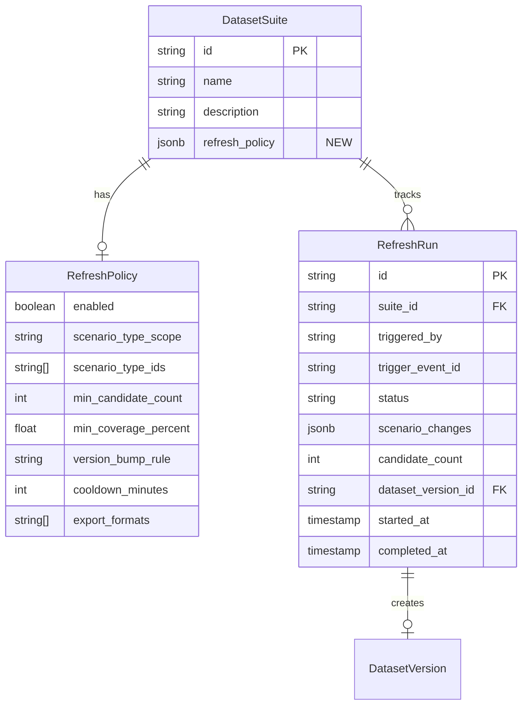

# Automatic Dataset Version Refresh on Scenario Clustering

## Overview

Wire the scenario clustering/mapping pipeline to automatic dataset version creation so that clients always have up-to-date evaluation datasets covering newly discovered scenarios. The pipeline has **two human gates**: scenario approval and dataset release approval. The goal is to maximize three value dimensions for clients: fresh coverage, rapid iteration, and comprehensive regression baselines.

## Problem Statement

Today, dataset versions are created **manually** via `POST /api/v1/dataset-versions`. There is no automation connecting:

- Clustering runs (new pattern detection) → scenario creation → candidate processing → dataset assembly
- Scenario graph changes (re-mapping) → candidate re-scoring → dataset refresh

This means clients testing their agents against Diamond datasets can have **stale coverage** — new scenarios exist but no dataset version includes them. The manual assembly step is a bottleneck that delays the feedback loop.

## Proposed Solution

An **Auto-Refresh Orchestrator** that listens to scenario and labeling events, tracks readiness per suite, and automatically creates draft dataset versions when configurable thresholds are met. Two human gates ensure quality:

1. **Gate 1 — Scenario approval**: Humans review and approve new ScenarioTypes suggested by clustering (existing flow via `needsReview` flag)
2. **Gate 2 — Dataset release approval**: Humans review diagnostics and approve the release (existing flow via `PATCH /dataset-versions/:id/state`)

```
┌─────────────────────────────────────────────────────────────────────────┐
│                    Auto-Refresh Pipeline                                │
│                                                                         │
│  clustering_run.completed                                               │
│       │                                                                 │
│       ▼                                                                 │
│  scenario_induction (auto-creates ScenarioTypes with needsReview=true)  │
│       │                                                                 │
│  ═══[HUMAN GATE 1]═══  approve/reject ScenarioTypes                    │
│       │                                                                 │
│       ▼                                                                 │
│  scenario_graph.updated                                                 │
│       │                                                                 │
│       ├──▶ candidates marked scoringDirty=true                          │
│       │       │                                                         │
│       │       ▼                                                         │
│       │    re-scoring run ──▶ re-selection run ──▶ labeling tasks       │
│       │                                                                 │
│       └──▶ AutoRefreshOrchestrator checks opted-in suites               │
│               │                                                         │
│               ▼                                                         │
│         ReadinessChecker (per label_task.finalized)                     │
│               │                                                         │
│          [threshold met?]                                               │
│               │                                                         │
│               ▼                                                         │
│         Auto-create draft DatasetVersion                                │
│               │                                                         │
│               ▼                                                         │
│         Auto-run diagnostics                                            │
│               │                                                         │
│  ═══[HUMAN GATE 2]═══  review diagnostics, approve release             │
│               │                                                         │
│               ▼                                                         │
│  dataset_version.released ──▶ auto-export ──▶ client notification      │
│                                                                         │
└─────────────────────────────────────────────────────────────────────────┘
```

## Technical Approach

### Architecture

The feature introduces a new **Orchestration layer** within the Dataset context that reacts to cross-context events and coordinates the auto-refresh pipeline. This follows the existing pattern of event handlers in each context's `application/handlers/` directory.

#### Key Design Decisions

1. **No backward state transitions on Candidate.** The existing state machine (`raw → scored → selected → labeled → validated → released`) is preserved. When scenario graph changes invalidate a candidate's mapping, the Intelligence context already marks it `scoringDirty=true` and the next scoring run re-processes candidates in `raw` or `scored` state. Candidates already past `scored` retain their current mapping — they were evaluated under the previous graph version and remain valid for their dataset version's lineage. New episodes entering through the pipeline will pick up the new mapping.

2. **Suite-level opt-in with configurable thresholds.** A `RefreshPolicy` entity on `DatasetSuite` defines whether auto-refresh is enabled, which scenario types are in scope, readiness thresholds, and version bump rules.

3. **One draft at a time per suite.** A guard prevents concurrent draft creation. Subsequent triggers are no-ops if a draft already exists for the suite.

4. **Diagnostics auto-run on draft creation.** The human gate is only at the release step, not at the "start diagnostics" step. This matches the existing flow where `PATCH /state` to `validating` triggers diagnostics synchronously.

5. **Incremental version assembly.** New draft versions include all currently `validated`/`released` candidates for the suite's scenario types, plus any newly `validated` candidates since the last released version. This is additive — no need to re-process the entire candidate pool.

### Implementation Phases

#### Phase 1: Suite Refresh Policy (Foundation)

Extend `DatasetSuite` with a `RefreshPolicy` configuration.

**New entity: `RefreshPolicy`** (value object on DatasetSuite)

```typescript
// src/contexts/dataset/domain/entities/RefreshPolicy.ts
interface RefreshPolicy {
  enabled: boolean;
  scenarioTypeScope: "all" | "explicit";
  scenarioTypeIds: string[]; // only if scope=explicit
  minCandidateCount: number; // minimum validated candidates to trigger draft
  minCoveragePercent: number; // minimum scenario coverage % to trigger draft
  versionBumpRule: "auto" | "minor" | "patch";
  cooldownMinutes: number; // minimum time between auto-created drafts
  exportFormats: string[]; // formats to auto-export on release
}
```

**Database changes:**

```sql
-- New columns on ds_dataset_suites
ALTER TABLE ds_dataset_suites ADD COLUMN refresh_policy jsonb DEFAULT NULL;
```

**API changes:**

```
PUT  /api/v1/dataset-suites/:id/refresh-policy   -- Set/update refresh policy
GET  /api/v1/dataset-suites/:id/refresh-policy   -- Get current policy
DELETE /api/v1/dataset-suites/:id/refresh-policy  -- Disable auto-refresh
```

**Files to create/modify:**

- `src/contexts/dataset/domain/entities/RefreshPolicy.ts` — value object with validation
- `src/db/schema/dataset.ts` — add `refreshPolicy` jsonb column to `dsDatasetSuites`
- `src/contexts/dataset/application/use-cases/ManageRefreshPolicies.ts` — CRUD use case
- `app/api/v1/dataset-suites/[id]/refresh-policy/route.ts` — API endpoint

#### Phase 2: Readiness Checker & Draft Creation

The core automation: listen to events, check readiness, create drafts.

**New service: `AutoRefreshOrchestrator`**

```typescript
// src/contexts/dataset/application/services/AutoRefreshOrchestrator.ts
class AutoRefreshOrchestrator {
  // Called on label_task.finalized, scenario_graph.updated, or manual trigger
  async checkAndRefresh(
    suiteId: string
  ): Promise<"created" | "not_ready" | "draft_exists" | "cooldown"> {
    // 1. Load suite + refresh policy
    // 2. Guard: policy enabled?
    // 3. Guard: no existing draft version for this suite?
    // 4. Guard: cooldown not expired since last auto-draft?
    // 5. Query validated candidates matching policy's scenario scope
    // 6. Check thresholds (minCandidateCount, minCoveragePercent)
    // 7. Compute next version string
    // 8. Create draft version with candidate IDs + lineage
    // 9. Auto-transition to validating (triggers diagnostics)
    // 10. Return result
  }
}
```

**New event handlers:**

```typescript
// src/contexts/dataset/application/handlers/onLabelTaskFinalized.ts
// Listens to: label_task.finalized
// Effect: Looks up which suites could include this candidate's scenario type,
//         calls orchestrator.checkAndRefresh(suiteId) for each

// src/contexts/dataset/application/handlers/onScenarioGraphUpdated.ts
// Listens to: scenario_graph.updated
// Effect: For each suite with auto-refresh enabled, checks if the graph change
//         affects the suite's scenario scope. If so, marks the suite as "pending
//         refresh" (the actual refresh happens when enough candidates are labeled)
```

**Version string computation:**

```typescript
// src/contexts/dataset/domain/services/VersionComputer.ts
class VersionComputer {
  computeNext(lastReleased: string | null, changes: GraphChange[]): string {
    // If no previous version: "1.0.0"
    // If changes include "added" ScenarioTypes: minor bump (1.0.0 → 1.1.0)
    // If changes include "removed" ScenarioTypes: major bump (1.0.0 → 2.0.0)
    // If only re-scoring/re-mapping: patch bump (1.0.0 → 1.0.1)
    // versionBumpRule=auto uses above logic; explicit rule overrides
  }
}
```

**Event bus wiring additions** (`src/lib/events/registry.ts`):

| Event                    | Handler                          | Effect                              |
| ------------------------ | -------------------------------- | ----------------------------------- |
| `label_task.finalized`   | `dataset/onLabelTaskFinalized`   | Check readiness for matching suites |
| `scenario_graph.updated` | `dataset/onScenarioGraphUpdated` | Mark suites as pending refresh      |

**Files to create/modify:**

- `src/contexts/dataset/application/services/AutoRefreshOrchestrator.ts` — core logic
- `src/contexts/dataset/domain/services/VersionComputer.ts` — semver computation
- `src/contexts/dataset/application/handlers/onLabelTaskFinalized.ts` — event handler
- `src/contexts/dataset/application/handlers/onScenarioGraphUpdated.ts` — event handler
- `src/lib/events/registry.ts` — register new handlers
- `src/contexts/dataset/index.ts` — wire new services and handlers

#### Phase 3: Auto-Export & Client Notification

Wire dataset release to automatic export and add notification mechanism.

**Export automation:**

Currently `dataset_version.released` is emitted but no handler creates export jobs. Add:

```typescript
// src/contexts/export/application/handlers/onDatasetVersionReleased.ts
// Listens to: dataset_version.released
// Effect: Reads the suite's refresh policy for export formats,
//         calls manageExportJobs.create() for each format
```

**Client notification event:**

```typescript
// New event: dataset_version.available
// Emitted after: export.completed (all formats for a version)
// Payload: { datasetVersionId, suiteId, version, formats, downloadUrls }
```

This event is the hook for future webhook/notification integrations. For now, it's emitted and logged. Clients can poll `GET /api/v1/dataset-suites/:id/latest-version`.

**New API endpoint:**

```
GET /api/v1/dataset-suites/:id/latest-version  -- Returns the latest released version for a suite
```

**Files to create/modify:**

- `src/contexts/export/application/handlers/onDatasetVersionReleased.ts` — auto-export handler
- `src/contexts/dataset/domain/events.ts` — add `dataset_version.available` event
- `app/api/v1/dataset-suites/[id]/latest-version/route.ts` — client-facing endpoint
- `src/lib/events/registry.ts` — register export handler

#### Phase 4: Observability & Pipeline Tracking

Add a `RefreshRun` entity to track the end-to-end pipeline status.

**New entity: `RefreshRun`**

```typescript
interface RefreshRun {
  id: string;
  suiteId: string;
  triggeredBy: "clustering_run" | "scenario_graph_updated" | "manual";
  triggerEventId: string;
  status:
    | "pending_scenarios"
    | "pending_labeling"
    | "pending_diagnostics"
    | "pending_approval"
    | "released"
    | "failed";
  scenarioChanges: GraphChange[];
  candidateCount: number;
  datasetVersionId: string | null;
  startedAt: Date;
  completedAt: Date | null;
}
```

**Database changes:**

```sql
CREATE TABLE ds_refresh_runs (
  id TEXT PRIMARY KEY,
  suite_id TEXT NOT NULL REFERENCES ds_dataset_suites(id),
  triggered_by TEXT NOT NULL,
  trigger_event_id TEXT NOT NULL,
  status TEXT NOT NULL DEFAULT 'pending_scenarios',
  scenario_changes JSONB,
  candidate_count INTEGER DEFAULT 0,
  dataset_version_id TEXT REFERENCES ds_dataset_versions(id),
  started_at TIMESTAMPTZ NOT NULL DEFAULT NOW(),
  completed_at TIMESTAMPTZ
);
```

**API:**

```
GET /api/v1/dataset-suites/:id/refresh-runs        -- List refresh runs for a suite
GET /api/v1/dataset-suites/:id/refresh-runs/:runId  -- Get specific run status
POST /api/v1/dataset-suites/:id/refresh-runs        -- Manually trigger a refresh
```

**Files to create:**

- `src/contexts/dataset/domain/entities/RefreshRun.ts`
- `src/db/schema/dataset.ts` — add `dsRefreshRuns` table
- `src/contexts/dataset/application/use-cases/ManageRefreshRuns.ts`
- `app/api/v1/dataset-suites/[id]/refresh-runs/route.ts`

### ERD: New Entities



## Edge Cases & Mitigations

### Scenario Removal / Merge

When a ScenarioType is removed (`scenario_graph.updated` with `changeType: "removed"`):

- Candidates mapped to the removed type retain their current state and mapping — they were valid under the previous graph version
- In-flight `LabelTask` records for candidates of that type are **cancelled** via `label_task.cancelled`
- The `AutoRefreshOrchestrator` excludes candidates with removed scenario types from new draft versions
- Previously released versions are **not auto-deprecated** — they remain valid snapshots of their era

### Gate Failure on Auto-Generated Draft

When diagnostics reject an auto-generated draft:

- Version transitions back to `draft` state (existing behavior)
- `RefreshRun.status` updates to `"failed"` with gate results in metadata
- A `release_gate.blocked` event is emitted (existing)
- Human can either:
  - Manually add/remove candidates and re-trigger validation via existing `PATCH /state`
  - Abandon the draft and wait for more candidates (the next `label_task.finalized` may trigger a new check)

### Concurrent Clustering Runs

- Each clustering run produces independent results
- The "one draft per suite" guard prevents duplicate draft creation
- If a draft already exists, the orchestrator returns `"draft_exists"` — no action taken
- The `cooldownMinutes` policy setting prevents rapid-fire draft creation after the first draft is released

### Partial Labeling

- The readiness check runs on every `label_task.finalized` event
- It counts **all** `validated` candidates for the suite's scenario types, not just newly labeled ones
- If thresholds aren't met, no action — the check is cheap (single count query)

### Suite Scope Changes

- If a suite's `RefreshPolicy.scenarioTypeIds` is updated while a draft exists, the existing draft is unaffected
- The next auto-refresh will use the updated scope

## Acceptance Criteria

### Functional Requirements

- [x] A `DatasetSuite` can have an optional `RefreshPolicy` configured via API
- [x] When `label_task.finalized` fires and enough validated candidates exist for an opted-in suite, a draft `DatasetVersion` is auto-created
- [x] When `scenario_graph.updated` fires with `added`/`removed` changes, opted-in suites are checked for refresh
- [ ] Auto-created drafts auto-run diagnostics (transition to `validating`) — deferred: human triggers validation via existing PATCH /state
- [x] Only one draft version per suite at a time (guard against concurrent creation)
- [x] Cooldown period between auto-drafts is respected
- [x] Version string is auto-computed based on change type and policy
- [x] On manual release approval, configured export formats are auto-triggered
- [x] `RefreshRun` entity tracks end-to-end pipeline status
- [x] `GET /dataset-suites/:id/latest-version` returns the latest released version

### Non-Functional Requirements

- [ ] Readiness check on `label_task.finalized` completes in <100ms (single count query)
- [ ] Auto-draft creation follows existing patterns: idempotent handlers, lazy cross-context imports
- [ ] All new event handlers are idempotent (catch `DuplicateError`, `NotFoundError`)

### Quality Gates

- [ ] Unit tests for `VersionComputer` (all bump rules)
- [ ] Unit tests for `AutoRefreshOrchestrator` (all guard conditions)
- [ ] Integration tests for the event handler chain
- [ ] Existing tests continue to pass (no regression on manual flows)

## Alternative Approaches Considered

### 1. Cron-based polling instead of event-driven

**Rejected.** Polling adds latency (up to one cron interval) and wastes cycles checking suites that haven't changed. Event-driven is more responsive and cheaper.

### 2. Backward state transitions on Candidate

**Rejected.** Breaking the forward-only state machine would undermine lineage guarantees. Each dataset version's lineage pins the scenario graph version and candidate states at creation time. Allowing backward transitions would make lineage unreliable. Instead, new episodes naturally flow through the updated pipeline.

### 3. Separate "auto-refresh" service outside bounded contexts

**Rejected.** The orchestrator belongs in the Dataset context because it owns the decision of "when to create a version." Cross-context reads happen through existing port interfaces (lazy imports), consistent with the established pattern.

## Dependencies & Prerequisites

- Intelligence context's clustering and scoring runs must be operational (Phase 2 features)
- Scenario induction from clustering (`onClusteringRunCompleted`) must be wired
- `candidate.state_changed` → labeling task creation must be wired (already done)
- Release gate policies must be configurable per suite (already implemented)

## Risk Analysis & Mitigation

| Risk                                                        | Impact       | Likelihood | Mitigation                                                                      |
| ----------------------------------------------------------- | ------------ | ---------- | ------------------------------------------------------------------------------- |
| Readiness check becomes expensive with many suites          | Performance  | Low        | Single count query per suite; add index on `(scenario_type_id, state)`          |
| Human gate 2 becomes bottleneck (too many drafts to review) | UX           | Medium     | Cooldown period; notification system; dashboard showing pending drafts          |
| Stale drafts accumulate if humans don't act                 | Data hygiene | Medium     | Auto-expire drafts after configurable TTL; cleanup job                          |
| Export failures block the notification pipeline             | Reliability  | Low        | Export and notification are independent; failure in one doesn't block the other |

## Future Considerations

- **Webhook notifications**: Add webhook configuration to `RefreshPolicy` so clients are actively notified of new versions
- **Diff-based client updates**: Instead of full version downloads, provide incremental diffs so clients can update efficiently
- **Auto-deprecation policy**: Optionally auto-deprecate the previous version N days after a new one is released
- **Smart cooldown**: Instead of fixed cooldown, use a rate-limiter that allows bursts but caps sustained rate
- **Suite templates**: Pre-configured refresh policies for common patterns ("high-risk weekly", "full-coverage monthly")

## References

### Internal References

- Event bus registry: `src/lib/events/registry.ts`
- Dataset context wiring: `src/contexts/dataset/index.ts`
- Intelligence clustering handler: `src/contexts/intelligence/application/handlers/onClusteringRunCompleted.ts`
- Candidate state machine: `src/contexts/candidate/domain/entities/Candidate.ts:15-22`
- DatasetVersion creation: `src/contexts/dataset/application/use-cases/ManageDatasetVersions.ts:32`
- Release gate evaluation: `src/contexts/dataset/domain/services/GateEvaluator.ts`
- Existing solutions: `docs/solutions/integration-issues/dataset-context-versioned-suites-release-gates-patterns.md`

### Institutional Learnings Applied

- Cross-context adapters: use lazy `await import()` inside adapter methods (from candidate context patterns)
- Idempotent event handlers: catch `DuplicateError` and `NotFoundError` (all contexts)
- State machine auto-transitions are transparent to API clients (dataset context pattern)
- Define both `get(id)` and `getMany(ids)` in port interfaces from the start (dataset context learnings)
- Lineage/snapshots as JSONB for immutable provenance (dataset context pattern)
