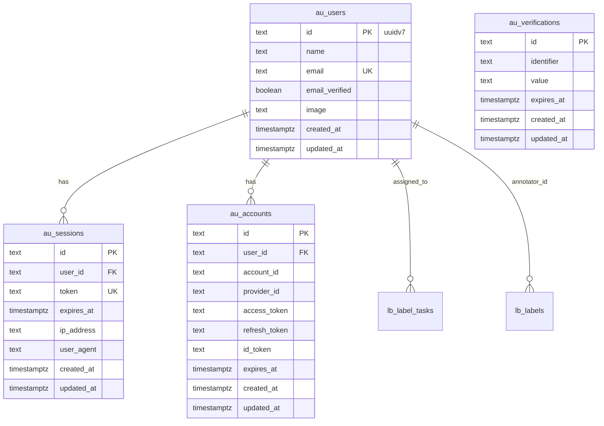

# Better Auth with Google OAuth

## Overview

Replace the hardcoded user stub and API-key-only auth with Better Auth + Google OAuth. Browser users authenticate via Google; programmatic clients continue using Bearer tokens. Sessions are cookie-based, stored in PostgreSQL via Drizzle.

## Decisions

| Topic              | Decision                                                                   |
| ------------------ | -------------------------------------------------------------------------- |
| Access control     | Open registration — any Google account can sign in                         |
| Post-auth redirect | Preserve original URL via `?returnTo=` param                               |
| Identity model     | Auth user ID used directly as `annotator_id` (no mapping layer)            |
| API key auth       | Kept alongside session auth (dual-auth in `withApiMiddleware`)             |
| Table prefix       | `au_` (follows existing convention: `sc_`, `cd_`, `lb_`, etc.)             |
| Auth user IDs      | Configure `generateId: () => uuidv7()` for consistency with rest of schema |
| Cookie strategy    | HTTP-only, Secure in prod, SameSite=Lax, 7-day expiry with daily refresh   |

## Technical Approach

### Architecture

```
proxy.ts (redirect unauthenticated browser requests to /sign-in)
    ↓
app/api/auth/[...all]/route.ts (Better Auth catch-all handler)
    ↓
src/lib/auth.ts (server-side auth instance — Drizzle adapter, Google provider)
src/lib/auth-client.ts (client-side hooks — useSession, signIn, signOut)
    ↓
withAuthMiddleware (extends withApiMiddleware — session OR Bearer token)
    ↓
Route handlers receive session user context
```

### Database Schema (ERD)



## Implementation Phases

### Phase 1: Foundation — Better Auth Setup

**Files to create:**

- `src/db/schema/auth.ts` — Four tables (`au_users`, `au_sessions`, `au_accounts`, `au_verifications`) with `au_` prefix, snake_case columns, `withTimezone` timestamps, text PKs
- `src/lib/auth.ts` — Server-side auth instance:
  ```ts
  betterAuth({
    database: drizzleAdapter(db, { provider: "pg", schema: { ... } }),
    socialProviders: { google: { clientId, clientSecret } },
    session: { expiresIn: 7d, updateAge: 1d, cookieCache: { enabled: true, maxAge: 300 } },
    advanced: { generateId: () => uuidv7() },
    plugins: [nextCookies()],  // must be last
  })
  ```
- `src/lib/auth-client.ts` — Client-side: `createAuthClient({ baseURL })`, export `useSession`, `signIn`, `signOut`
- `app/api/auth/[...all]/route.ts` — `toNextJsHandler(auth)` catch-all

**Files to modify:**

- `src/db/schema/index.ts` — Add `export * from "./auth"`
- `.env` — Add `BETTER_AUTH_SECRET`, `BETTER_AUTH_URL`, `GOOGLE_CLIENT_ID`, `GOOGLE_CLIENT_SECRET`, `NEXT_PUBLIC_APP_URL`

**Then run:**

```bash
pnpm db:generate && pnpm db:migrate
```

**Success criteria:**

- [x] `GET /api/auth/ok` returns 200
- [x] Auth tables exist in PostgreSQL with `au_` prefix

### Phase 2: Sign-In Page & OAuth Flow

**Files to create:**

- `app/(auth)/sign-in/page.tsx` — Sign-in page with:
  - "Continue with Google" button
  - Loading/redirecting state after click
  - Error display from `?error=` query param (OAuth denial, provider errors)
  - Redirect away if already authenticated
  - Read `?returnTo=` param, pass as `callbackURL` to `signIn.social()`
- `app/(auth)/layout.tsx` — Minimal centered layout for auth pages (no sidebar/topbar)

**States the sign-in page handles:**

1. Default — show Google button
2. Loading — button disabled, "Redirecting…" text
3. Error — display error message from `?error=` or `?error=oauth_failed`
4. Already authenticated — redirect to `/` or `?returnTo=`

**Success criteria:**

- [x] Clicking "Continue with Google" initiates OAuth flow
- [x] Successful OAuth creates user + session, redirects to `returnTo` or `/`
- [x] Denying Google consent shows error on sign-in page
- [x] Visiting /sign-in while authenticated redirects away

### Phase 3: Route Protection & Session Middleware

**Files to modify:**

- `proxy.ts` — Add session check for dashboard routes:
  - If no session and route matches `/(dashboard)/*`, redirect to `/sign-in?returnTo={path}`
  - Keep existing Bearer token logic for `/api/v1/*` routes unchanged
  - Let `/api/auth/*` pass through (Better Auth's own routes)
  - Keep public paths: `/api/v1/health`, `/api/v1/setup/readiness`

- `src/lib/api/middleware.ts` — Add `withAuthMiddleware` HOF:

  ```ts
  export function withAuthMiddleware(handler) {
    return withApiMiddleware(async (req, ctx) => {
      // 1. Check Bearer token first (existing logic)
      // 2. If no Bearer, check session cookie via auth.api.getSession()
      // 3. If neither, return 401
      // 4. Pass resolved user to handler
    });
  }
  ```

  - Bearer token takes precedence over session cookie
  - Both resolve to a common `AuthenticatedUser` shape: `{ id, email, name }`

- `app/api/v1/me/route.ts` — Replace hardcoded user with session lookup

**Auth resolution order for API routes:**

1. `Authorization: Bearer <token>` → validate against `API_KEYS` env → synthetic user context
2. Session cookie → `auth.api.getSession()` → real user from DB
3. Neither → 401

**Success criteria:**

- [x] Unauthenticated browser visit to `/datasets` redirects to `/sign-in?returnTo=/datasets`
- [x] After OAuth, user lands back on `/datasets`
- [x] `GET /api/v1/me` returns real user from session
- [x] Bearer token auth still works for programmatic access
- [x] `/api/auth/*` routes are not blocked by proxy

### Phase 4: UI Integration

**Files to modify:**

- `src/components/app-shell/top-bar.tsx` — Replace hardcoded "TU" avatar:
  - Use `useSession()` to get user name/image
  - Show user avatar (Google profile image) or initials
  - Add dropdown with "Sign out" action

**Success criteria:**

- [x] Top bar shows authenticated user's name/avatar
- [x] Sign out clears session and redirects to /sign-in

## Environment Variables

```bash
# .env (add these)
BETTER_AUTH_SECRET=     # openssl rand -hex 32
BETTER_AUTH_URL=http://localhost:3000
NEXT_PUBLIC_APP_URL=http://localhost:3000
GOOGLE_CLIENT_ID=       # from Google Cloud Console
GOOGLE_CLIENT_SECRET=   # from Google Cloud Console
```

**Google Cloud Console setup:**

- APIs & Services → Credentials → OAuth 2.0 Client ID
- Authorized redirect URI: `http://localhost:3000/api/auth/callback/google`

## Gotchas

1. **`nextCookies()` must be the last plugin** in the `plugins` array or cookie injection in Server Actions silently fails
2. **Auth tables use text IDs**, not `uuid` columns — Better Auth manages IDs internally. Configure `generateId: () => uuidv7()` for consistency but keep columns as `text`
3. **`proxy.ts` not `middleware.ts`** — Next.js 16 convention, already in use
4. **Column name mapping**: Use snake_case SQL names in Drizzle schema (e.g., `email_verified`). The Drizzle adapter reads column SQL names automatically
5. **`NEXT_PUBLIC_APP_URL`** must be `NEXT_PUBLIC_` prefixed for client bundle access
6. **Cookie `sameSite: "lax"`** is required for OAuth redirect flow — `"strict"` breaks the callback
7. **Don't run `npx @better-auth/cli generate`** — it would conflict with existing Drizzle schema organization. Write schema manually

## Dependencies

```bash
pnpm add better-auth
```

No other new dependencies needed. `postgres` (postgres.js) and `drizzle-orm` are already installed.

## References

- [Better Auth Installation](https://www.better-auth.com/docs/installation)
- [Better Auth Google OAuth](https://www.better-auth.com/docs/authentication/google)
- [Better Auth Next.js Integration](https://www.better-auth.com/docs/integrations/next)
- [Better Auth Drizzle Adapter](https://www.better-auth.com/docs/adapters/drizzle)
- [Better Auth Session Management](https://www.better-auth.com/docs/concepts/session-management)
