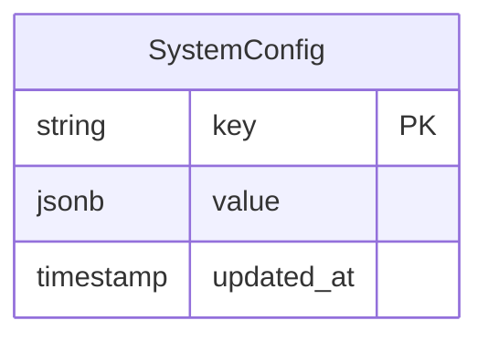

# First-Time Setup Wizard

## Overview

A guided onboarding flow that detects whether Diamond has been configured and walks the user through creating required reference data before the intelligence pipeline can operate. The wizard uses a `system_config` table for permanent completion tracking, a readiness API endpoint, and a multi-step React UI with the existing shadcn component library.

## Problem Statement

When a fresh Diamond instance is deployed, the intelligence pipeline fails at scenario induction because no risk tiers, failure modes, or scenario types exist. The current workaround is `pnpm db:seed` which only creates 4 risk tiers — the user still needs to manually create scenario types via the API. There is no guidance, no detection of missing setup, and no explanation of Diamond's domain concepts.

## Proposed Solution

### Architecture

```
┌──────────────────────────────────────────────────────┐
│  app/(dashboard)/layout.tsx                          │
│                                                      │
│  On mount: GET /api/v1/setup/readiness               │
│    → { ready: false } → redirect to /setup           │
│    → { ready: true }  → render dashboard normally    │
└──────────────────────────────────────────────────────┘

┌──────────────────────────────────────────────────────┐
│  app/setup/page.tsx  (outside dashboard route group) │
│                                                      │
│  Minimal layout (no sidebar, just logo + progress)   │
│  Multi-step wizard:                                  │
│    1. Welcome                                        │
│    2. Risk Tiers (required: ≥1)                      │
│    3. Failure Modes (recommended: ≥1)                │
│    4. Scenario Type + Rubric (required: ≥1)          │
│    5. Summary → POST /api/v1/setup/complete          │
│                                                      │
│  On complete: redirect to / (dashboard)              │
└──────────────────────────────────────────────────────┘

┌──────────────────────────────────────────────────────┐
│  app/(dashboard)/settings/reference-data/page.tsx    │
│                                                      │
│  Voluntary re-entry: same forms, no forced redirect  │
│  Accessible from sidebar Settings section            │
└──────────────────────────────────────────────────────┘
```

### Key Design Decisions

1. **`system_config` table with `setup_completed_at` timestamp.** Once set, the wizard never reappears — even if the user later deletes all risk tiers. This prevents surprising redirect loops. The readiness check is: `setup_completed_at IS NOT NULL`.

2. **Readiness endpoint is unauthenticated.** Like `/api/v1/health`, it only reveals a boolean. No sensitive data leaked.

3. **Wizard state is derived from data presence, not persisted.** On each step render, the wizard queries existing data. If risk tiers already exist (from seed or API), Step 2 shows them and lets the user proceed. Browser refresh is safe — the wizard re-derives progress from what exists in the DB.

4. **Separate routes for first-run vs extend.** `/setup` (forced, outside dashboard group) vs `/settings/reference-data` (voluntary, inside dashboard). No redirect loops.

5. **Context Profiles removed from wizard.** They're optional and confusing for first-time users. Available in settings for power users.

6. **Dataset Suite removed from wizard.** Suites require understanding the full pipeline first. Better as a post-setup task.

## Technical Approach

### Phase 1: System Config + Readiness API

**New table: `system_config`**

```sql
CREATE TABLE system_config (
  key VARCHAR(100) PRIMARY KEY,
  value JSONB NOT NULL,
  updated_at TIMESTAMPTZ NOT NULL DEFAULT NOW()
);
```

**New API endpoints:**

```
GET  /api/v1/setup/readiness   -- Unauthenticated. Returns { ready, missing[] }
POST /api/v1/setup/complete    -- Authenticated. Sets setup_completed_at
```

**Readiness logic:**

```typescript
// GET /api/v1/setup/readiness
interface ReadinessResponse {
  ready: boolean;
  missing: string[]; // ["risk_tiers", "scenario_types"] — helps wizard skip completed steps
  counts: {
    riskTiers: number;
    failureModes: number;
    scenarioTypes: number;
  };
}

// ready = setup_completed_at IS NOT NULL
// If not completed: missing = items where count is 0
```

**Files to create:**

- `src/db/schema/system.ts` — `systemConfig` table
- `src/lib/system/readiness.ts` — readiness check logic (pure function, no context dependency)
- `app/api/v1/setup/readiness/route.ts` — unauthenticated GET endpoint
- `app/api/v1/setup/complete/route.ts` — authenticated POST, sets `setup_completed_at`

**Files to modify:**

- `src/db/schema/index.ts` — export system schema
- `proxy.ts` — add `/api/v1/setup/readiness` to `PUBLIC_PATHS`

### Phase 2: Wizard UI

**Setup layout (no sidebar):**

```
app/setup/
  layout.tsx    — minimal layout: logo, step progress bar, max-w-2xl centered
  page.tsx      — wizard root: manages current step, queries readiness on mount
```

**Wizard steps as components:**

```
src/components/setup/
  wizard.tsx              — step state machine, navigation controls
  step-welcome.tsx        — intro copy explaining Diamond concepts
  step-risk-tiers.tsx     — list existing + form to create + "use defaults" button
  step-failure-modes.tsx  — list existing + form to create + "use defaults" button
  step-scenario-type.tsx  — form to create scenario type + inline rubric
  step-summary.tsx        — recap of created data + "Complete Setup" button
```

**Step state machine:**

```typescript
type WizardStep =
  | "welcome"
  | "risk_tiers"
  | "failure_modes"
  | "scenario_type"
  | "summary";

const STEPS: WizardStep[] = [
  "welcome",
  "risk_tiers",
  "failure_modes",
  "scenario_type",
  "summary",
];

// Each step renders independently, queries its own data
// "Next" button is enabled when step's requirements are met
// "Back" navigates to previous step (data persists in DB, not state)
```

**Step requirements:**

| Step          | Required to proceed     | "Use Defaults" available                   |
| ------------- | ----------------------- | ------------------------------------------ |
| Welcome       | Click "Get Started"     | No                                         |
| Risk Tiers    | ≥1 risk tier exists     | Yes (seeds 4 defaults)                     |
| Failure Modes | None (can skip)         | Yes (seeds 6 defaults)                     |
| Scenario Type | ≥1 scenario type exists | No (domain-specific, must be user-created) |
| Summary       | Click "Complete Setup"  | N/A                                        |

**Default failure modes to seed:**

| Name              | Description                                            | Severity |
| ----------------- | ------------------------------------------------------ | -------- |
| hallucination     | Model generates factually incorrect information        | critical |
| refusal_error     | Model refuses a valid request inappropriately          | high     |
| tool_misuse       | Model calls tools incorrectly or with wrong parameters | high     |
| policy_violation  | Model violates safety or content policies              | critical |
| retrieval_miss    | Model fails to use relevant retrieved context          | medium   |
| instruction_drift | Model ignores or contradicts user instructions         | medium   |

**UI patterns:**

- Each step uses `Card` with title, description, and form
- `StepIndicator` (already exists at `src/components/bulk-source/step-indicator.tsx`) for progress
- `useMutation` for all create operations
- `useApi` to load existing data on each step mount
- `EmptyState` when no data exists yet
- `toast` (sonner) for success/error feedback
- `Button` with loading state during API calls

### Phase 3: Dashboard Readiness Guard

**Modify `app/(dashboard)/layout.tsx`:**

```typescript
// Server component check (no flash of dashboard)
import { checkReadiness } from "@/lib/system/readiness";
import { redirect } from "next/navigation";

export default async function DashboardLayout({ children }) {
  const { ready } = await checkReadiness();
  if (!ready) redirect("/setup");

  return (
    <SidebarProvider>
      {/* existing layout */}
    </SidebarProvider>
  );
}
```

This is a **server-side redirect** — the dashboard never renders if setup is incomplete. No flash.

**Files to modify:**

- `app/(dashboard)/layout.tsx` — add readiness check + redirect

### Phase 4: Extend Seed Scripts + Settings Page

**Extend seeds:**

```
src/db/seeds/
  index.ts            — calls all seed functions
  risk-tiers.ts       — existing (4 defaults)
  failure-modes.ts    — NEW (6 defaults from table above)
```

**Settings reference data page:**

```
app/(dashboard)/settings/reference-data/page.tsx
```

Same forms as wizard steps but in a tabbed layout (Tabs component). No forced flow — user can edit any category independently. Links from sidebar under Settings.

**Files to create:**

- `src/db/seeds/failure-modes.ts` — default failure modes
- `app/(dashboard)/settings/reference-data/page.tsx` — voluntary management UI

**Files to modify:**

- `src/db/seeds/index.ts` — call `seedFailureModes()`
- `src/components/app-shell/sidebar.tsx` — add Settings > Reference Data nav item

### ERD: New Table



Single table, single key `"setup_completed_at"` with value `{ "completed_at": "2026-02-21T..." }`.

## Edge Cases & Mitigations

### Browser refresh mid-wizard

Each step queries existing data on mount. If risk tiers exist, Step 2 shows them and enables "Next". The wizard derives progress from DB state, not React state. Refresh is safe.

### User creates data via API directly (bypasses wizard)

The readiness check at `/setup/readiness` will reflect the data. If risk tiers and scenario types exist AND `setup_completed_at` is set, the wizard is never shown. If data exists but `setup_completed_at` is not set, the wizard appears but pre-populates completed steps — the user just clicks through.

### User deletes all risk tiers after setup

The `setup_completed_at` flag is permanent. The wizard does not reappear. The user manages reference data through Settings > Reference Data. If they delete everything, the intelligence pipeline's `findOrCreateRiskTier` auto-creates defaults as a safety net.

### Concurrent users in wizard

All create operations are idempotent (ON CONFLICT DO NOTHING for seeds, DuplicateError caught in use cases). Both users complete independently without conflict.

### Step 5 partial failure (scenario type created, rubric fails)

The scenario type creation and rubric creation are separate API calls. If the rubric fails, the scenario type still exists. The wizard shows the scenario type as created and offers a "retry rubric" option. The readiness gate only requires a scenario type — the rubric is recommended but not blocking.

### Auth during wizard

The wizard calls authenticated API endpoints. In dev mode, same-origin requests bypass auth (existing behavior). In production, the operator must have an API key configured in `API_KEYS` env var before deploying. The readiness endpoint itself is unauthenticated (added to `PUBLIC_PATHS`).

## Acceptance Criteria

### Functional Requirements

- [x] `system_config` table exists with `setup_completed_at` key
- [x] `GET /api/v1/setup/readiness` returns `{ ready, missing, counts }` without authentication
- [x] `POST /api/v1/setup/complete` sets `setup_completed_at` and requires authentication
- [x] Dashboard layout redirects to `/setup` when `ready=false` (server-side, no flash)
- [x] `/setup` renders a multi-step wizard outside the dashboard layout
- [x] Step 2 (Risk Tiers): can create manually or load 4 defaults; ≥1 required to proceed
- [x] Step 3 (Failure Modes): can create manually or load 6 defaults; can skip
- [x] Step 4 (Scenario Type): form creates scenario type + optional rubric; ≥1 type required
- [x] Step 5 (Summary): shows recap, "Complete Setup" button calls POST /setup/complete
- [x] After completion: redirect to dashboard, wizard never reappears
- [x] Settings > Reference Data page allows voluntary management of all reference data
- [x] Wizard handles browser refresh gracefully (re-derives step progress from DB)

### Non-Functional Requirements

- [x] Readiness check adds <50ms to dashboard layout render (single count query)
- [x] Wizard UI uses existing shadcn components, no new dependencies
- [x] All wizard API calls go through existing CRUD endpoints (no special wizard-only APIs except readiness/complete)

## Dependencies & Prerequisites

- Existing CRUD APIs for risk tiers, failure modes, context profiles, scenario types, rubrics (all built)
- shadcn UI components (all available)
- `useApi` and `useMutation` hooks (built)
- `StepIndicator` component (exists at `src/components/bulk-source/step-indicator.tsx`)

## References

### Internal References

- Dashboard layout: `app/(dashboard)/layout.tsx`
- Scenario context barrel: `src/contexts/scenario/index.ts`
- Risk tier seed: `src/db/seeds/risk-tiers.ts`
- Step indicator: `src/components/bulk-source/step-indicator.tsx`
- API middleware: `src/lib/api/middleware.ts`
- Proxy (auth): `proxy.ts`
- Health endpoint: `app/api/v1/health/route.ts`

### Institutional Learnings Applied

- Next.js 16: use `proxy.ts` not `middleware.ts`
- Zod v4: `z.record(z.string(), z.unknown())` not `z.record(z.unknown())`
- API pattern: `withApiMiddleware` + `parseBody` + response helpers
- Cross-context lazy imports in adapters
- ON CONFLICT DO NOTHING for idempotent seeds
